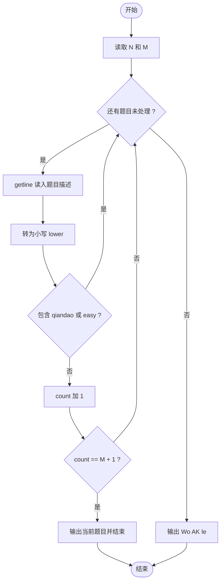
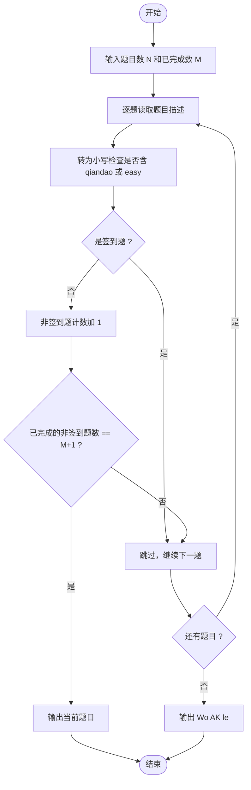

# L1-078 - 吉老师的回归（15 分）

- **时间限制**: 400 ms
- **内存限制**: 65536 KB
- **代码长度限制**: 16 KB

---

## 题目描述

曾经在天梯赛大杀四方的吉老师决定回归天梯赛赛场啦！

为了简化题目，我们不妨假设天梯赛的每道题目可以用一个不超过 500 的、只包括可打印符号的字符串描述出来，如：`Problem A: Print "Hello world!"`。

众所周知，吉老师的竞赛水平非常高超，你可以认为他每道题目都会做（事实上也是……）。因此，吉老师会按照顺序看题并做题。但吉老师水平太高了，所以签到题他就懒得做了（浪费时间），具体来说，假如题目的字符串里有 `qiandao` 或者 `easy`（区分大小写）的话，吉老师看完题目就会跳过这道题目不做。

现在给定这次天梯赛总共有几道题目以及吉老师已经做完了几道题目，请你告诉大家吉老师现在正在做哪个题，或者吉老师已经把所有他打算做的题目做完了。

*提醒：天梯赛有分数升级的规则，如果不做签到题可能导致团队总分不足以升级，一般的选手请千万不要学习吉老师的酷炫行为！*

### 输入格式:

输入第一行是两个正整数 $$N, M$$ ($$1 \le M\le N \le 30$$)，表示本次天梯赛有 $$N$$ 道题目，吉老师现在做完了 $$M$$ 道。

接下来 $$N$$ 行，每行是一个符合题目描述的字符串，表示天梯赛的题目内容。吉老师会按照给出的顺序看题——第一行就是吉老师看的第一道题，第二行就是第二道，以此类推。

### 输出格式:

在一行中输出吉老师当前正在做的题目对应的题面（即做完了 $$M$$ 道题目后，吉老师正在做哪个题）。如果吉老师已经把所有他打算做的题目做完了，输出一行 `Wo AK le`。

### 输入样例 1:

```in
5 1
L1-1 is a qiandao problem.
L1-2 is so...easy.
L1-3 is Easy.
L1-4 is qianDao.
Wow, such L1-5, so easy.
```

### 输出样例 1:

```out
L1-4 is qianDao.
```

### 输入样例 2:

```in
5 4
L1-1 is a-qiandao problem.
L1-2 is so easy.
L1-3 is Easy.
L1-4 is qianDao.
Wow, such L1-5, so!!easy.
```

### 输出样例 2:

```out
Wo AK le
```

## 示例

### 示例 1

**输入:**
```
5 1
L1-1 is a qiandao problem.
L1-2 is so...easy.
L1-3 is Easy.
L1-4 is qianDao.
Wow, such L1-5, so easy.
```

**输出:**
```
L1-4 is qianDao.
```

### 示例 2

**输入:**
```
5 4
L1-1 is a-qiandao problem.
L1-2 is so easy.
L1-3 is Easy.
L1-4 is qianDao.
Wow, such L1-5, so!!easy.
```

**输出:**
```
Wo AK le
```

---

## 题目详解

### 一、解题思路

本题的 R 实现采用以下方法：按行或按字段解析输入，使用字符串或序列操作完成题目要求的变换，并按格式输出。

### 二、代码流程说明

1. 读取并解析标准输入，转换为题目所需的数据结构。
2. 按题意执行核心算法，维护中间状态并处理边界情况。
3. 整理计算结果，按照输出格式生成答案。

### 三、代码实现

```r
# 实现原理：按行或按字段解析输入，使用字符串或序列操作完成题目要求的变换，并按格式输出。
# 处理流程：读取输入 -> 建立状态 -> 执行算法 -> 按题目格式输出。
# 关键变量和循环均直接对应题目中的数据、约束或操作。

# 读取并解析标准输入。
x <- readLines("stdin", warn = FALSE)
q <- as.integer(strsplit(trimws(x[1]), " ", fixed = TRUE)[[1]])
n <- q[1]
m <- q[2]
ans <- "Wo AK le"
# 按题目约束遍历当前数据，更新中间状态。
for (s in x[2:(n + 1)]) if (!grepl("qiandao|easy", s)) {
    if (m == 0) {
        ans <- s
        break
    }
    m <- m - 1
}
# 严格按照题目规定的输出格式输出答案。
cat(ans, "\n", sep = "")
```

### 四、代码流程图



### 五、解题流程图



### 六、常见易错点

- 题目描述、输入格式、输出格式和输入输出样例必须保持原文不变。
- R 语言下标从 1 开始，注意编号转换和空输入边界。
- 输出时严格保留题目规定的空格、换行和小数位数。
