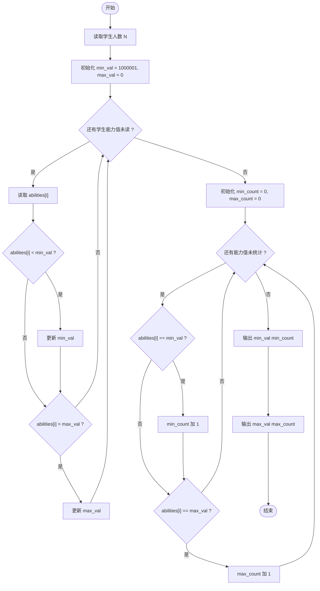
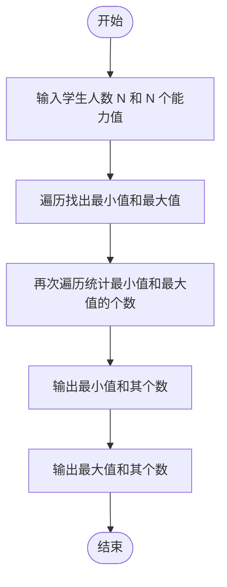

# L1-079 - 天梯赛的善良（20 分）

- **时间限制**: 200 ms
- **内存限制**: 65536 KB
- **代码长度限制**: 16 KB

---

## 题目描述

天梯赛是个善良的比赛。善良的命题组希望将题目难度控制在一个范围内，使得每个参赛的学生都有能做出来的题目，并且最厉害的学生也要非常努力才有可能得到高分。

于是命题组首先将编程能力划分成了 $$10^6$$ 个等级（太疯狂了，这是假的），然后调查了每个参赛学生的编程能力。现在请你写个程序找出所有参赛学生的最小和最大能力值，给命题组作为出题的参考。

### 输入格式:

输入在第一行中给出一个正整数 $$N$$（$$\le 2\times 10^4$$），即参赛学生的总数。随后一行给出 $$N$$ 个不超过 $$10^6$$ 的正整数，是参赛学生的能力值。

### 输出格式:

第一行输出所有参赛学生的最小能力值，以及具有这个能力值的学生人数。第二行输出所有参赛学生的最大能力值，以及具有这个能力值的学生人数。同行数字间以 1 个空格分隔，行首尾不得有多余空格。

### 输入样例:

```in
10
86 75 233 888 666 75 886 888 75 666
```

### 输出样例:

```out
75 3
888 2
```

## 示例

### 示例 1

**输入:**
```
10
86 75 233 888 666 75 886 888 75 666
```

**输出:**
```
75 3
888 2
```

---

## 题目详解

### 一、解题思路

本题的 R 实现采用以下方法：读取标准输入后建立题目所需的数据结构，按约束执行核心计算并输出结果。

### 二、代码流程说明

1. 读取并解析标准输入，转换为题目所需的数据结构。
2. 按题意执行核心算法，维护中间状态并处理边界情况。
3. 整理计算结果，按照输出格式生成答案。

### 三、代码实现

```r
# 实现原理：读取标准输入后建立题目所需的数据结构，按约束执行核心计算并输出结果。
# 处理流程：读取输入 -> 建立状态 -> 执行算法 -> 按题目格式输出。
# 关键变量和循环均直接对应题目中的数据、约束或操作。

# 读取并解析标准输入。
v <- scan(file = "stdin", quiet = TRUE)
a <- v[2:(v[1] + 1)]
lo <- min(a)
hi <- max(a)
# 严格按照题目规定的输出格式输出答案。
cat(paste(lo, sum(a == lo)), "\n", sep = "")
cat(paste(hi, sum(a == hi)), "\n", sep = "")
```

### 四、代码流程图



### 五、解题流程图



### 六、常见易错点

- 题目描述、输入格式、输出格式和输入输出样例必须保持原文不变。
- R 语言下标从 1 开始，注意编号转换和空输入边界。
- 输出时严格保留题目规定的空格、换行和小数位数。
