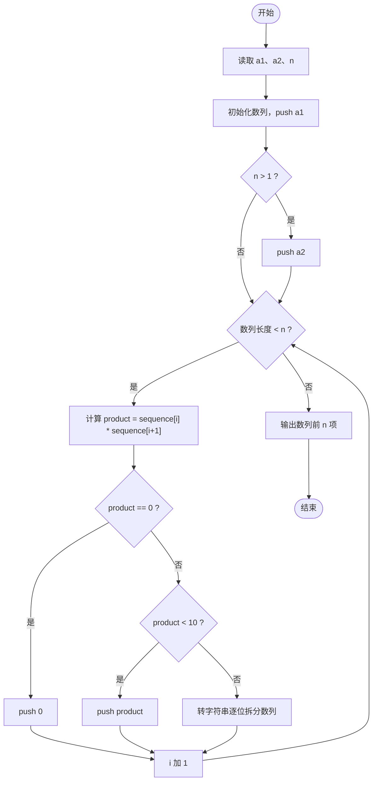
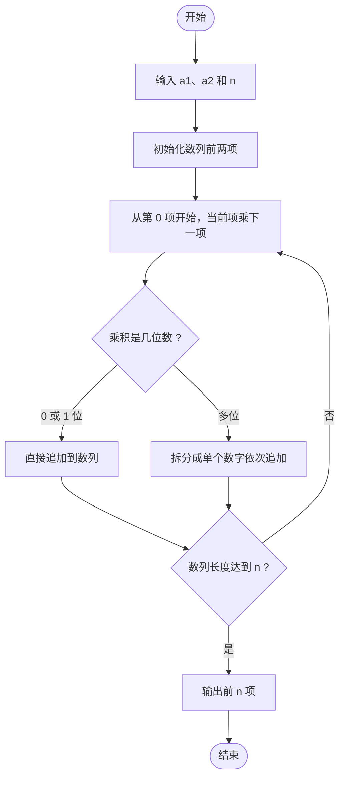

# L1-080 - 乘法口诀数列（20 分）

- **时间限制**: 400 ms
- **内存限制**: 65536 KB
- **代码长度限制**: 16 KB

---

## 题目描述

本题要求你从任意给定的两个 1 位数字 $$a_1$$ 和 $$a_2$$ 开始，用乘法口诀生成一个数列 {$$a_n$$}，规则为从 $$a_1$$ 开始顺次进行，每次将当前数字与后面一个数字相乘，将结果贴在数列末尾。如果结果不是 1 位数，则其每一位都应成为数列的一项。

### 输入格式:

输入在一行中给出 3 个整数，依次为 $$a_1$$、$$a_2$$ 和 $$n$$，满足 $$0\le a_1,a_2\le 9$$，$$0<n\le 10^3$$。

### 输出格式:

在一行中输出数列的前 $$n$$ 项。数字间以 1 个空格分隔，行首尾不得有多余空格。

### 输入样例:

```in
2 3 10
```

### 输出样例:

```out
2 3 6 1 8 6 8 4 8 4
```

## 样例解释：

数列前 2 项为 2 和 3。从 2 开始，因为 $$2\times 3=6$$，所以第 3 项是 6。因为 $$3\times 6=18$$，所以第 4、5 项分别是 1、8。依次类推…… 最后因为第 6 项有 $$6\times 8=48$$，对应第 10、11 项应该是 4、8。而因为只要求输出前 10 项，所以在输出 4 后结束。

## 示例

### 示例 1

**输入:**
```
2 3 10
```

**输出:**
```
2 3 6 1 8 6 8 4 8 4
```

---

## 题目详解

### 一、解题思路

本题的 R 实现采用以下方法：读取标准输入后建立题目所需的数据结构，按约束执行核心计算并输出结果。

### 二、代码流程说明

1. 读取并解析标准输入，转换为题目所需的数据结构。
2. 按题意执行核心算法，维护中间状态并处理边界情况。
3. 整理计算结果，按照输出格式生成答案。

### 三、代码实现

```r
# 实现原理：读取标准输入后建立题目所需的数据结构，按约束执行核心计算并输出结果。
# 处理流程：读取输入 -> 建立状态 -> 执行算法 -> 按题目格式输出。
# 关键变量和循环均直接对应题目中的数据、约束或操作。

# 读取并解析标准输入。
v <- scan(file = "stdin", quiet = TRUE)
a <- v[1]
b <- v[2]
n <- v[3]
s <- c(a, b)
i <- 1
# 按题目约束遍历当前数据，更新中间状态。
while (length(s) < n) {
    p <- s[i] * s[i + 1]
    s <- c(s, if (p >= 10) c(p%/%10, p%%10) else p)
    i <- i + 1
}
# 严格按照题目规定的输出格式输出答案。
cat(paste(s[1:n], collapse = " "), "\n", sep = "")
```

### 四、代码流程图



### 五、解题流程图



### 六、常见易错点

- 题目描述、输入格式、输出格式和输入输出样例必须保持原文不变。
- R 语言下标从 1 开始，注意编号转换和空输入边界。
- 输出时严格保留题目规定的空格、换行和小数位数。
