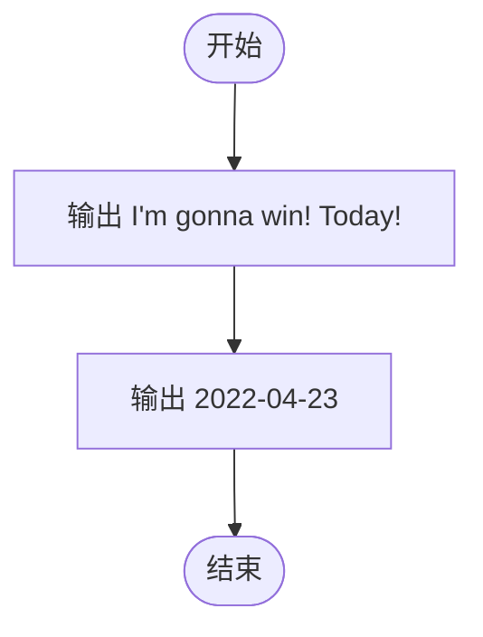
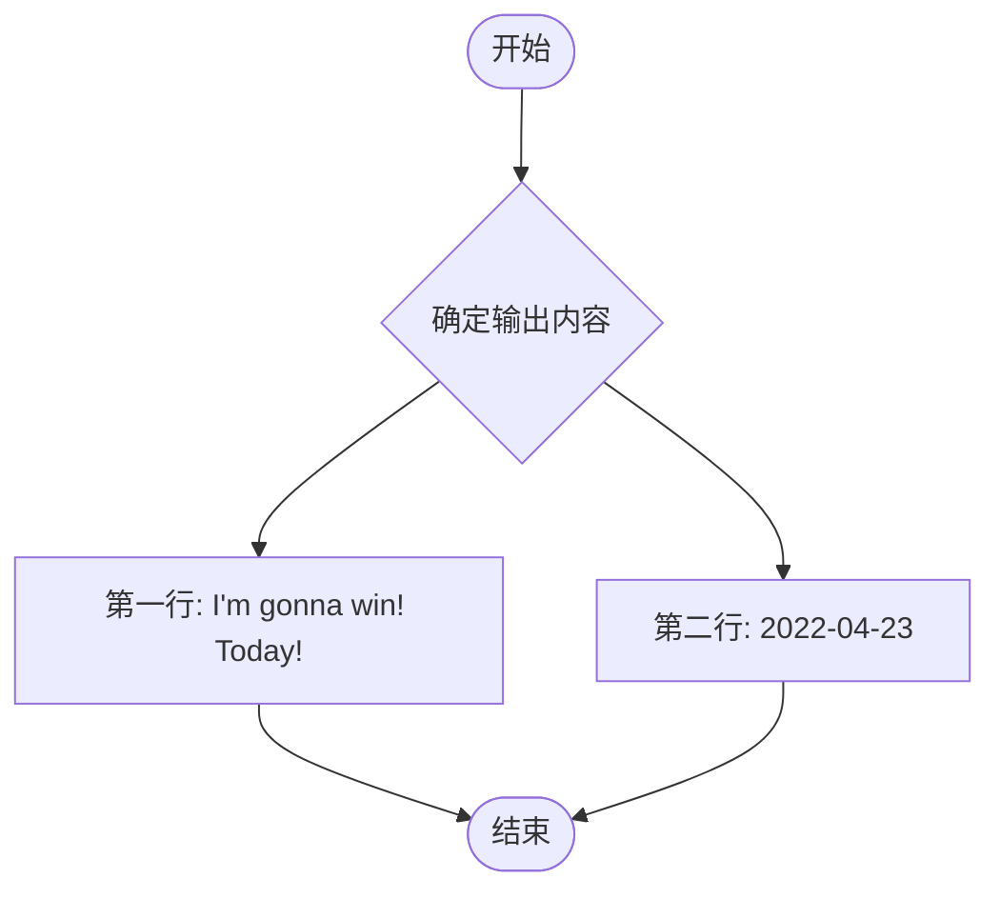

# L1-081 - 今天我要赢（5 分）

- **时间限制**: 400 ms
- **内存限制**: 65536 KB
- **代码长度限制**: 16 KB

---

## 题目描述

2018 年我们曾经出过一题，是输出“2018 我们要赢”。今年是 2022 年，你要输出的句子变成了“我要赢！就在今天！”然后以比赛当天的日期落款。

### 输入格式:

本题没有输入。

### 输出格式:

输出分 2 行。在第一行中输出 `I'm gonna win! Today!`，在第二行中用 `年年年年-月月-日日` 的格式输出比赛当天的日期。已知比赛的前一天是 `2022-04-22`。

### 输入样例:

```in
无
```

### 输出样例（第二行的内容要你自己想一想，这里不给出）：

```out
I'm gonna win! Today!
这一行的内容我不告诉你…… 你要自己输出正确的日期呀~
```

## 示例

### 示例 1

**输入:**
```
无
```

**输出:**
```
I'm gonna win! Today!
这一行的内容我不告诉你…… 你要自己输出正确的日期呀~
```

---

## 题目详解

### 一、解题思路

本题的 R 实现采用以下方法：题目要求输出固定内容，程序直接按规定文本和换行输出结果。

### 二、代码流程说明

1. 读取并解析标准输入，转换为题目所需的数据结构。
2. 按题意执行核心算法，维护中间状态并处理边界情况。
3. 整理计算结果，按照输出格式生成答案。

### 三、代码实现

```r
# 实现原理：题目要求输出固定内容，程序直接按规定文本和换行输出结果。
# 处理流程：读取输入 -> 建立状态 -> 执行算法 -> 按题目格式输出。
# 关键变量和循环均直接对应题目中的数据、约束或操作。

# 本题无输入，直接输出题目规定的固定文本。
# 严格按照题目规定的输出格式输出答案。
cat("I'm gonna win! Today!\n2022-04-23\n")
```

### 四、代码流程图



### 五、解题流程图



### 六、常见易错点

- 题目描述、输入格式、输出格式和输入输出样例必须保持原文不变。
- R 语言下标从 1 开始，注意编号转换和空输入边界。
- 输出时严格保留题目规定的空格、换行和小数位数。
