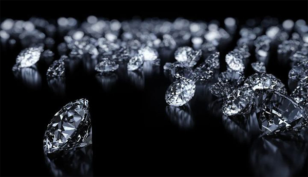
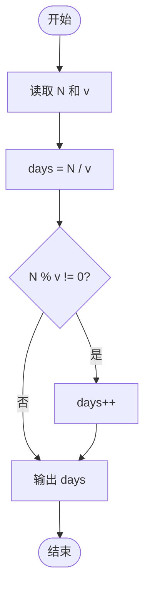
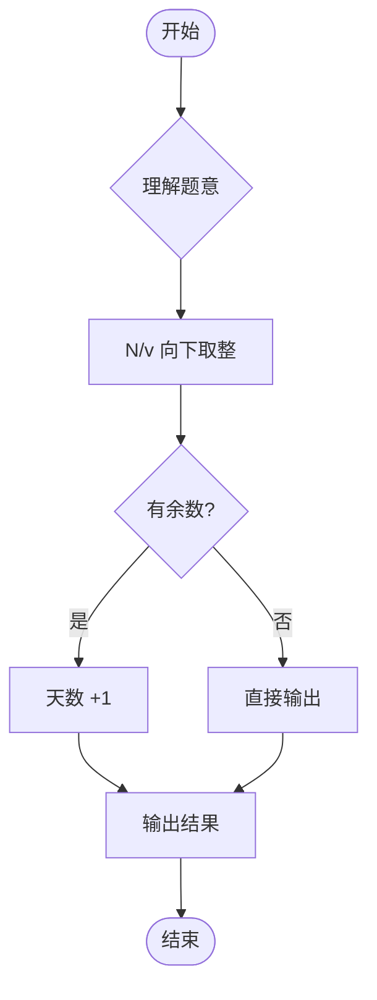

# L1-082 - 种钻石（5 分）

- **时间限制**: 400 ms
- **内存限制**: 65536 KB
- **代码长度限制**: 16 KB

---

## 题目描述



2019年10月29日，中央电视台专题报道，中国科学院在培育钻石领域，取得科技突破。科学家们用金刚石的籽晶片作为种子，利用甲烷气体在能量作用下形成碳的等离子体，慢慢地沉积到钻石种子上，一周“种”出了一颗 1 克拉大小的钻石。

本题给出钻石的需求量和人工培育钻石的速度，请你计算出货需要的时间。

### 输入格式:

输入在一行中给出钻石的需求量 $$N$$（不超过 $$10^7$$ 的正整数，以`微克拉`为单位）和人工培育钻石的速度 $$v$$（$$1\le v \le 200$$，以`微克拉/天`为单位的整数）。

### 输出格式:

在一行中输出培育 $$N$$ 微克拉钻石需要的整数天数。不到一天的时间不算在内。

### 输入样例:

```in
102000 130
```

### 输出样例:

```out
784
```

## 示例

### 示例 1

**输入:**
```
102000 130
```

**输出:**
```
784
```

---

## 题目详解

### 一、解题思路

本题的 R 实现采用以下方法：读取标准输入后建立题目所需的数据结构，按约束执行核心计算并输出结果。

### 二、代码流程说明

1. 读取并解析标准输入，转换为题目所需的数据结构。
2. 按题意执行核心算法，维护中间状态并处理边界情况。
3. 整理计算结果，按照输出格式生成答案。

### 三、代码实现

```r
# 实现原理：读取标准输入后建立题目所需的数据结构，按约束执行核心计算并输出结果。
# 处理流程：读取输入 -> 建立状态 -> 执行算法 -> 按题目格式输出。
# 关键变量和循环均直接对应题目中的数据、约束或操作。

# 读取并解析标准输入。
v <- scan(file = "stdin", quiet = TRUE)
# 严格按照题目规定的输出格式输出答案。
cat(v[1]%/%v[2], "\n", sep = "")
```

### 四、代码流程图



### 五、解题流程图



### 六、常见易错点

- 题目描述、输入格式、输出格式和输入输出样例必须保持原文不变。
- R 语言下标从 1 开始，注意编号转换和空输入边界。
- 输出时严格保留题目规定的空格、换行和小数位数。
