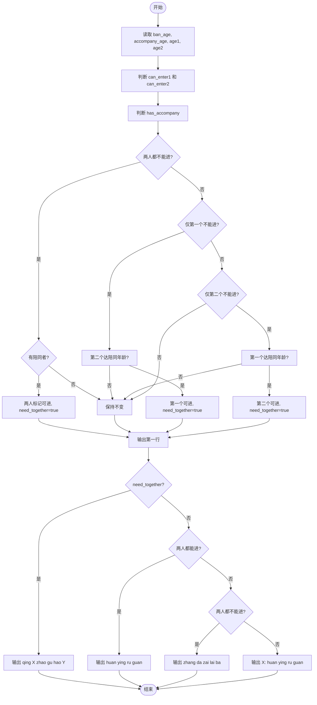
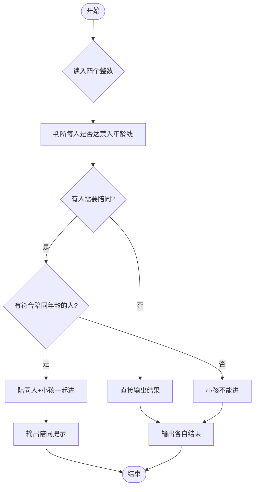

# L1-083 - 谁能进图书馆（10 分）

- **时间限制**: 400 ms
- **内存限制**: 65536 KB
- **代码长度限制**: 16 KB

---

## 题目描述

为了保障安静的阅读环境，有些公共图书馆对儿童入馆做出了限制。例如“12 岁以下儿童禁止入馆，除非有 18 岁以上（包括 18 岁）的成人陪同”。现在有两位小/大朋友跑来问你，他们能不能进去？请你写个程序自动给他们一个回复。

### 输入格式:

输入在一行中给出 4 个整数：
```
禁入年龄线 陪同年龄线 询问者1的年龄 询问者2的年龄
```

这里的`禁入年龄线`是指严格小于该年龄的儿童禁止入馆；`陪同年龄线`是指大于等于该年龄的人士可以陪同儿童入馆。默认两个询问者的编号依次分别为 `1` 和 `2`；年龄和年龄线都是 [1, 200] 区间内的整数，并且保证 `陪同年龄线` 严格大于 `禁入年龄线`。

### 输出格式:

在一行中输出对两位询问者的回答，如果可以进就输出 `年龄-Y`，否则输出 `年龄-N`，中间空 1 格，行首尾不得有多余空格。

在第二行根据两个询问者的情况输出一句话：

- 如果两个人必须一起进，则输出 `qing X zhao gu hao Y`，其中 `X` 是陪同人的编号， `Y` 是小孩子的编号；
- 如果两个人都可以进但不是必须一起的，则输出 `huan ying ru guan`；
- 如果两个人都进不去，则输出 `zhang da zai lai ba`；
- 如果一个人能进一个不能，则输出 `X: huan ying ru guan`，其中 `X` 是可以入馆的那个人的编号。

### 输入样例 1:

```in
12 18 18 8
```

### 输出样例 1:

```out
18-Y 8-Y
qing 1 zhao gu hao 2
```

### 输入样例 2:

```in
12 18 10 15
```

### 输出样例 2:

```out
10-N 15-Y
2: huan ying ru guan
```

## 示例

### 示例 1

**输入:**
```
12 18 18 8
```

**输出:**
```
18-Y 8-Y
qing 1 zhao gu hao 2
```

### 示例 2

**输入:**
```
12 18 10 15
```

**输出:**
```
10-N 15-Y
2: huan ying ru guan
```

---

## 题目详解

### 一、解题思路

本题的 R 实现采用以下方法：读取标准输入后建立题目所需的数据结构，按约束执行核心计算并输出结果。

### 二、代码流程说明

1. 读取并解析标准输入，转换为题目所需的数据结构。
2. 按题意执行核心算法，维护中间状态并处理边界情况。
3. 整理计算结果，按照输出格式生成答案。

### 三、代码实现

```r
# 实现原理：读取标准输入后建立题目所需的数据结构，按约束执行核心计算并输出结果。
# 处理流程：读取输入 -> 建立状态 -> 执行算法 -> 按题目格式输出。
# 关键变量和循环均直接对应题目中的数据、约束或操作。

# 读取并解析标准输入。
v <- scan(file = "stdin", quiet = TRUE)
f <- v[1]
c <- v[2]
a <- v[3]
b <- v[4]
t1 <- a < f && b >= c
t2 <- b < f && a >= c
x <- a >= f || t1
y <- b >= f || t2
# 严格按照题目规定的输出格式输出答案。
cat(a, "-", if (x) "Y" else "N", " ", b, "-", if (y) "Y" else "N",
    "\n", sep = "")
if (t1) cat("qing 2 zhao gu hao 1\n") else if (t2) cat("qing 1 zhao gu hao 2\n") else if (x &&
    y) cat("huan ying ru guan\n") else if (!x && !y) cat("zhang da zai lai ba\n") else cat(if (x) 1 else 2,
    ": huan ying ru guan\n", sep = "")
```

### 四、代码流程图



### 五、解题流程图



### 六、常见易错点

- 题目描述、输入格式、输出格式和输入输出样例必须保持原文不变。
- R 语言下标从 1 开始，注意编号转换和空输入边界。
- 输出时严格保留题目规定的空格、换行和小数位数。
