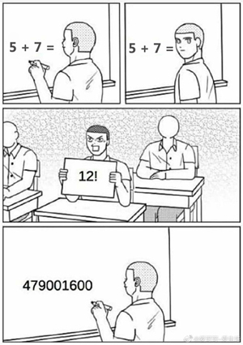
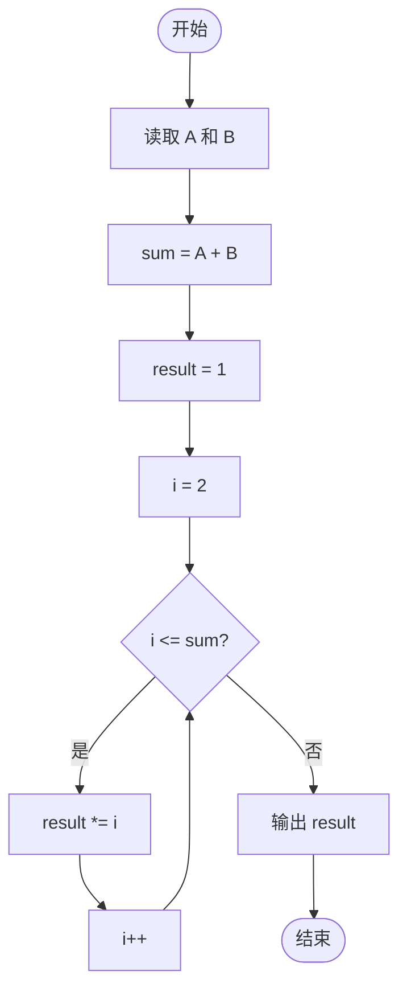
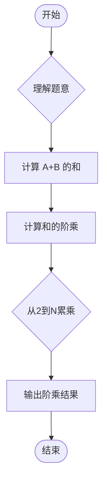

# L1-084 - 拯救外星人（10 分）

- **时间限制**: 400 ms
- **内存限制**: 65536 KB
- **代码长度限制**: 16 KB

---

## 题目描述



你的外星人朋友不认得地球上的加减乘除符号，但是会算阶乘 —— 正整数 N 的阶乘记为 “N!”，是从 1 到 N 的连乘积。所以当他不知道“5+7”等于多少时，如果你告诉他等于“12!”，他就写出了“479001600”这个答案。

本题就请你写程序模仿外星人的行为。

### 输入格式:

输入在一行中给出两个正整数 A 和 B。

### 输出格式:

在一行中输出 (A+B) 的阶乘。题目保证 (A+B) 的值小于 12。

### 输入样例:

```in
3 6
```

### 输出样例:

```out
362880
```

## 示例

### 示例 1

**输入:**
```
3 6
```

**输出:**
```
362880
```

---

## 题目详解

### 一、解题思路

本题的 R 实现采用以下方法：读取标准输入后建立题目所需的数据结构，按约束执行核心计算并输出结果。

### 二、代码流程说明

1. 读取并解析标准输入，转换为题目所需的数据结构。
2. 按题意执行核心算法，维护中间状态并处理边界情况。
3. 整理计算结果，按照输出格式生成答案。

### 三、代码实现

```r
# 实现原理：读取标准输入后建立题目所需的数据结构，按约束执行核心计算并输出结果。
# 处理流程：读取输入 -> 建立状态 -> 执行算法 -> 按题目格式输出。
# 关键变量和循环均直接对应题目中的数据、约束或操作。

# 读取并解析标准输入。
v <- scan(file = "stdin", quiet = TRUE)
# 严格按照题目规定的输出格式输出答案。
cat(prod(seq_len(v[1] + v[2])), "\n", sep = "")
```

### 四、代码流程图



### 五、解题流程图



### 六、常见易错点

- 题目描述、输入格式、输出格式和输入输出样例必须保持原文不变。
- R 语言下标从 1 开始，注意编号转换和空输入边界。
- 输出时严格保留题目规定的空格、换行和小数位数。
