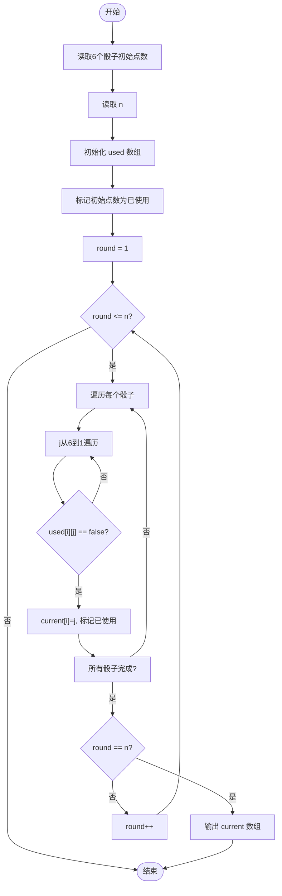
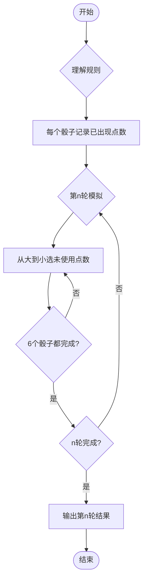

# L1-085 - 试试手气（15 分）

- **时间限制**: 400 ms
- **内存限制**: 65536 KB
- **代码长度限制**: 16 KB

---

## 题目描述


我们知道一个骰子有 6 个面，分别刻了 1 到 6 个点。下面给你 6 个骰子的初始状态，即它们朝上一面的点数，让你一把抓起摇出另一套结果。假设你摇骰子的手段特别精妙，每次摇出的结果都满足以下两个条件：

- 1、每个骰子摇出的点数都跟它之前任何一次出现的点数不同；
- 2、在满足条件 1 的前提下，每次都能让每个骰子得到可能得到的最大点数。

那么你应该可以预知自己第 $$n$$ 次（$$1\le n\le 5$$）摇出的结果。

### 输入格式:

输入第一行给出 6 个骰子的初始点数，即 [1,6] 之间的整数，数字间以空格分隔；第二行给出摇的次数 $$n$$（$$1\le n\le 5$$）。

### 输出格式:

在一行中顺序列出第 $$n$$ 次摇出的每个骰子的点数。数字间必须以 1 个空格分隔，行首位不得有多余空格。

### 输入样例:

```in
3 6 5 4 1 4
3

```

### 输出样例:

```out
4 3 3 3 4 3

```

## 样例解释：

这 3 次摇出的结果依次为：

```
6 5 6 6 6 6
5 4 4 5 5 5
4 3 3 3 4 3
```

## 示例

### 示例 1

**输入:**
```
3 6 5 4 1 4
3

```

**输出:**
```
4 3 3 3 4 3

```

---

## 题目详解

### 一、解题思路

本题的 R 实现采用以下方法：读取标准输入后建立题目所需的数据结构，按约束执行核心计算并输出结果。

### 二、代码流程说明

1. 读取并解析标准输入，转换为题目所需的数据结构。
2. 按题意执行核心算法，维护中间状态并处理边界情况。
3. 整理计算结果，按照输出格式生成答案。

### 三、代码实现

```r
# 实现原理：读取标准输入后建立题目所需的数据结构，按约束执行核心计算并输出结果。
# 处理流程：读取输入 -> 建立状态 -> 执行算法 -> 按题目格式输出。
# 关键变量和循环均直接对应题目中的数据、约束或操作。

# 读取并解析标准输入。
v <- scan(file = "stdin", quiet = TRUE)
init <- v[1:6]
n <- v[7]
out <- integer(6)
# 按题目约束遍历当前数据，更新中间状态。
for (i in seq_len(6)) {
    k <- n
    for (y in 6:1) {
        if (y != init[i])
            k <- k - 1
        if (k == 0) {
            out[i] <- y
            break
        }
    }
}
# 严格按照题目规定的输出格式输出答案。
cat(paste(out, collapse = " "), "\n", sep = "")
```

### 四、代码流程图



### 五、解题流程图



### 六、常见易错点

- 题目描述、输入格式、输出格式和输入输出样例必须保持原文不变。
- R 语言下标从 1 开始，注意编号转换和空输入边界。
- 输出时严格保留题目规定的空格、换行和小数位数。
