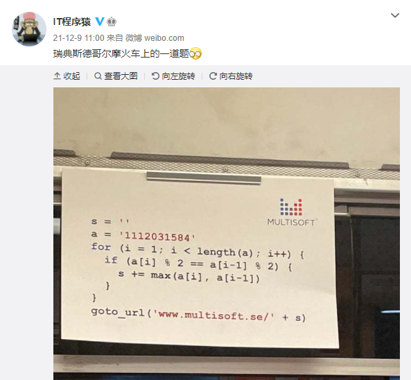
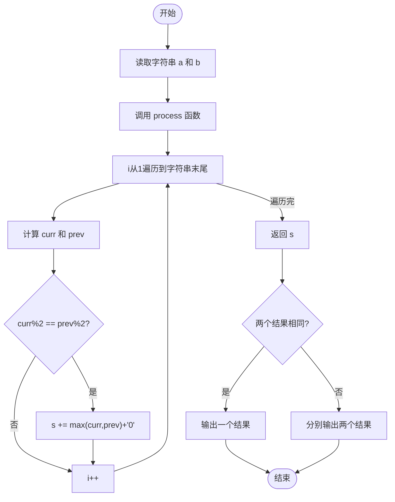
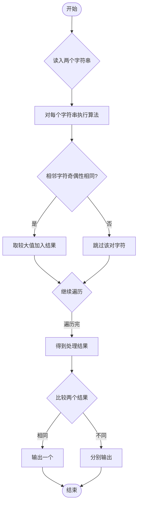

# L1-086 - 斯德哥尔摩火车上的题（15 分）

- **时间限制**: 400 ms
- **内存限制**: 65536 KB
- **代码长度限制**: 16 KB

---

## 题目描述



上图是新浪微博上的一则趣闻，是瑞典斯德哥尔摩火车上的一道题，看上去是段伪代码：

```
s = ''
a = '1112031584'
for (i = 1; i < length(a); i++) {
  if (a[i] % 2 == a[i-1] % 2) {
    s += max(a[i], a[i-1])
  }
}
goto_url('www.multisoft.se/' + s)
```

其中字符串的 `+` 操作是连接两个字符串的意思。所以这道题其实是让大家访问网站 `www.multisoft.se/112358`（**注意：比赛中千万不要访问这个网址！！！**）。

当然，能通过上述算法得到 `112358` 的原始字符串 `a` 是不唯一的。本题就请你判断，两个给定的原始字符串，能否通过上述算法得到相同的输出？

### 输入格式:

输入为两行仅由数字组成的非空字符串，长度均不超过 $$10^4$$，以回车结束。

### 输出格式:

对两个字符串分别采用上述斯德哥尔摩火车上的算法进行处理。如果两个结果是一样的，则在一行中输出那个结果；否则分别输出各自对应的处理结果，每个占一行。题目保证输出结果不为空。

### 输入样例 1:

```in
1112031584
011102315849

```

### 输出样例 1:

```out
112358

```

### 输入样例 2:

```in
111203158412334
12341112031584

```

### 输出样例 2:

```out
1123583
112358

```

## 示例

### 示例 1

**输入:**
```
1112031584
011102315849

```

**输出:**
```
112358

```

### 示例 2

**输入:**
```
111203158412334
12341112031584

```

**输出:**
```
1123583
112358

```

---

## 题目详解

### 一、解题思路

本题的 R 实现采用以下方法：按行或按字段解析输入，使用字符串或序列操作完成题目要求的变换，并按格式输出。

### 二、代码流程说明

1. 读取并解析标准输入，转换为题目所需的数据结构。
2. 按题意执行核心算法，维护中间状态并处理边界情况。
3. 整理计算结果，按照输出格式生成答案。

### 三、代码实现

```r
# 实现原理：按行或按字段解析输入，使用字符串或序列操作完成题目要求的变换，并按格式输出。
# 处理流程：读取输入 -> 建立状态 -> 执行算法 -> 按题目格式输出。
# 关键变量和循环均直接对应题目中的数据、约束或操作。

# 读取并解析标准输入。
x <- readLines("stdin", warn = FALSE)[1:2]
f <- function(s) {
    z <- strsplit(trimws(s), "", fixed = TRUE)[[1]]
    if (length(z) < 2)
        return("")
    out <- character()
# 按题目约束遍历当前数据，更新中间状态。
    for (i in 2:length(z)) if (as.integer(z[i - 1])%%2 == as.integer(z[i])%%2)
        out <- c(out, max(z[i - 1], z[i]))
    paste(out, collapse = "")
}
a <- f(x[1])
b <- f(x[2])
# 严格按照题目规定的输出格式输出答案。
cat(a, "\n", sep = "")
if (a != b) cat(b, "\n", sep = "")
```

### 四、代码流程图



### 五、解题流程图



### 六、常见易错点

- 题目描述、输入格式、输出格式和输入输出样例必须保持原文不变。
- R 语言下标从 1 开始，注意编号转换和空输入边界。
- 输出时严格保留题目规定的空格、换行和小数位数。
