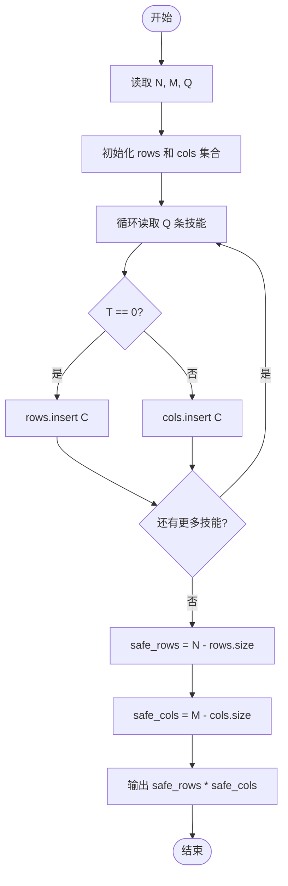
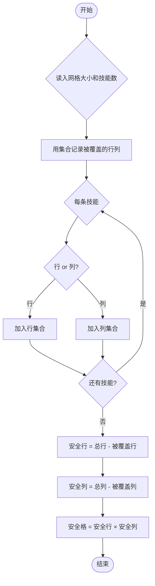

# L1-087 - 机工士姆斯塔迪奥（20 分）

- **时间限制**: 400 ms
- **内存限制**: 65536 KB
- **代码长度限制**: 16 KB

---

## 题目描述

在 MMORPG《最终幻想14》的副本“乐欲之所瓯博讷修道院”里，BOSS 机工士姆斯塔迪奥将会接受玩家的挑战。

你需要处理这个副本其中的一个机制：$N \times M$ 大小的地图被拆分为了 $N \times M$ 个 $1 \times 1$ 的格子，BOSS 会选择若干行或/及若干列释放技能，玩家不能站在释放技能的方格上，否则就会被击中而失败。

给定 BOSS 所有释放技能的行或列信息，请你计算出最后有多少个格子是安全的。

### 输入格式:

输入第一行是三个整数 $N, M, Q$ ($1 \le N \times M \le 10^5$，$0 \le Q \le 1000$)，表示地图为 $N$ 行 $M$ 列大小以及选择的行/列数量。

接下来 $Q$ 行，每行两个数 $T_i, C_i$，其中 $T_i = 0$ 表示 BOSS 选择的是一整行，$T_i = 1$ 表示选择的是一整列，$C_i$ 为选择的行号/列号。行和列的编号均从 1 开始。

### 输出格式:

输出一个数，表示安全格子的数量。

### 输入样例:

```in
5 5 3
0 2
0 4
1 3
```

### 输出样例:

```out
12
```

## 示例

### 示例 1

**输入:**
```
5 5 3
0 2
0 4
1 3
```

**输出:**
```
12
```

---

## 题目详解

### 一、解题思路

本题的 R 实现采用以下方法：读取标准输入后建立题目所需的数据结构，按约束执行核心计算并输出结果。

### 二、代码流程说明

1. 读取并解析标准输入，转换为题目所需的数据结构。
2. 按题意执行核心算法，维护中间状态并处理边界情况。
3. 整理计算结果，按照输出格式生成答案。

### 三、代码实现

```r
# 实现原理：读取标准输入后建立题目所需的数据结构，按约束执行核心计算并输出结果。
# 处理流程：读取输入 -> 建立状态 -> 执行算法 -> 按题目格式输出。
# 关键变量和循环均直接对应题目中的数据、约束或操作。

# 读取并解析标准输入。
v <- scan(file = "stdin", quiet = TRUE)
n <- v[1]
m <- v[2]
q <- v[3]
p <- 4
r <- integer(n)
c <- integer(m)
# 按题目约束遍历当前数据，更新中间状态。
for (i in seq_len(q)) {
    t <- v[p]
    x <- v[p + 1]
    p <- p + 2
    if (t == 0)
        r[x] <- 1
    else c[x] <- 1
}
# 严格按照题目规定的输出格式输出答案。
cat((n - sum(r)) * (m - sum(c)), "\n", sep = "")
```

### 四、代码流程图



### 五、解题流程图



### 六、常见易错点

- 题目描述、输入格式、输出格式和输入输出样例必须保持原文不变。
- R 语言下标从 1 开始，注意编号转换和空输入边界。
- 输出时严格保留题目规定的空格、换行和小数位数。
