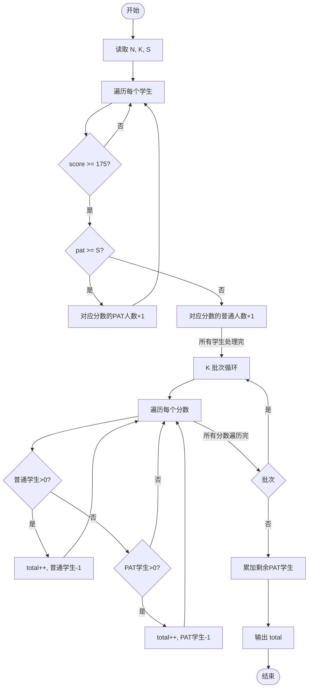
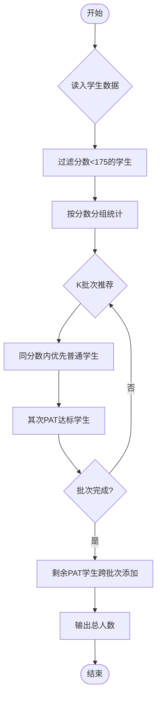

# L1-088 - 静静的推荐（20 分）

- **时间限制**: 200 ms
- **内存限制**: 65536 KB
- **代码长度限制**: 16 KB

---

## 题目描述

天梯赛结束后，某企业的人力资源部希望组委会能推荐一批优秀的学生，这个整理推荐名单的任务就由静静姐负责。企业接受推荐的流程是这样的：

- 只考虑得分不低于 175 分的学生；
- 一共接受 $$K$$ 批次的推荐名单；
- 同一批推荐名单上的学生的成绩原则上应严格递增；
- 如果有的学生天梯赛成绩虽然与前一个人相同，但其参加过 PAT 考试，且成绩达到了该企业的面试分数线，则也可以接受。

给定全体参赛学生的成绩和他们的 PAT 考试成绩，请你帮静静姐算一算，她最多能向企业推荐多少学生？

### 输入格式:

输入第一行给出 3 个正整数：$$N$$（$$\le 10^5$$）为参赛学生人数，$$K$$（$$\le 5\times 10^3$$）为企业接受的推荐批次，$$S$$（$$\le 100$$）为该企业的 PAT 面试分数线。

随后 $$N$$ 行，每行给出两个分数，依次为一位学生的天梯赛分数（最高分 290）和 PAT 分数（最高分 100）。

### 输出格式:

在一行中输出静静姐最多能向企业推荐的学生人数。

### 输入样例:

```in
10 2 90
203 0
169 91
175 88
175 0
175 90
189 0
189 0
189 95
189 89
256 100
```

### 输出样例:

```out
8
```

## 样例解释：

第一批可以选择 175、189、203、256 这四个分数的学生各一名，此外 175 分 PAT 分数达到 90 分的学生和 189 分 PAT 分数达到 95 分的学生可以额外进入名单。第二批就只剩下 175、189 两个分数的学生各一名可以进入名单了。最终一共 8 人进入推荐名单。

## 示例

### 示例 1

**输入:**
```
10 2 90
203 0
169 91
175 88
175 0
175 90
189 0
189 0
189 95
189 89
256 100
```

**输出:**
```
8
```

---

## 题目详解

### 一、解题思路

本题的 R 实现采用以下方法：读取标准输入后建立题目所需的数据结构，按约束执行核心计算并输出结果。

### 二、代码流程说明

1. 读取并解析标准输入，转换为题目所需的数据结构。
2. 按题意执行核心算法，维护中间状态并处理边界情况。
3. 整理计算结果，按照输出格式生成答案。

### 三、代码实现

```r
# 实现原理：读取标准输入后建立题目所需的数据结构，按约束执行核心计算并输出结果。
# 处理流程：读取输入 -> 建立状态 -> 执行算法 -> 按题目格式输出。
# 关键变量和循环均直接对应题目中的数据、约束或操作。

# 读取并解析标准输入。
v <- scan(file = "stdin", quiet = TRUE)
n <- v[1]
k <- v[2]
line <- v[3]
p <- 4
ans <- 0
low <- numeric()
# 按题目约束遍历当前数据，更新中间状态。
for (i in seq_len(n)) {
    score <- v[p]
    pat <- v[p + 1]
    p <- p + 2
    if (score >= 175) {
        if (pat >= line)
            ans <- ans + 1
        else low <- c(low, score)
    }
}
# 严格按照题目规定的输出格式输出答案。
cat(ans + sum(pmin(k, as.numeric(table(low)))), "\n", sep = "")
```

### 四、代码流程图



### 五、解题流程图



### 六、常见易错点

- 题目描述、输入格式、输出格式和输入输出样例必须保持原文不变。
- R 语言下标从 1 开始，注意编号转换和空输入边界。
- 输出时严格保留题目规定的空格、换行和小数位数。
