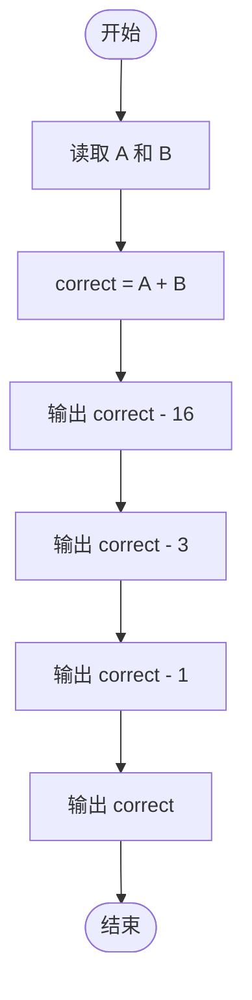
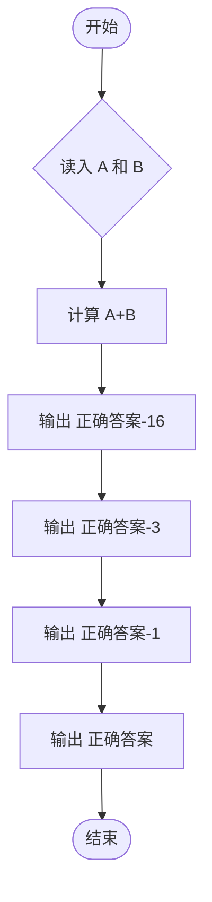

# L1-090 - 什么是机器学习（5 分）

- **时间限制**: 400 ms
- **内存限制**: 65536 KB
- **代码长度限制**: 16 KB

---

## 题目描述


什么是机器学习？上图展示了一段面试官与“机器学习程序”的对话：
```
面试官：9 + 10 等于多少？
答：3
面试官：差远了，是19。
答：16
面试官：错了，是19。
答：18
面试官：不，是19。
答：19
```
本题就请你模仿这个“机器学习程序”的行为。

### 输入格式:

输入在一行中给出两个整数，绝对值都不超过 100，中间用一个空格分开，分别表示面试官给出的两个数字 A 和 B。
### 输出格式:

要求你输出 4 行，每行一个数字。第 1 行比正确结果少 16，第 2 行少 3，第 3 行少 1，最后一行才输出 A+B 的正确结果。
### 输入样例:

```in
9 10
```
### 输出样例:

```out
3
16
18
19
```

## 示例

### 示例 1

**输入:**
```
9 10
```

**输出:**
```
3
16
18
19
```

---

## 题目详解

### 一、解题思路

本题的 R 实现采用以下方法：读取标准输入后建立题目所需的数据结构，按约束执行核心计算并输出结果。

### 二、代码流程说明

1. 读取并解析标准输入，转换为题目所需的数据结构。
2. 按题意执行核心算法，维护中间状态并处理边界情况。
3. 整理计算结果，按照输出格式生成答案。

### 三、代码实现

```r
# 实现原理：读取标准输入后建立题目所需的数据结构，按约束执行核心计算并输出结果。
# 处理流程：读取输入 -> 建立状态 -> 执行算法 -> 按题目格式输出。
# 关键变量和循环均直接对应题目中的数据、约束或操作。

# 读取并解析标准输入。
v <- scan(file = "stdin", quiet = TRUE)
s <- sum(v)
# 严格按照题目规定的输出格式输出答案。
cat(paste(c(s - 16, s - 3, s - 1, s), collapse = "\n"), "\n",
    sep = "")
```

### 四、代码流程图



### 五、解题流程图



### 六、常见易错点

- 题目描述、输入格式、输出格式和输入输出样例必须保持原文不变。
- R 语言下标从 1 开始，注意编号转换和空输入边界。
- 输出时严格保留题目规定的空格、换行和小数位数。
