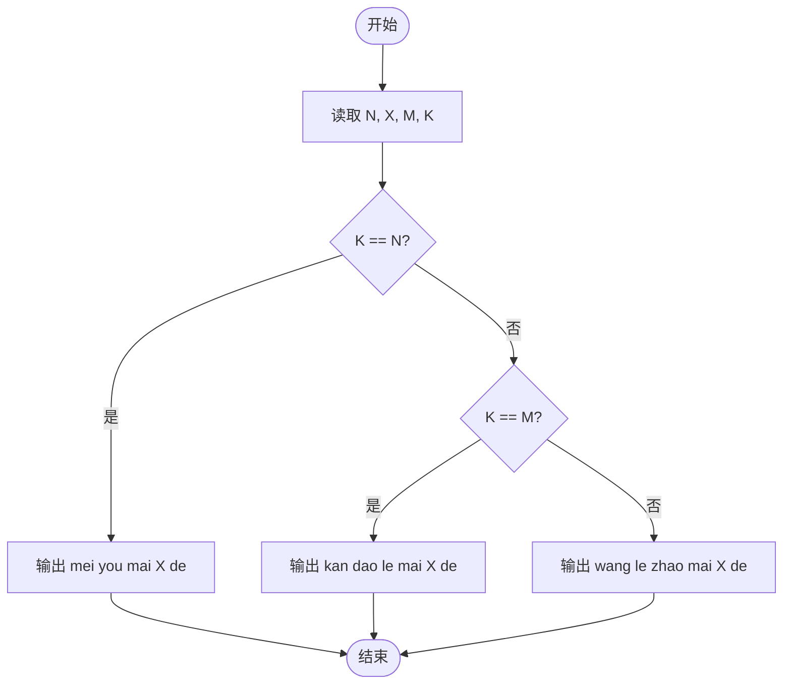
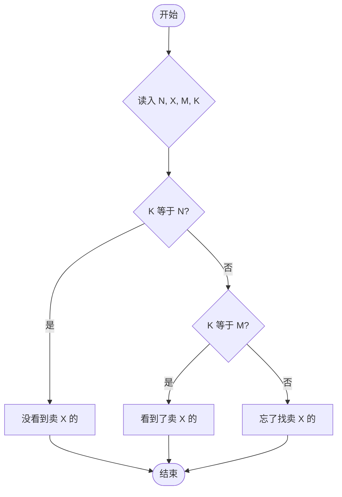

# L1-091 - 程序员买包子（10 分）

- **时间限制**: 400 ms
- **内存限制**: 65536 KB
- **代码长度限制**: 16 KB

---

## 题目描述


这是一条检测真正程序员的段子：假如你被家人要求下班顺路买十只包子，如果看到卖西瓜的，买一只。那么你会在什么情况下只买一只包子回家？
本题要求你考虑这个段子的通用版：假如你被要求下班顺路买 $$N$$ 只包子，如果看到卖 $$X$$ 的，买 $$M$$ 只。那么如果你最后买了 $$K$$ 只包子回家，说明你看到卖 $$X$$ 的没有呢？

### 输入格式:

输入在一行中顺序给出题面中的 $$N$$、$$X$$、$$M$$、$$K$$，以空格分隔。其中 $$N$$、$$M$$ 和 $$K$$ 为不超过 1000 的正整数，$$X$$ 是一个长度不超过 10 的、仅由小写英文字母组成的字符串。题目保证 $$N\neq M$$。
### 输出格式:

在一行中输出结论，格式为：
- 如果 $$K=N$$，输出 `mei you mai X de`；
- 如果 $$K=M$$，输出 `kan dao le mai X de`；
- 否则输出 `wang le zhao mai X de`.
其中 `X` 是输入中给定的字符串 $$X$$。

### 输入样例 1:

```in
10 xigua 1 10
```
### 输出样例 1:

```out
mei you mai xigua de
```
### 输入样例 2:

```in
10 huanggua 1 1
```
### 输出样例 2:

```out
kan dao le mai huanggua de
```
### 输入样例 3:

```in
10 shagua 1 250
```
### 输出样例 3:

```out
wang le zhao mai shagua de
```

## 示例

### 示例 1

**输入:**
```
10 xigua 1 10
```

**输出:**
```
mei you mai xigua de
```

### 示例 2

**输入:**
```
10 huanggua 1 1
```

**输出:**
```
kan dao le mai huanggua de
```

### 示例 3

**输入:**
```
10 shagua 1 250
```

**输出:**
```
wang le zhao mai shagua de
```

---

## 题目详解

### 一、解题思路

本题的 R 实现采用以下方法：读取标准输入后建立题目所需的数据结构，按约束执行核心计算并输出结果。

### 二、代码流程说明

1. 读取并解析标准输入，转换为题目所需的数据结构。
2. 按题意执行核心算法，维护中间状态并处理边界情况。
3. 整理计算结果，按照输出格式生成答案。

### 三、代码实现

```r
# 实现原理：读取标准输入后建立题目所需的数据结构，按约束执行核心计算并输出结果。
# 处理流程：读取输入 -> 建立状态 -> 执行算法 -> 按题目格式输出。
# 关键变量和循环均直接对应题目中的数据、约束或操作。

# 读取并解析标准输入。
v <- scan(file = "stdin", what = "", quiet = TRUE)
n <- as.integer(v[1])
item <- v[2]
m <- as.integer(v[3])
a <- as.integer(v[4])
msg <- if (a == n) "mei you" else if (a == m) "kan dao le" else "wang le zhao"
# 严格按照题目规定的输出格式输出答案。
cat(msg, "mai", item, "de\n", sep = " ")
```

### 四、代码流程图



### 五、解题流程图



### 六、常见易错点

- 题目描述、输入格式、输出格式和输入输出样例必须保持原文不变。
- R 语言下标从 1 开始，注意编号转换和空输入边界。
- 输出时严格保留题目规定的空格、换行和小数位数。
