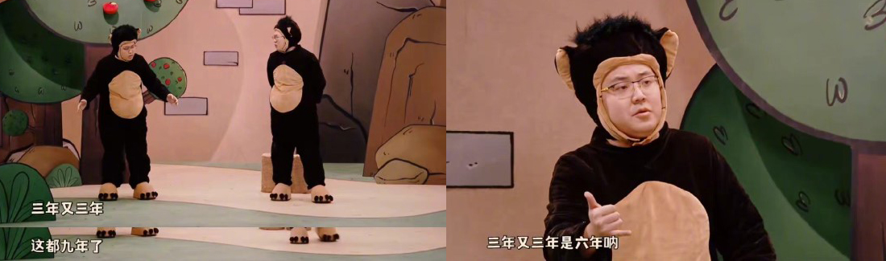
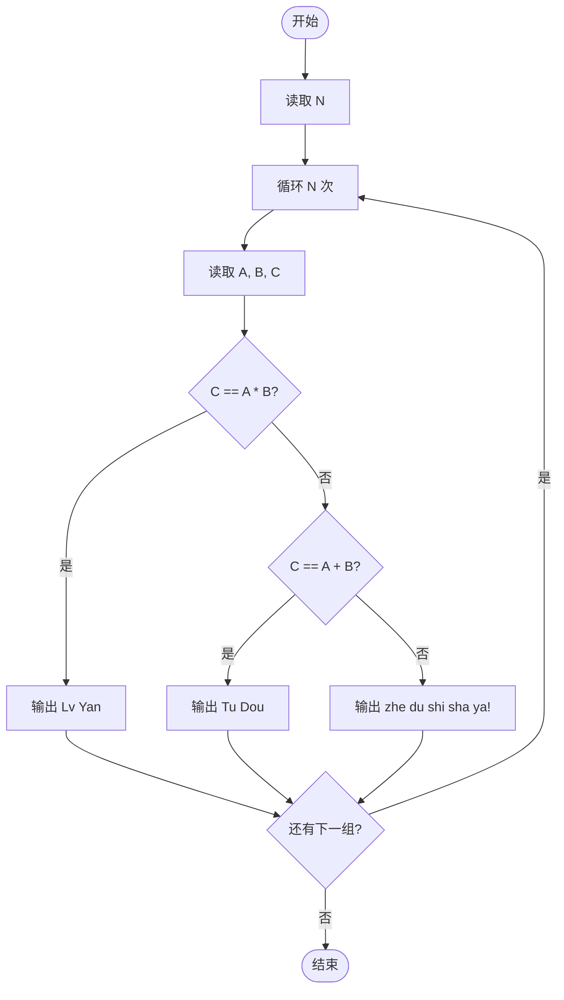
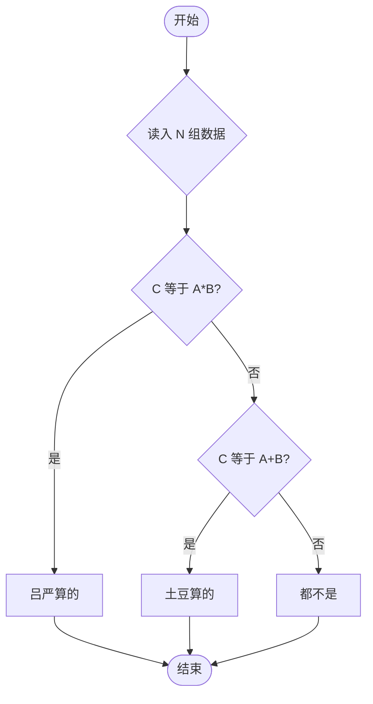

# L1-092 - 进化论（10 分）

- **时间限制**: 400 ms
- **内存限制**: 65536 KB
- **代码长度限制**: 16 KB

---

## 题目描述



在“一年一度喜剧大赛”上有一部作品《进化论》，讲的是动物园两只猩猩进化的故事。猩猩吕严说自己已经进化了 9 年了，因为“三年又三年”。猩猩土豆指出“三年又三年是六年呐”……
本题给定两个数字，以及用这两个数字计算的结果，要求你根据结果判断，这是吕严算出来的，还是土豆算出来的。

### 输入格式:

输入第一行给出一个正整数 $$N$$，随后 $$N$$ 行，每行给出三个正整数 $$A$$、$$B$$ 和 $$C$$。其中 $$C$$ 不超过 10000，其他三个数字都不超过 100。
### 输出格式:

对每一行给出的三个数，如果 $$C$$ 是 $$A\times B$$，就在一行中输出 `Lv Yan`；如果是 $$A+B$$，就在一行中输出 `Tu Dou`；如果都不是，就在一行中输出 `zhe du shi sha ya!`。

### 输入样例:

```in
3
3 3 9
3 3 6
3 3 12
```
### 输出样例:

```out
Lv Yan
Tu Dou
zhe du shi sha ya!
```

## 示例

### 示例 1

**输入:**
```
3
3 3 9
3 3 6
3 3 12
```

**输出:**
```
Lv Yan
Tu Dou
zhe du shi sha ya!
```

---

## 题目详解

### 一、解题思路

本题的 R 实现采用以下方法：读取标准输入后建立题目所需的数据结构，按约束执行核心计算并输出结果。

### 二、代码流程说明

1. 读取并解析标准输入，转换为题目所需的数据结构。
2. 按题意执行核心算法，维护中间状态并处理边界情况。
3. 整理计算结果，按照输出格式生成答案。

### 三、代码实现

```r
# 实现原理：读取标准输入后建立题目所需的数据结构，按约束执行核心计算并输出结果。
# 处理流程：读取输入 -> 建立状态 -> 执行算法 -> 按题目格式输出。
# 关键变量和循环均直接对应题目中的数据、约束或操作。

# 读取并解析标准输入。
v <- scan(file = "stdin", quiet = TRUE)
n <- v[1]
p <- 2
# 按题目约束遍历当前数据，更新中间状态。
for (i in seq_len(n)) {
    a <- v[p]
    b <- v[p + 1]
    c <- v[p + 2]
    p <- p + 3
# 严格按照题目规定的输出格式输出答案。
    cat(if (c == a * b)
        "Lv Yan"
    else if (c == a + b)
        "Tu Dou"
    else "zhe du shi sha ya!", "\n", sep = "")
}
```

### 四、代码流程图



### 五、解题流程图



### 六、常见易错点

- 题目描述、输入格式、输出格式和输入输出样例必须保持原文不变。
- R 语言下标从 1 开始，注意编号转换和空输入边界。
- 输出时严格保留题目规定的空格、换行和小数位数。
