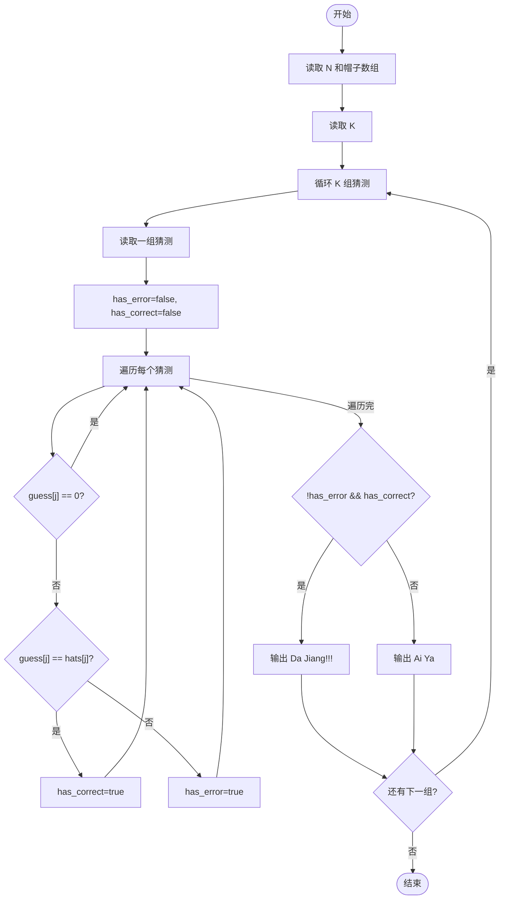
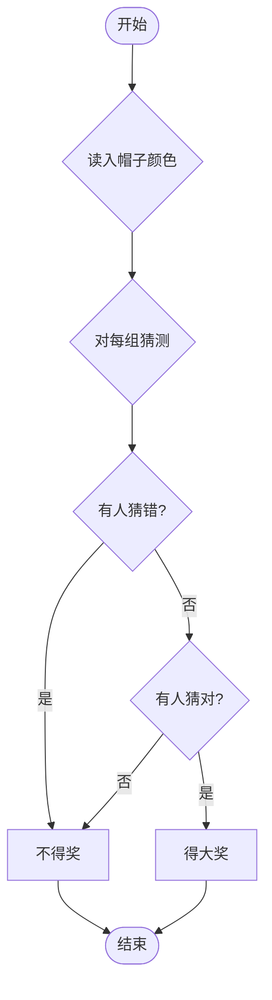

# L1-093 - 猜帽子游戏（15 分）

- **时间限制**: 400 ms
- **内存限制**: 65536 KB
- **代码长度限制**: 16 KB

---

## 题目描述


宝宝们在一起玩一个猜帽子游戏。每人头上被扣了一顶帽子，有的是黑色的，有的是黄色的。每个人可以看到别人头上的帽子，但是看不到自己的。游戏开始后，每个人可以猜自己头上的帽子是什么颜色，或者可以弃权不猜。如果没有一个人猜错、并且至少有一个人猜对了，那么所有的宝宝共同获得一个大奖。如果所有人都不猜，或者只要有一个人猜错了，所有宝宝就都没有奖。
下面顺序给出一排帽子的颜色，假设每一群宝宝来玩的时候，都是按照这个顺序发帽子的。然后给出每一群宝宝们猜的结果，请你判断他们能不能得大奖。

### 输入格式:

输入首先在一行中给出一个正整数 $$N$$（$$2 < N \le 100$$），是帽子的个数。第二行给出 $$N$$ 顶帽子的颜色，数字 `1` 表示黑色，`2` 表示黄色。
再下面给出一个正整数 $$K$$（$$\le 10$$），随后 $$K$$ 行，每行给出一群宝宝们猜的结果，除了仍然用数字 `1` 表示黑色、`2` 表示黄色之外，`0` 表示这个宝宝弃权不猜。
同一行中的数字用空格分隔。
### 输出格式:

对于每一群玩游戏的宝宝，如果他们能获得大奖，就在一行中输出 `Da Jiang!!!`，否则输出 `Ai Ya`。
### 输入样例:

```in
5
1 1 2 1 2
3
0 1 2 0 0
0 0 0 0 0
1 2 2 0 2
```
### 输出样例:

```out
Da Jiang!!!
Ai Ya
Ai Ya
```

## 示例

### 示例 1

**输入:**
```
5
1 1 2 1 2
3
0 1 2 0 0
0 0 0 0 0
1 2 2 0 2
```

**输出:**
```
Da Jiang!!!
Ai Ya
Ai Ya
```

---

## 题目详解

### 一、解题思路

本题的 R 实现采用以下方法：读取标准输入后建立题目所需的数据结构，按约束执行核心计算并输出结果。

### 二、代码流程说明

1. 读取并解析标准输入，转换为题目所需的数据结构。
2. 按题意执行核心算法，维护中间状态并处理边界情况。
3. 整理计算结果，按照输出格式生成答案。

### 三、代码实现

```r
# 实现原理：读取标准输入后建立题目所需的数据结构，按约束执行核心计算并输出结果。
# 处理流程：读取输入 -> 建立状态 -> 执行算法 -> 按题目格式输出。
# 关键变量和循环均直接对应题目中的数据、约束或操作。

# 读取并解析标准输入。
v <- scan(file = "stdin", quiet = TRUE)
n <- v[1]
hat <- v[2:(n + 1)]
m <- v[n + 2]
p <- n + 3
# 按题目约束遍历当前数据，更新中间状态。
for (i in seq_len(m)) {
    g <- v[p:(p + n - 1)]
    p <- p + n
    ok <- any(g != 0) && all(g == 0 | g == hat)
# 严格按照题目规定的输出格式输出答案。
    cat(if (ok)
        "Da Jiang!!!"
    else "Ai Ya", "\n", sep = "")
}
```

### 四、代码流程图



### 五、解题流程图



### 六、常见易错点

- 题目描述、输入格式、输出格式和输入输出样例必须保持原文不变。
- R 语言下标从 1 开始，注意编号转换和空输入边界。
- 输出时严格保留题目规定的空格、换行和小数位数。
