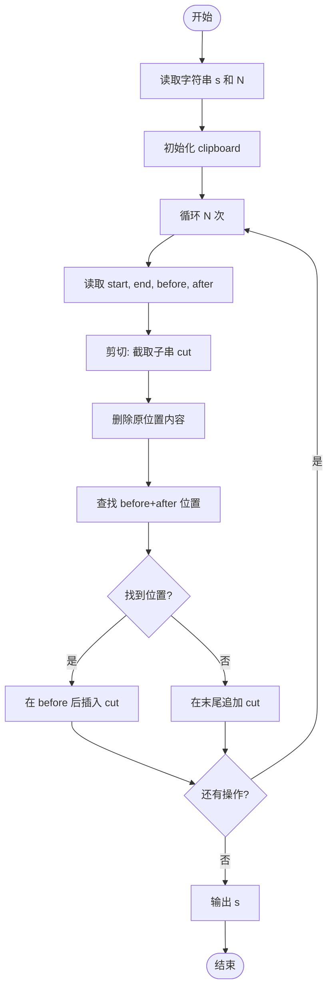
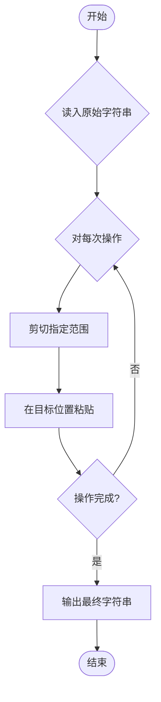

# L1-094 - 剪切粘贴（15 分）

- **时间限制**: 400 ms
- **内存限制**: 65536 KB
- **代码长度限制**: 16 KB

---

## 题目描述

使用计算机进行文本编辑时常见的功能是剪切功能（快捷键：Ctrl + X）。请实现一个简单的具有剪切和粘贴功能的文本编辑工具。

工具需要完成一系列剪切后粘贴的操作，每次操作分为两步：

* 剪切：给定需操作的起始位置和结束位置，将当前字符串中起始位置到结束位置部分的字符串放入剪贴板中，并删除当前字符串对应位置的内容。例如，当前字符串为 `abcdefg`，起始位置为 3，结束位置为 5，则剪贴操作后， 剪贴板内容为 `cde`，操作后字符串变为 `abfg`。字符串位置从 1 开始编号。
* 粘贴：给定插入位置的前后字符串，寻找到插入位置，将剪贴板内容插入到位置中，并清除剪贴板内容。例如，对于上面操作后的结果，给定插入位置前为 `bf`，插入位置后为 `g`，则插入后变为 `abfcdeg`。如找不到应该插入的位置，则直接将插入位置设置为字符串最后，仍然完成插入操作。查找字符串时区分大小写。

每次操作后的字符串即为新的当前字符串。在若干次操作后，请给出最后的编辑结果。

### 输入格式:

输入第一行是一个长度小于等于 200 的字符串 $S$，表示原始字符串。字符串只包含所有可见 ASCII 字符，不包含回车与空格。

第二行是一个正整数 $N$ ($1 \le N \le 100$)，表示要进行的操作次数。

接下来的 $N$ 行，每行是两个数字和两个**长度不大于 5** 的不包含空格的非空字符串，前两个数字表示需要剪切的位置，后两个字符串表示插入位置前和后的字符串，用一个空格隔开。如果有多个可插入的位置，选择最靠近当前操作字符串开头的一个。

剪切的位置保证总是合法的。

### 输出格式:

输出一行，表示操作后的字符串。

### 输入样例:

```in
AcrosstheGreatWall,wecanreacheverycornerintheworld
5
10 18 ery cor
32 40 , we
1 6 tW all
14 18 rnerr eache
1 1 e r

```

### 输出样例:

```out
he,allcornetrrwecaneacheveryGreatWintheworldAcross
```

**题目引用自团体程序设计天梯赛真题（2023年）。**

## 示例

### 示例 1

**输入:**
```
AcrosstheGreatWall,wecanreacheverycornerintheworld
5
10 18 ery cor
32 40 , we
1 6 tW all
14 18 rnerr eache
1 1 e r

```

**输出:**
```
he,allcornetrrwecaneacheveryGreatWintheworldAcross
```

---

## 题目详解

### 一、解题思路

本题的 R 实现采用以下方法：读取标准输入后建立题目所需的数据结构，按约束执行核心计算并输出结果。

### 二、代码流程说明

1. 读取并解析标准输入，转换为题目所需的数据结构。
2. 按题意执行核心算法，维护中间状态并处理边界情况。
3. 整理计算结果，按照输出格式生成答案。

### 三、代码实现

```r
# 实现原理：读取标准输入后建立题目所需的数据结构，按约束执行核心计算并输出结果。
# 处理流程：读取输入 -> 建立状态 -> 执行算法 -> 按题目格式输出。
# 关键变量和循环均直接对应题目中的数据、约束或操作。

# 读取并解析标准输入。
v <- scan(file = "stdin", what = "", quiet = TRUE)
s <- v[1]
n <- as.integer(v[2])
p <- 3
# 按题目约束遍历当前数据，更新中间状态。
for (i in seq_len(n)) {
    l <- as.integer(v[p])
    r <- as.integer(v[p + 1])
    before <- v[p + 2]
    after <- v[p + 3]
    p <- p + 4
    clip <- substr(s, l, r)
    s <- paste0(substr(s, 1, l - 1), substr(s, r + 1, nchar(s)))
    pos <- regexpr(paste0(before, after), s, fixed = TRUE)[1]
    if (pos < 0)
        pos <- nchar(s) + 1
    else pos <- pos + nchar(before)
    s <- paste0(substr(s, 1, pos - 1), clip, substr(s, pos, nchar(s)))
}
# 严格按照题目规定的输出格式输出答案。
cat(s, "\n", sep = "")
```

### 四、代码流程图



### 五、解题流程图



### 六、常见易错点

- 题目描述、输入格式、输出格式和输入输出样例必须保持原文不变。
- R 语言下标从 1 开始，注意编号转换和空输入边界。
- 输出时严格保留题目规定的空格、换行和小数位数。
