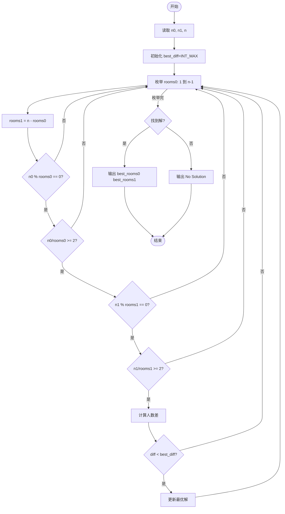
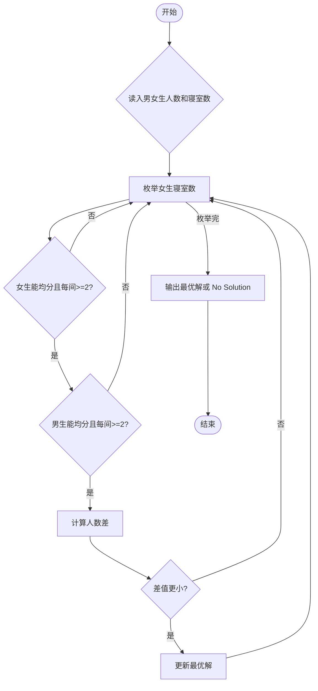

# L1-095 - 分寝室（20 分）

- **时间限制**: 400 ms
- **内存限制**: 65536 KB
- **代码长度限制**: 16 KB

---

## 题目描述

学校新建了宿舍楼，共有 $n$ 间寝室。等待分配的学生中，有女生 $n_0$ 位、男生 $n_1$ 位。所有待分配的学生都必须分到一间寝室。所有的寝室都要分出去，最后不能有寝室留空。\
现请你写程序完成寝室的自动分配。分配规则如下：

* 男女生不能混住；
* 不允许单人住一间寝室；
* 对每种性别的学生，每间寝室入住的人数都必须相同；例如不能出现一部分寝室住 2 位女生，一部分寝室住 3 位女生的情况。但女生寝室都是 2 人一间，男生寝室都是 3 人一间，则是允许的；
* 在有多种分配方案满足前面三项要求的情况下，要求两种性别每间寝室入住的人数差最小。

### 输入格式:

输入在一行中给出 3 个正整数 $n_0$、$n_1$、$n$，分别对应女生人数、男生人数、寝室数。数字间以空格分隔，均不超过 $10^5$。

### 输出格式:

在一行中顺序输出女生和男生被分配的寝室数量，其间以 1 个空格分隔。行首尾不得有多余空格。\
如果有解，题目保证解是唯一的。如果无解，则在一行中输出 `No Solution`。

### 输入样例 1:

```in
24 60 10
```

### 输出样例 1:

```out
4 6
```

**注意：**输出的方案对应女生都是 24/4=6 人间、男生都是 60/6=10 人间，人数差为 4。满足前三项要求的分配方案还有两种，即女生 6 间（都是 4 人间）、男生 4 间（都是 15 人间）；或女生 8 间（都是 3 人间）、男生 2 间（都是 30 人间）。但因为人数差都大于 4 而不被采用。

### 输入样例 2:

```in
29 30 10
```

### 输出样例 2:

```out
No Solution
```

**感谢浙江警官职业学院楼满芳老师斧正数据！**

## 示例

### 示例 1

**输入:**
```
24 60 10
```

**输出:**
```
4 6
```

### 示例 2

**输入:**
```
29 30 10
```

**输出:**
```
No Solution
```

---

## 题目详解

### 一、解题思路

本题的 R 实现采用以下方法：读取标准输入后建立题目所需的数据结构，按约束执行核心计算并输出结果。

### 二、代码流程说明

1. 读取并解析标准输入，转换为题目所需的数据结构。
2. 按题意执行核心算法，维护中间状态并处理边界情况。
3. 整理计算结果，按照输出格式生成答案。

### 三、代码实现

```r
# 实现原理：读取标准输入后建立题目所需的数据结构，按约束执行核心计算并输出结果。
# 处理流程：读取输入 -> 建立状态 -> 执行算法 -> 按题目格式输出。
# 关键变量和循环均直接对应题目中的数据、约束或操作。

# 读取并解析标准输入。
v <- scan(file = "stdin", quiet = TRUE)
g <- v[1]
b <- v[2]
n <- v[3]
best <- NULL
# 按题目约束遍历当前数据，更新中间状态。
for (x in seq_len(n - 1)) {
    y <- n - x
    if (g%%x == 0 && b%%y == 0 && g%/%x >= 2 && b%/%y >= 2) {
        z <- abs(g%/%x - b%/%y)
        if (is.null(best) || z < best[1])
            best <- c(z, x, y)
    }
}
# 严格按照题目规定的输出格式输出答案。
if (is.null(best)) cat("No Solution\n") else cat(paste(best[2], best[3]),
    "\n", sep = "")
```

### 四、代码流程图



### 五、解题流程图



### 六、常见易错点

- 题目描述、输入格式、输出格式和输入输出样例必须保持原文不变。
- R 语言下标从 1 开始，注意编号转换和空输入边界。
- 输出时严格保留题目规定的空格、换行和小数位数。
