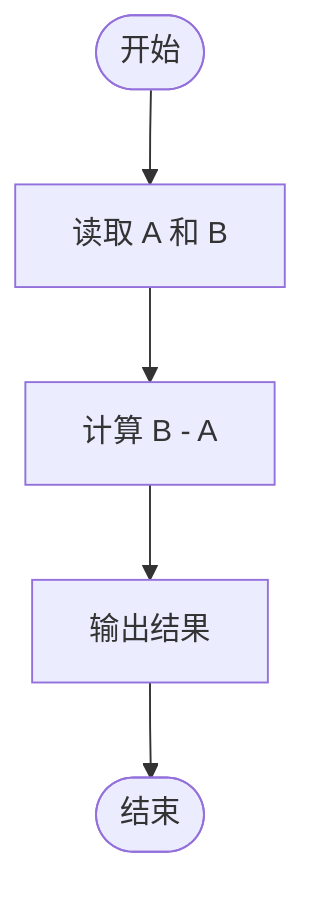
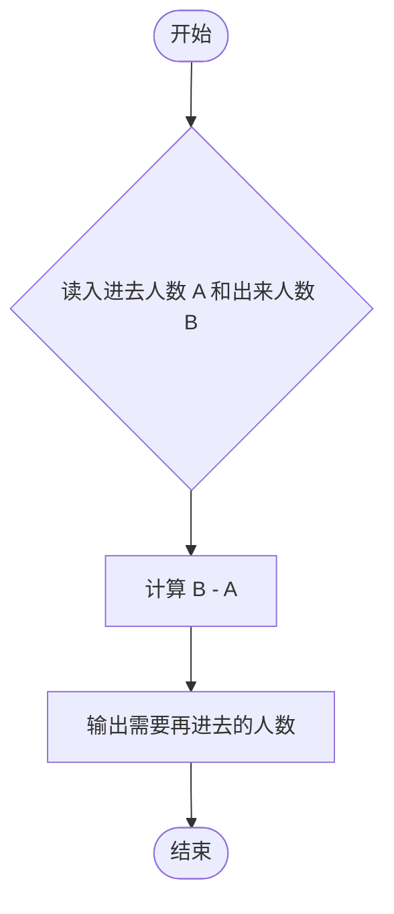

# L1-098 - 再进去几个人（5 分）

- **时间限制**: 400 ms
- **内存限制**: 65536 KB
- **代码长度限制**: 16 KB

---

## 题目描述


数学家、生物学家和物理学家坐在街头咖啡屋里，看着人们从街对面的一间房子走进走出。他们先看到两个人进去。时光流逝。他们又看到三个人出来。
物理学家:“测量不够准确。”
生物学家:“他们进行了繁殖。”
数学家:“如果现在再进去一个人，那房子就空了。”
下面就请你写个程序，根据进去和出来的人数，帮数学家算出来，再进去几个人，那房子就空了。

### 输入格式:

输入在一行中给出 2 个不超过 100 的正整数 A 和 B，其中 A 是进去的人数，B 是出来的人数。题目保证 B 比 A 要大。
### 输出格式:

在一行中输出使得房子变空的、需要再进去的人数。
### 输入样例:

```in
4 7
```
### 输出样例:

```out
3
```

## 示例

### 示例 1

**输入:**
```
4 7
```

**输出:**
```
3
```

---

## 题目详解

### 一、解题思路

本题的 R 实现采用以下方法：读取标准输入后建立题目所需的数据结构，按约束执行核心计算并输出结果。

### 二、代码流程说明

1. 读取并解析标准输入，转换为题目所需的数据结构。
2. 按题意执行核心算法，维护中间状态并处理边界情况。
3. 整理计算结果，按照输出格式生成答案。

### 三、代码实现

```r
# 实现原理：读取标准输入后建立题目所需的数据结构，按约束执行核心计算并输出结果。
# 处理流程：读取输入 -> 建立状态 -> 执行算法 -> 按题目格式输出。
# 关键变量和循环均直接对应题目中的数据、约束或操作。

# 读取并解析标准输入。
v <- scan(file = "stdin", quiet = TRUE)
# 严格按照题目规定的输出格式输出答案。
cat(v[2] - v[1], "\n", sep = "")
```

### 四、代码流程图



### 五、解题流程图



### 六、常见易错点

- 题目描述、输入格式、输出格式和输入输出样例必须保持原文不变。
- R 语言下标从 1 开始，注意编号转换和空输入边界。
- 输出时严格保留题目规定的空格、换行和小数位数。
