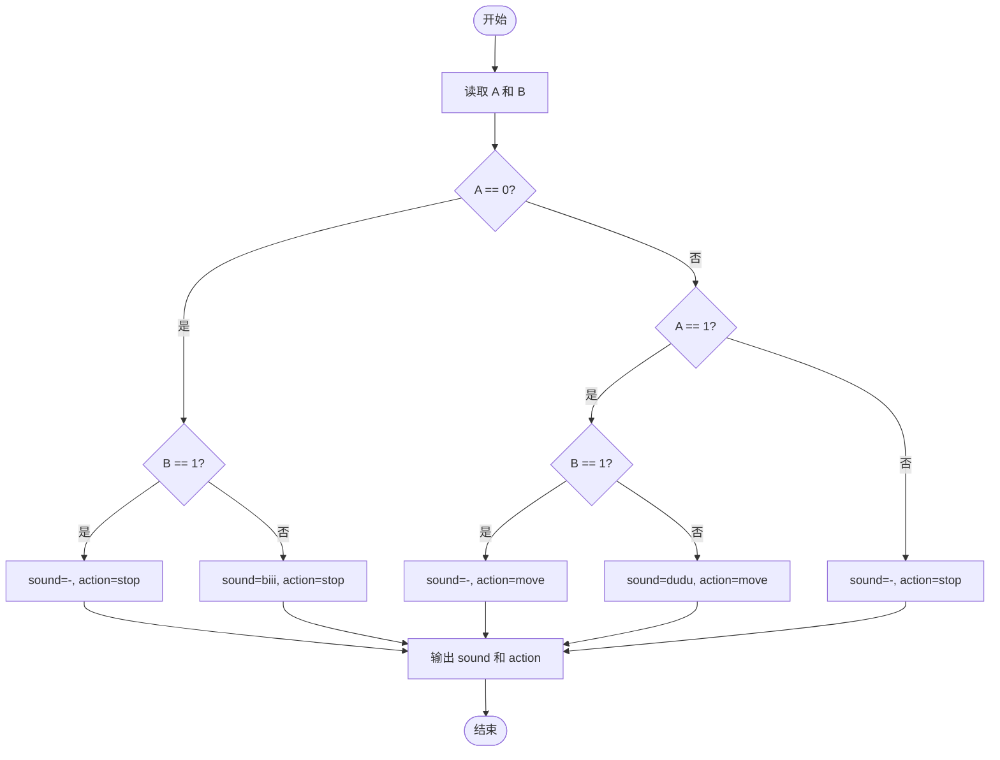
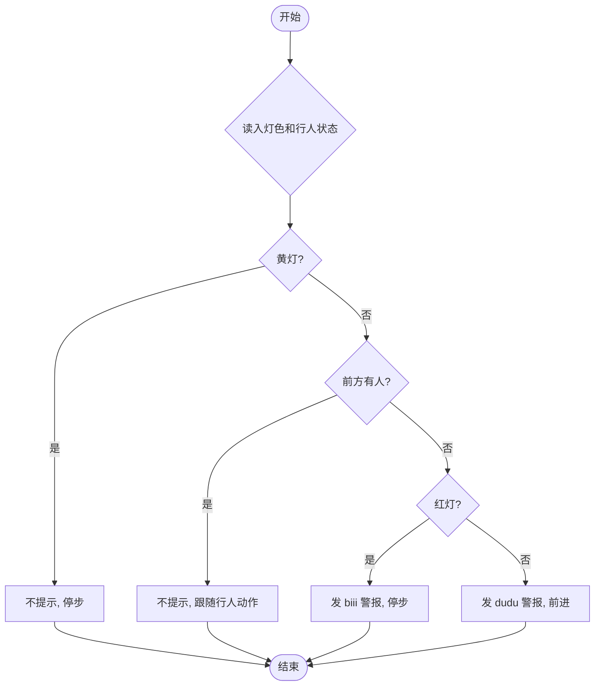

# L1-099 - 帮助色盲（10 分）

- **时间限制**: 400 ms
- **内存限制**: 65536 KB
- **代码长度限制**: 16 KB

---

## 题目描述


在古老的红绿灯面前，红绿色盲患者无法分辨当前亮起的灯是红色还是绿色，有些聪明人通过路口的策略是这样的：当红灯或绿灯亮起时，灯的颜色无法判断，但前方两米内有同向行走的人，就跟着前面那人行动，人家走就跟着走，人家停就跟着停；如果当前是黄灯，那么很快就要变成红灯了，于是应该停下来。麻烦的是，当灯的颜色无法判断时，前方两米内没有人……
本题就请你写一个程序，通过产生不同的提示音来帮助红绿色盲患者判断当前交通灯的颜色；但当患者可以自行判断的时候（例如黄灯或者前方两米内有人），就不做多余的打扰。具体要求的功能为：当前交通灯为红灯或绿灯时，检测其前方两米内是否有同向行走的人 —— 如果有，则患者自己可以判断，程序就不做提示；如果没有，则根据灯的颜色给出不同的提示音。黄灯也不需要给出提示。

### 输入格式:

输入在一行中给出两个数字 A 和 B，其间以空格分隔。其中 A 是当前交通灯的颜色，取值为 0 表示红灯、1 表示绿灯、2 表示黄灯；B 是前方行人的状态，取值为 0 表示前方两米内没有同向行走的人、1 表示有。
### 输出格式:

根据输入的状态在第一行中输出提示音：`dudu` 表示前方为绿灯，可以继续前进；`biii` 表示前方为红灯，应该止步；`-` 表示不做提示。在第二行输出患者应该执行的动作：`move` 表示继续前进、`stop` 表示止步。
### 输入样例 1:

```in
0 0
```
### 输出样例 1:

```out
biii
stop
```
### 输入样例 2:

```in
1 1
```
### 输出样例 2:

```out
-
move
```

## 示例

### 示例 1

**输入:**
```
0 0
```

**输出:**
```
biii
stop
```

### 示例 2

**输入:**
```
1 1
```

**输出:**
```
-
move
```

---

## 题目详解

### 一、解题思路

本题的 R 实现采用以下方法：读取标准输入后建立题目所需的数据结构，按约束执行核心计算并输出结果。

### 二、代码流程说明

1. 读取并解析标准输入，转换为题目所需的数据结构。
2. 按题意执行核心算法，维护中间状态并处理边界情况。
3. 整理计算结果，按照输出格式生成答案。

### 三、代码实现

```r
# 实现原理：读取标准输入后建立题目所需的数据结构，按约束执行核心计算并输出结果。
# 处理流程：读取输入 -> 建立状态 -> 执行算法 -> 按题目格式输出。
# 关键变量和循环均直接对应题目中的数据、约束或操作。

# 读取并解析标准输入。
v <- scan(file = "stdin", quiet = TRUE)
a <- v[1]
b <- v[2]
# 严格按照题目规定的输出格式输出答案。
cat(if (b == 0 && a == 0) "biii" else if (b == 0 && a < 2) "dudu" else "-",
    "\n", sep = "")
cat(if (a == 1) "move" else "stop", "\n", sep = "")
```

### 四、代码流程图



### 五、解题流程图



### 六、常见易错点

- 题目描述、输入格式、输出格式和输入输出样例必须保持原文不变。
- R 语言下标从 1 开始，注意编号转换和空输入边界。
- 输出时严格保留题目规定的空格、换行和小数位数。
