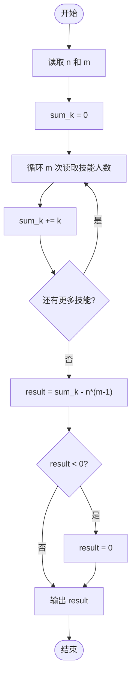
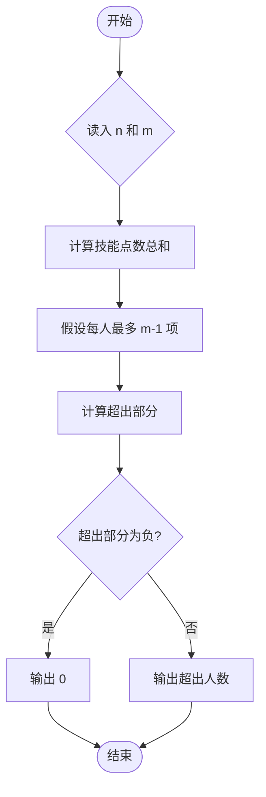

# L1-100 - 四项全能（10 分）

- **时间限制**: 400 ms
- **内存限制**: 65536 KB
- **代码长度限制**: 16 KB

---

## 题目描述


新浪微博上有一个帖子给出了一道题：全班有 50 人，有 30 人会游泳，有 35 人会篮球，有 42 人会唱歌，有 46 人会骑车，至少有（ ）人四项都会。
发帖人不会做这道题，但是回帖有会做的：每一个才艺是一个技能点，一共是 30 + 35 + 42 + 46 = 153 个技能点，50 个人假设平均分配，每人都会 3 个技能那也只有 150，所以至少有 3 人会四个技能。
本题就请你写个程序来自动解决这类问题：给定全班总人数为 $n$，其中有 $m$ 项技能，分别有 $k_1$、$k_2$、……、$k_m$ 个人会，问至少有多少人 $m$ 项都会。

### 输入格式:

输入在第一行中给出 2 个正整数：$n$（$4\le n\le 1000$）和 $m$（$1<m\le n/2$），分别对应全班人数和技能总数。随后一行给出 $m$ 个不超过 $n$ 的正整数，其中第 $i$ 个整数对应会第 $i$ 项技能的人数。
### 输出格式:

输出至少有多少人 $m$ 项都会。
### 输入样例:

```in
50 4
30 35 42 46
```
### 输出样例:

```out
3
```

## 示例

### 示例 1

**输入:**
```
50 4
30 35 42 46
```

**输出:**
```
3
```

---

## 题目详解

### 一、解题思路

本题的 R 实现采用以下方法：读取标准输入后建立题目所需的数据结构，按约束执行核心计算并输出结果。

### 二、代码流程说明

1. 读取并解析标准输入，转换为题目所需的数据结构。
2. 按题意执行核心算法，维护中间状态并处理边界情况。
3. 整理计算结果，按照输出格式生成答案。

### 三、代码实现

```r
# 实现原理：读取标准输入后建立题目所需的数据结构，按约束执行核心计算并输出结果。
# 处理流程：读取输入 -> 建立状态 -> 执行算法 -> 按题目格式输出。
# 关键变量和循环均直接对应题目中的数据、约束或操作。

# 读取并解析标准输入。
v <- scan(file = "stdin", quiet = TRUE)
n <- v[1]
m <- v[2]
# 严格按照题目规定的输出格式输出答案。
cat(max(0, sum(v[3:length(v)]) - n * (m - 1)), "\n", sep = "")
```

### 四、代码流程图



### 五、解题流程图



### 六、常见易错点

- 题目描述、输入格式、输出格式和输入输出样例必须保持原文不变。
- R 语言下标从 1 开始，注意编号转换和空输入边界。
- 输出时严格保留题目规定的空格、换行和小数位数。
