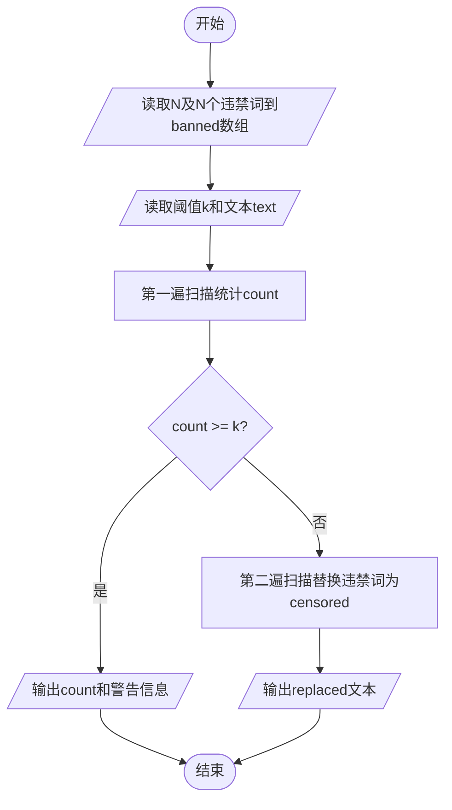
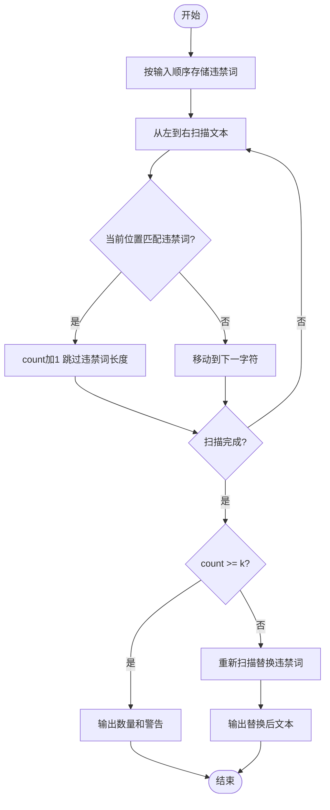

# L1-101 - 别再来这么多猫娘了！（15 分）

- **时间限制**: 400 ms
- **内存限制**: 65536 KB
- **代码长度限制**: 16 KB

---

## 题目描述

以 GPT 技术为核心的人工智能系统出现后迅速引领了行业的变革，不仅用于大量的语言工作（如邮件编写或文章生成等工作），还被应用在一些较特殊的领域——例如去年就有同学尝试使用 ChatGPT 作弊并被当场逮捕（全校被取消成绩）。相信聪明的你一定不会犯一样的错误！

言归正传，对于 GPT 类的 AI，一个使用方式受到不少年轻用户的欢迎——将 AI 变成猫娘：

<br/>


*部分公司使用 AI 进行网络营销，网友同样乐于使用“变猫娘”的方式进行反击。注意：图中内容与题目无关，如无法看到图片不影响解题。*

<br/>

当然，由于训练数据里并不区分道德或伦理倾向，因此如果不加审查，AI 会生成大量的、不一定符合社会公序良俗的内容。尽管关于这个问题仍有争论，但至少在比赛中，我们还是期望 AI 能用于对人类更有帮助的方向上，少来一点猫娘。

因此你的工作是实现一个审查内容的代码，用于对 AI 生成的内容的初步审定。更具体地说，你会得到一段由大小写字母、数字、空格及 ASCII 码范围内的标点符号的文字，以及若干个违禁词以及警告阈值，你需要首先检查内容里有多少违禁词，如果少于阈值个，则简单地将违禁词替换为```<censored>```；如果大于等于阈值个，则直接输出一段警告并输出有几个违禁词。

### 输入格式:

输入第一行是一个正整数 $N$ ($1 \le N \le 100$)，表示违禁词的数量。接下来的 $N$ 行，每行一个长度不超过 10 的、只包含大小写字母、数字及 ASCII 码范围内的标点符号的单词，表示应当屏蔽的违禁词。
然后的一行是一个非负整数 $k$ ($0 \le k \le 100$)，表示违禁词的阈值。
最后是一行不超过 5000 个字符的字符串，表示需要检查的文字。
从左到右处理文本，违禁词则按照输入顺序依次处理；对于有重叠的情况，无论计数还是替换，查找完成后从违禁词末尾继续处理。

### 输出格式:

如果违禁词数量小于阈值，则输出替换后的文本；否则先输出一行一个数字，表示违禁词的数量，然后输出```He Xie Ni Quan Jia!```。

### 输入样例 1:

```in
5
MaoNiang
SeQing
BaoLi
WeiGui
BuHeShi
4
BianCheng MaoNiang ba! WeiGui De Hua Ye Keyi Shuo! BuYao BaoLi NeiRong.

```

### 输出样例 1:

```out
BianCheng <censored> ba! <censored> De Hua Ye Keyi Shuo! BuYao <censored> NeiRong.
```

### 输入样例 2:

```in
5
MaoNiang
SeQing
BaoLi
WeiGui
BuHeShi
3
BianCheng MaoNiang ba! WeiGui De Hua Ye Keyi Shuo! BuYao BaoLi NeiRong.

```

### 输出样例 2:

```out
3
He Xie Ni Quan Jia!
```
### 输入样例 3:

```in
2
AA
BB
3
AAABBB

```

### 输出样例 3:

```out
<censored>A<censored>B
```

### 输入样例 4:

```in
2
AB
BB
3
AAABBB

```

### 输出样例 4:

```out
AA<censored><censored>
```

### 输入样例 5:

```in
2
BB
AB
3
AAABBB

```

### 输出样例 5:

```out
AAA<censored>B
```

## 示例

### 示例 1

**输入:**
```
5
MaoNiang
SeQing
BaoLi
WeiGui
BuHeShi
4
BianCheng MaoNiang ba! WeiGui De Hua Ye Keyi Shuo! BuYao BaoLi NeiRong.

```

**输出:**
```
BianCheng <censored> ba! <censored> De Hua Ye Keyi Shuo! BuYao <censored> NeiRong.
```

### 示例 2

**输入:**
```
5
MaoNiang
SeQing
BaoLi
WeiGui
BuHeShi
3
BianCheng MaoNiang ba! WeiGui De Hua Ye Keyi Shuo! BuYao BaoLi NeiRong.

```

**输出:**
```
3
He Xie Ni Quan Jia!
```

### 示例 3

**输入:**
```
2
AA
BB
3
AAABBB

```

**输出:**
```
<censored>A<censored>B
```

### 示例 4

**输入:**
```
2
AB
BB
3
AAABBB

```

**输出:**
```
AA<censored><censored>
```

### 示例 5

**输入:**
```
2
BB
AB
3
AAABBB

```

**输出:**
```
AAA<censored>B
```

---

## 题目详解

### 一、解题思路

本题的 R 实现采用以下方法：按行或按字段解析输入，使用字符串或序列操作完成题目要求的变换，并按格式输出。

### 二、代码流程说明

1. 读取并解析标准输入，转换为题目所需的数据结构。
2. 按题意执行核心算法，维护中间状态并处理边界情况。
3. 整理计算结果，按照输出格式生成答案。

### 三、代码实现

```r
# 实现原理：按行或按字段解析输入，使用字符串或序列操作完成题目要求的变换，并按格式输出。
# 处理流程：读取输入 -> 建立状态 -> 执行算法 -> 按题目格式输出。
# 关键变量和循环均直接对应题目中的数据、约束或操作。

# 读取并解析标准输入。
x <- readLines("stdin", warn = FALSE)
n <- as.integer(x[1])
words <- x[2:(n + 1)]
k <- as.integer(x[n + 2])
s <- if (length(x) >= n + 3) x[n + 3] else ""
cnt <- 0
# 按题目约束遍历当前数据，更新中间状态。
for (w in words) if (nchar(w) > 0) {
    repeat {
        pos <- regexpr(w, s, fixed = TRUE)[1]
        if (pos < 0)
            break
        s <- paste0(substr(s, 1, pos - 1), "<censored>", substr(s,
            pos + nchar(w), nchar(s)))
        cnt <- cnt + 1
    }
}
# 严格按照题目规定的输出格式输出答案。
if (cnt < k) cat(s, "\n", sep = "") else cat(cnt, "\nHe Xie Ni Quan Jia!\n",
    sep = "")
```

### 四、代码流程图



### 五、解题流程图



### 六、常见易错点

- 题目描述、输入格式、输出格式和输入输出样例必须保持原文不变。
- R 语言下标从 1 开始，注意编号转换和空输入边界。
- 输出时严格保留题目规定的空格、换行和小数位数。
