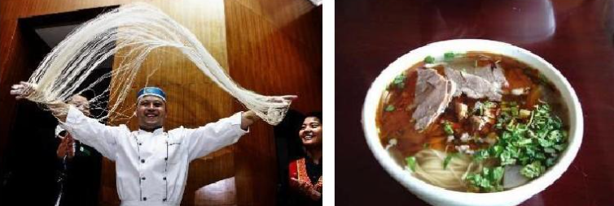
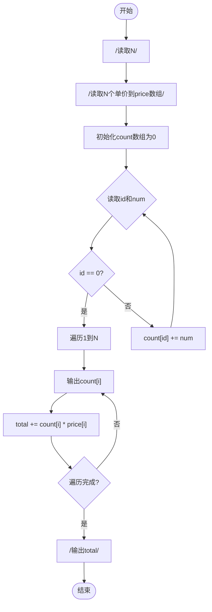
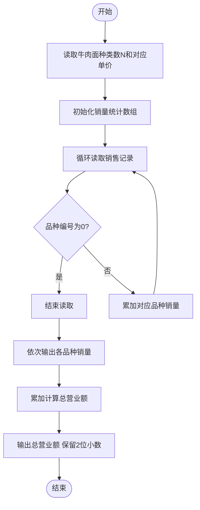

# L1-102 - 兰州牛肉面（15 分）

- **时间限制**: 400 ms
- **内存限制**: 65536 KB
- **代码长度限制**: 16 KB

---

## 题目描述



兰州牛肉面是历史悠久的美食，根据牛肉面的宽窄、配料的种类，可以细分为上百个不同的品种。你进到兰州的任何一家牛肉面馆，只说：“来一碗牛肉面！”就好像进到加州的咖啡馆说“来一杯咖啡”一样，会被店主人当成外星人……
本题的任务是，请你写程序帮助一家牛肉面馆的老板统计一下，他们一天卖出各种品种的牛肉面有多少碗，营业额一共有多少。

### 输入格式:

输入第一行给出一个正整数 $$N$$（$$\le 100$$），为牛肉面的种类数量。这里为了简单起见，我们把不同种类的牛肉面从 1 到 $$N$$ 编号，以后就用编号代替牛肉面品种的名称。第二行给出 $$N$$ 个价格，第 $$i$$ 个价格对应第 $$i$$ 种牛肉面一碗的单价。这里的价格是 [0.01, 200.00] 区间内的实数，以元为单位，精确到分。
随后是一天内客人买面的记录，每条记录占一行，格式为：
```
品种编号 碗数
```
其中`碗数`保证是正整数。当对应的 `品种编号` 为 `0` 时，表示输入结束。这个记录不算在内。
### 输出格式:

首先输出 $$N$$ 行，第 $$i$$ 行输出第 $$i$$ 种牛肉面卖出了多少碗。最后一行输出当天的总营业额，仍然是以元为单位，精确到分。题目保证总营业额不超过 $$10^6$$。
### 输入样例:

```in
5
4.00 8.50 3.20 12.00 14.10
3 5
5 2
1 1
2 3
2 2
1 9
0 0
```
### 输出样例:

```out
10
5
5
0
2
126.70
```

## 示例

### 示例 1

**输入:**
```
5
4.00 8.50 3.20 12.00 14.10
3 5
5 2
1 1
2 3
2 2
1 9
0 0
```

**输出:**
```
10
5
5
0
2
126.70
```

---

## 题目详解

### 一、解题思路

本题的 R 实现采用以下方法：读取标准输入后建立题目所需的数据结构，按约束执行核心计算并输出结果。

### 二、代码流程说明

1. 读取并解析标准输入，转换为题目所需的数据结构。
2. 按题意执行核心算法，维护中间状态并处理边界情况。
3. 整理计算结果，按照输出格式生成答案。

### 三、代码实现

```r
# 实现原理：读取标准输入后建立题目所需的数据结构，按约束执行核心计算并输出结果。
# 处理流程：读取输入 -> 建立状态 -> 执行算法 -> 按题目格式输出。
# 关键变量和循环均直接对应题目中的数据、约束或操作。

# 读取并解析标准输入。
v <- scan(file = "stdin", what = "", quiet = TRUE)
n <- as.integer(v[1])
price <- as.integer(round(as.numeric(v[2:(n + 1)]) * 100))
cnt <- integer(n)
total <- 0
p <- n + 2
# 按题目约束遍历当前数据，更新中间状态。
repeat {
    if (p > length(v))
        break
    item <- as.integer(v[p])
    q <- as.integer(v[p + 1])
    p <- p + 2
    if (item == 0)
        break
    cnt[item] <- cnt[item] + q
    total <- total + price[item] * q
}
# 严格按照题目规定的输出格式输出答案。
cat(paste(cnt, collapse = "\n"), "\n", sep = "")
cat(sprintf("%d.%02d\n", total%/%100, total%%100))
```

### 四、代码流程图



### 五、解题流程图



### 六、常见易错点

- 题目描述、输入格式、输出格式和输入输出样例必须保持原文不变。
- R 语言下标从 1 开始，注意编号转换和空输入边界。
- 输出时严格保留题目规定的空格、换行和小数位数。
