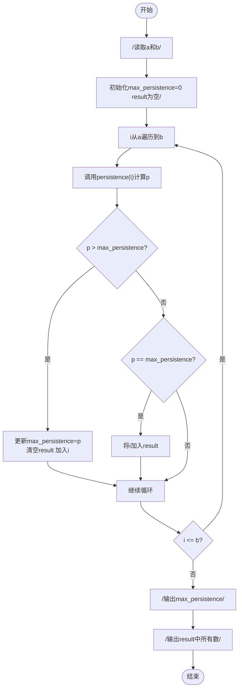
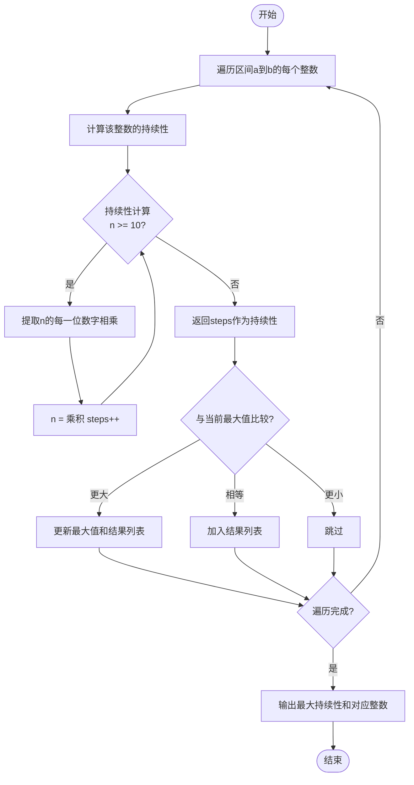

# L1-103 - 整数的持续性（20 分）

- **时间限制**: 400 ms
- **内存限制**: 65536 KB
- **代码长度限制**: 16 KB

---

## 题目描述

从任一给定的正整数 $n$ 出发，将其每一位数字相乘，记得到的乘积为 $n_1$。以此类推，令 $n_{i+1}$ 为 $n_i$ 的各位数字的乘积，直到最后得到一个个位数 $n_m$，则 $m$ 就称为 $n$ 的**持续性**。例如 $679$ 的持续性就是 5，因为我们从 $679$ 开始，得到 $6\times 7\times 9 = 378$，随后得到 $3\times 7\times 8 = 168$、$1\times 6\times 8 = 48$、$4\times 8 = 32$，最后得到 $3\times 2 = 6$，一共用了 5 步。
本题就请你编写程序，找出任一给定区间内持续性最长的整数。

### 输入格式:

输入在一行中给出两个正整数 $a$ 和 $b$（$1\le a \le b \le 10^9$ 且 $(b-a)<10^3$），为给定区间的两个端点。
### 输出格式:

首先在第一行输出区间 $[a, b]$ 内整数最长的持续性。随后在第二行中输出持续性最长的整数。如果这样的整数不唯一，则按照递增序输出，数字间以 1 个空格分隔，行首尾不得有多余空格。
### 输入样例:

```in
500 700
```
### 输出样例:

```out
5
679 688 697
```

## 示例

### 示例 1

**输入:**
```
500 700
```

**输出:**
```
5
679 688 697
```

---

## 题目详解

### 一、解题思路

本题的 R 实现采用以下方法：将输入组织为矩阵或表格，按题目定义的行、列和状态关系完成计算。

### 二、代码流程说明

1. 读取并解析标准输入，转换为题目所需的数据结构。
2. 按题意执行核心算法，维护中间状态并处理边界情况。
3. 整理计算结果，按照输出格式生成答案。

### 三、代码实现

```r
# 实现原理：将输入组织为矩阵或表格，按题目定义的行、列和状态关系完成计算。
# 处理流程：读取输入 -> 建立状态 -> 执行算法 -> 按题目格式输出。
# 关键变量和循环均直接对应题目中的数据、约束或操作。

# 读取并解析标准输入。
v <- scan(file = "stdin", quiet = TRUE)
a <- v[1]
b <- v[2]
pers <- function(x) {
    c <- 0
# 按题目约束遍历当前数据，更新中间状态。
    while (x > 9) {
        d <- as.integer(strsplit(as.character(x), "", fixed = TRUE)[[1]])
        x <- prod(d)
        c <- c + 1
    }
    c
}
z <- vapply(a:b, pers, 0)
m <- max(z)
# 严格按照题目规定的输出格式输出答案。
cat(m, "\n", sep = "")
cat(paste((a:b)[z == m], collapse = " "), "\n", sep = "")
```

### 四、代码流程图



### 五、解题流程图



### 六、常见易错点

- 题目描述、输入格式、输出格式和输入输出样例必须保持原文不变。
- R 语言下标从 1 开始，注意编号转换和空输入边界。
- 输出时严格保留题目规定的空格、换行和小数位数。
