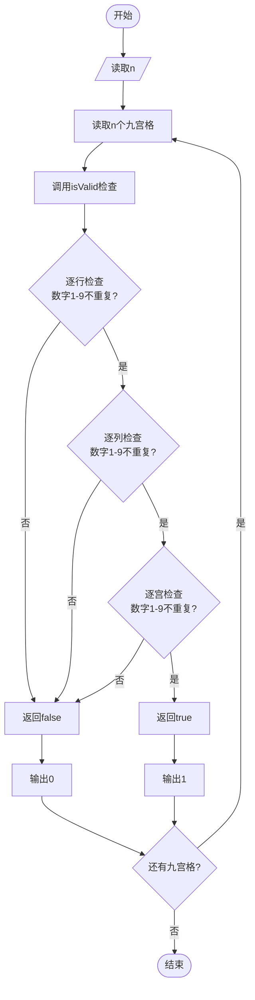
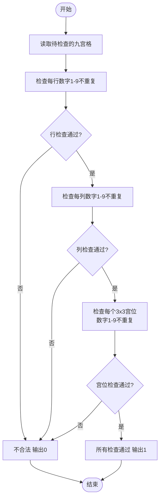

# L1-104 - 九宫格（20 分）

- **时间限制**: 400 ms
- **内存限制**: 65536 KB
- **代码长度限制**: 16 KB

---

## 题目描述


九宫格是一款数字游戏，传说起源于河图洛书，现代数学中称之为三阶幻方。游戏规则是：将一个 $9\times 9$ 的正方形区域划分为 9 个 $3\times 3$ 的正方形宫位，要求 1 到 9 这九个数字中的每个数字在每一行、每一列、每个宫位中都只能出现一次。
本题并不要求你写程序解决这个问题，只是对每个填好数字的九宫格，判断其是否满足游戏规则的要求。

### 输入格式:

输入首先在第一行给出一个正整数 $n$（$\le 10$），随后给出 $n$ 个填好数字的九宫格。每个九宫格分 9 行给出，每行给出 9 个数字，其间以空格分隔。
### 输出格式:

对每个给定的九宫格，判断其中的数字是否满足游戏规则的要求。满足则在一行中输出 1，否则输出 0。
### 输入样例:

```in
3
5 1 9 2 8 3 4 6 7
7 2 8 9 6 4 3 5 1
3 4 6 5 7 1 9 2 8
8 9 2 1 4 5 7 3 6
4 7 3 6 2 8 1 9 5
6 5 1 7 3 9 2 8 4
9 3 4 8 1 6 5 7 2
1 6 7 3 5 2 8 4 9
2 8 5 4 9 7 6 1 3
8 2 5 4 9 7 1 3 6
7 9 6 5 1 3 8 2 4
3 4 1 6 8 2 7 9 5
6 8 4 2 7 1 3 5 9
9 1 2 8 3 5 6 4 7
5 3 7 9 6 4 2 1 8
2 7 9 1 5 8 4 6 3
4 5 8 3 2 6 9 7 1
1 6 3 7 4 9 5 8 3
81 2 5 4 9 7 1 3 6
7 9 6 5 1 3 8 2 4
3 4 1 6 8 2 7 9 5
6 8 4 2 7 1 3 5 9
9 1 2 8 3 5 6 4 7
5 3 7 9 6 4 2 1 8
2 7 9 1 5 8 4 6 3
4 5 8 3 2 6 9 7 1
1 6 3 7 4 9 5 8 2
```
### 输出样例:

```out
1
0
0
```

## 示例

### 示例 1

**输入:**
```
3
5 1 9 2 8 3 4 6 7
7 2 8 9 6 4 3 5 1
3 4 6 5 7 1 9 2 8
8 9 2 1 4 5 7 3 6
4 7 3 6 2 8 1 9 5
6 5 1 7 3 9 2 8 4
9 3 4 8 1 6 5 7 2
1 6 7 3 5 2 8 4 9
2 8 5 4 9 7 6 1 3
8 2 5 4 9 7 1 3 6
7 9 6 5 1 3 8 2 4
3 4 1 6 8 2 7 9 5
6 8 4 2 7 1 3 5 9
9 1 2 8 3 5 6 4 7
5 3 7 9 6 4 2 1 8
2 7 9 1 5 8 4 6 3
4 5 8 3 2 6 9 7 1
1 6 3 7 4 9 5 8 3
81 2 5 4 9 7 1 3 6
7 9 6 5 1 3 8 2 4
3 4 1 6 8 2 7 9 5
6 8 4 2 7 1 3 5 9
9 1 2 8 3 5 6 4 7
5 3 7 9 6 4 2 1 8
2 7 9 1 5 8 4 6 3
4 5 8 3 2 6 9 7 1
1 6 3 7 4 9 5 8 2
```

**输出:**
```
1
0
0
```

---

## 题目详解

### 一、解题思路

本题的 R 实现采用以下方法：将输入组织为矩阵或表格，按题目定义的行、列和状态关系完成计算。

### 二、代码流程说明

1. 读取并解析标准输入，转换为题目所需的数据结构。
2. 按题意执行核心算法，维护中间状态并处理边界情况。
3. 整理计算结果，按照输出格式生成答案。

### 三、代码实现

```r
# 实现原理：将输入组织为矩阵或表格，按题目定义的行、列和状态关系完成计算。
# 处理流程：读取输入 -> 建立状态 -> 执行算法 -> 按题目格式输出。
# 关键变量和循环均直接对应题目中的数据、约束或操作。

# 读取并解析标准输入。
v <- scan(file = "stdin", quiet = TRUE)
t <- v[1]
p <- 2
# 按题目约束遍历当前数据，更新中间状态。
for (k in seq_len(t)) {
    a <- matrix(v[p:(p + 80)], 9, 9, byrow = TRUE)
    p <- p + 81
# 执行核心排序、状态转移或选择逻辑。
    ok <- function(z) all(sort(z) == 1:9)
    good <- all(apply(a, 1, ok), apply(a, 2, ok))
    for (i in c(1, 4, 7)) for (j in c(1, 4, 7)) good <- good &&
        ok(as.vector(a[i:(i + 2), j:(j + 2)]))
# 严格按照题目规定的输出格式输出答案。
    cat(if (good)
        "1"
    else "0", if (k < t)
        "\n"
    else "", "", sep = "")
}
```

### 四、代码流程图



### 五、解题流程图



### 六、常见易错点

- 题目描述、输入格式、输出格式和输入输出样例必须保持原文不变。
- R 语言下标从 1 开始，注意编号转换和空输入边界。
- 输出时严格保留题目规定的空格、换行和小数位数。
