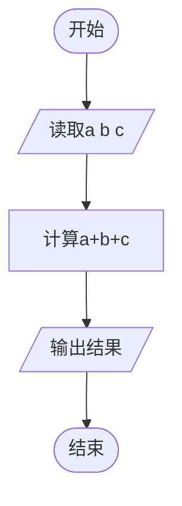
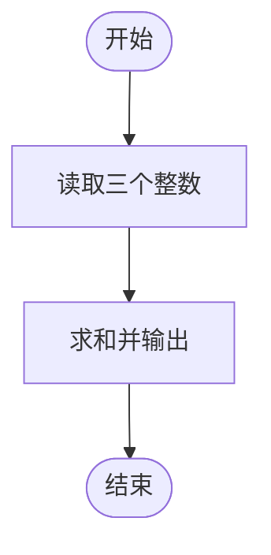

# L1-106 - 偷感好重（5 分）

- **时间限制**: 400 ms
- **内存限制**: 65536 KB
- **代码长度限制**: 16 KB

---

## 题目描述


以上图片截自新浪微博“iPanda 熊猫频道”，说“大熊猫吃苹果边吃边拿偷感好重。滚滚嘴里含 2 块，右手拿 1 块，左手捂 3 块…… 请问，它一共得到了多少块小苹果？”本题就请你计算一下这个问题的答案。

### 输入格式:

输入在一行中给出 3 个不超过 100 的正整数，分别为熊猫嘴里含的、右手拿的、左手捂的小苹果块数。同行数字间以空格分隔。

### 输出格式:

在一行中输出熊猫一共得到的小苹果块数。

### 输入样例:

```in
2 1 3
```

### 输出样例:

```out
6
```

## 示例

### 示例 1

**输入:**
```
2 1 3
```

**输出:**
```
6
```

---

## 题目详解

### 一、解题思路

本题的 R 实现采用以下方法：读取标准输入后建立题目所需的数据结构，按约束执行核心计算并输出结果。

### 二、代码流程说明

1. 读取并解析标准输入，转换为题目所需的数据结构。
2. 按题意执行核心算法，维护中间状态并处理边界情况。
3. 整理计算结果，按照输出格式生成答案。

### 三、代码实现

```r
# 实现原理：读取标准输入后建立题目所需的数据结构，按约束执行核心计算并输出结果。
# 处理流程：读取输入 -> 建立状态 -> 执行算法 -> 按题目格式输出。
# 关键变量和循环均直接对应题目中的数据、约束或操作。

# 读取并解析标准输入。
v <- scan(file = "stdin", quiet = TRUE)
# 严格按照题目规定的输出格式输出答案。
cat(sum(v), "\n", sep = "")
```

### 四、代码流程图



### 五、解题流程图



### 六、常见易错点

- 题目描述、输入格式、输出格式和输入输出样例必须保持原文不变。
- R 语言下标从 1 开始，注意编号转换和空输入边界。
- 输出时严格保留题目规定的空格、换行和小数位数。
