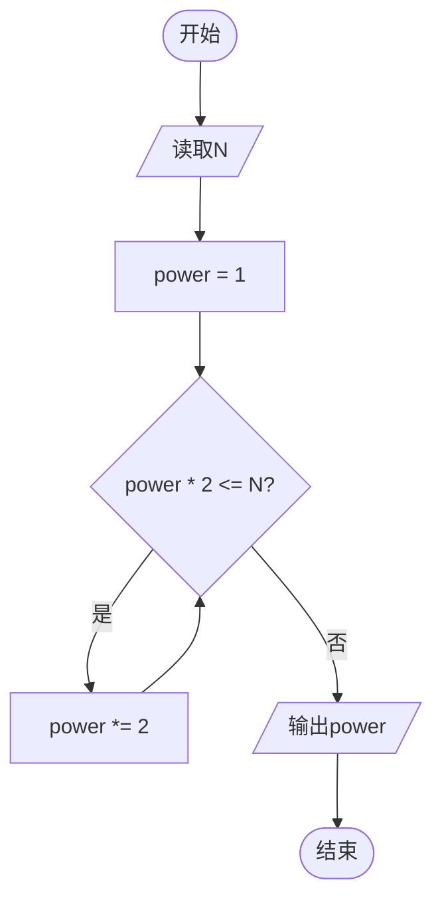
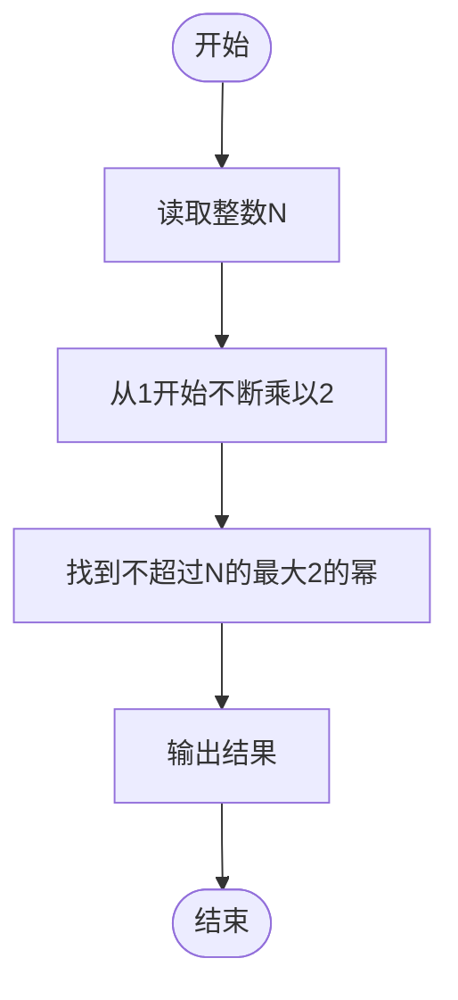

# L1-108 - 零头就抹了吧（10 分）

- **时间限制**: 400 ms
- **内存限制**: 65536 KB
- **代码长度限制**: 16 KB

---

## 题目描述


这是知乎上看到的：前几天去肉店灌香肠，结账一共258元。我说：“都是老顾客了，零头就抹了吧。”老板也很爽快：“行，凑个整，你给256块吧。”我顿时肃然起敬：“您以前当过程序员吧？在哪个公司啊？”老板看了看我，有点不好意思地说：“XX”。

本题就请你写个程序，帮老板计算他怎么抹零头。

### 输入格式:

输入在一行中给出一个正整数 $$N$$（$$\le 10^9$$），为客人应该付的钱。

### 输出格式:

在一行中输出老板抹掉零头后应收的钱。

### 输入样例:

```in
258
```

### 输出样例:

```out
256
```

## 样例说明：

256 在二进制中是 100 000 000，被程序员认为是个很“整”的数。所有二进制中最高位是 1 后面全是 0 的数字都是程序员世界里的“整”数。256 是小于 258 的最大的“整”数，所以老板收取这个数。

## 示例

### 示例 1

**输入:**
```
258
```

**输出:**
```
256
```

---

## 题目详解

### 一、解题思路

本题的 R 实现采用以下方法：读取标准输入后建立题目所需的数据结构，按约束执行核心计算并输出结果。

### 二、代码流程说明

1. 读取并解析标准输入，转换为题目所需的数据结构。
2. 按题意执行核心算法，维护中间状态并处理边界情况。
3. 整理计算结果，按照输出格式生成答案。

### 三、代码实现

```r
# 实现原理：读取标准输入后建立题目所需的数据结构，按约束执行核心计算并输出结果。
# 处理流程：读取输入 -> 建立状态 -> 执行算法 -> 按题目格式输出。
# 关键变量和循环均直接对应题目中的数据、约束或操作。

# 读取并解析标准输入。
n <- scan(file = "stdin", quiet = TRUE)[1]
p <- 1
# 按题目约束遍历当前数据，更新中间状态。
while (p * 2 <= n) p <- p * 2
# 严格按照题目规定的输出格式输出答案。
cat(p, "\n", sep = "")
```

### 四、代码流程图



### 五、解题流程图



### 六、常见易错点

- 题目描述、输入格式、输出格式和输入输出样例必须保持原文不变。
- R 语言下标从 1 开始，注意编号转换和空输入边界。
- 输出时严格保留题目规定的空格、换行和小数位数。
