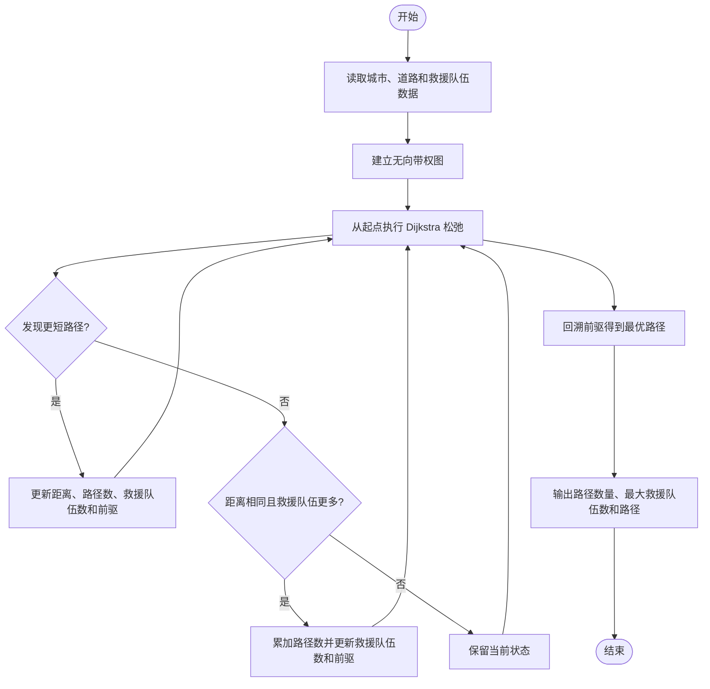
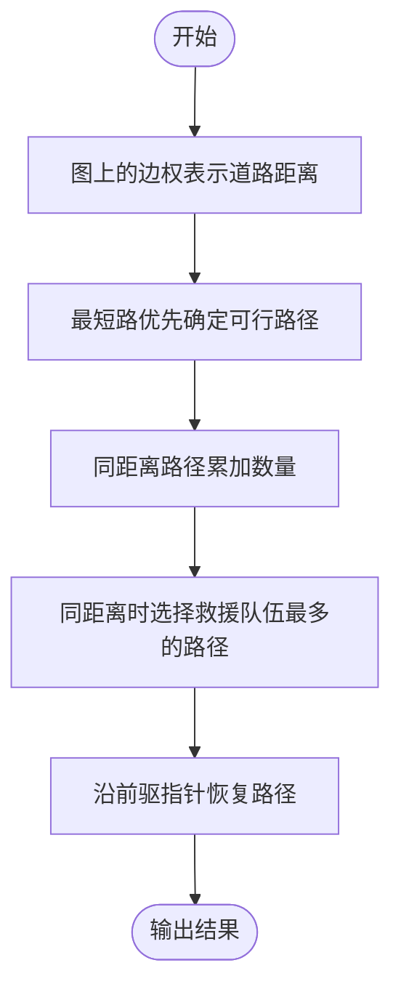

# L2-001 - 紧急救援（25 分）

- **时间限制**: 200 ms
- **内存限制**: 65536 KB
- **代码长度限制**: 16 KB

---

## 题目描述

作为一个城市的应急救援队伍的负责人，你有一张特殊的全国地图。在地图上显示有多个分散的城市和一些连接城市的快速道路。每个城市的救援队数量和每一条连接两个城市的快速道路长度都标在地图上。当其他城市有紧急求助电话给你的时候，你的任务是带领你的救援队尽快赶往事发地，同时，一路上召集尽可能多的救援队。

### 输入格式:

输入第一行给出4个正整数$$N$$、$$M$$、$$S$$、$$D$$，其中$$N$$（$$2\le N\le 500$$）是城市的个数，顺便假设城市的编号为0 ~ $$(N-1)$$；$$M$$是快速道路的条数；$$S$$是出发地的城市编号；$$D$$是目的地的城市编号。

第二行给出$$N$$个正整数，其中第$$i$$个数是第$$i$$个城市的救援队的数目，数字间以空格分隔。随后的$$M$$行中，每行给出一条快速道路的信息，分别是：城市1、城市2、快速道路的长度，中间用空格分开，数字均为整数且不超过500。输入保证救援可行且最优解唯一。

### 输出格式:

第一行输出最短路径的条数和能够召集的最多的救援队数量。第二行输出从$$S$$到$$D$$的路径中经过的城市编号。数字间以空格分隔，输出结尾不能有多余空格。

### 输入样例:

```in
4 5 0 3
20 30 40 10
0 1 1
1 3 2
0 3 3
0 2 2
2 3 2
```

### 输出样例:

```out
2 60
0 1 3
```

## 示例

### 示例 1

**输入:**
```
4 5 0 3
20 30 40 10
0 1 1
1 3 2
0 3 3
0 2 2
2 3 2
```

**输出:**
```
2 60
0 1 3
```

---

## 题目详解

### 一、解题思路

本题的 R 实现采用以下方法：先建立图结构，再用最短路或距离状态逐步松弛，最后根据距离和题目规则输出结果。

### 二、代码流程说明

1. 读取并解析标准输入，转换为题目所需的数据结构。
2. 按题意执行核心算法，维护中间状态并处理边界情况。
3. 整理计算结果，按照输出格式生成答案。

### 三、代码实现

```r
# 实现原理：先建立图结构，再用最短路或距离状态逐步松弛，最后根据距离和题目规则输出结果。
# 处理流程：读取输入 -> 建立状态 -> 执行算法 -> 按题目格式输出。
# 关键变量和循环均直接对应题目中的数据、约束或操作。

# 读取并解析标准输入。
v <- scan(file = "stdin", quiet = TRUE)
n <- v[1]
m <- v[2]
s <- v[3]
d <- v[4]
team <- v[5:(n + 4)]
p <- n + 5
g <- vector("list", n)
# 按题目约束遍历当前数据，更新中间状态。
for (i in seq_len(n)) g[[i]] <- list()
for (i in seq_len(m)) {
    a <- v[p] + 1
    b <- v[p + 1] + 1
    w <- v[p + 2]
    p <- p + 3
    g[[a]] <- append(g[[a]], list(c(b, w)))
    g[[b]] <- append(g[[b]], list(c(a, w)))
}
inf <- 1e+18
dist <- rep(inf, n)
ways <- integer(n)
power <- numeric(n)
pre <- rep(NA_integer_, n)
dist[s + 1] <- 0
ways[s + 1] <- 1
power[s + 1] <- team[s + 1]
used <- rep(FALSE, n)
for (z in seq_len(n)) {
    u <- which(!used & dist == min(dist[!used]))[1]
    if (is.na(u))
        break
    used[u] <- TRUE
    for (e in g[[u]]) {
        w <- e[1]
        nd <- dist[u] + e[2]
        np <- power[u] + team[w]
        if (nd < dist[w]) {
            dist[w] <- nd
            ways[w] <- ways[u]
            power[w] <- np
            pre[w] <- u
        }
        else if (nd == dist[w]) {
            ways[w] <- ways[w] + ways[u]
            if (np > power[w]) {
                power[w] <- np
                pre[w] <- u
            }
        }
    }
}
path <- integer()
u <- d + 1
while (!is.na(u)) {
    path <- c(path, u - 1)
    u <- pre[u]
}
# 严格按照题目规定的输出格式输出答案。
cat(paste(ways[d + 1], power[d + 1]), "\n", sep = "")
cat(paste(rev(path), collapse = " "), "\n", sep = "")
```

### 四、代码流程图



### 五、解题流程图



### 六、常见易错点

- 题目描述、输入格式、输出格式和输入输出样例必须保持原文不变。
- R 语言下标从 1 开始，注意编号转换和空输入边界。
- 输出时严格保留题目规定的空格、换行和小数位数。
