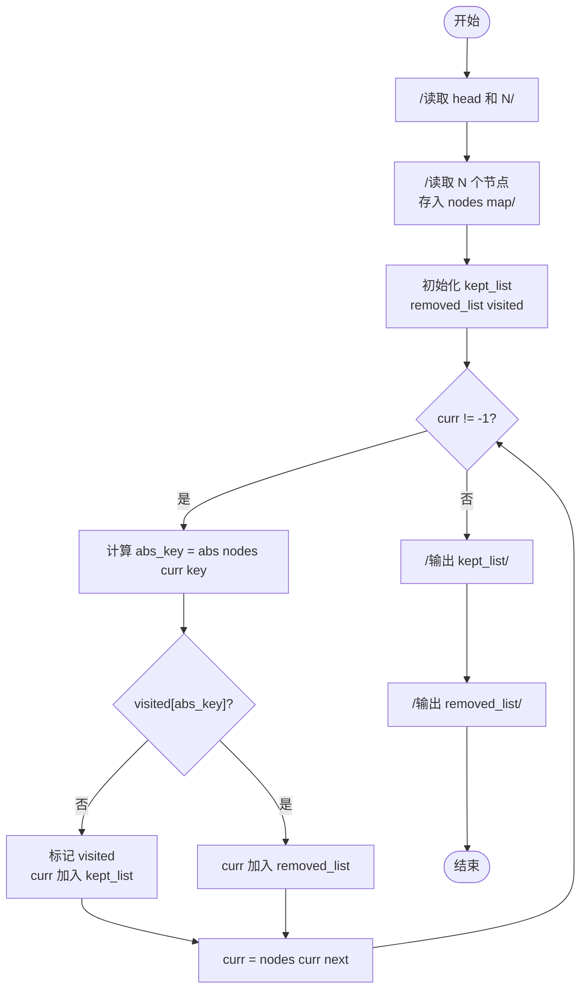
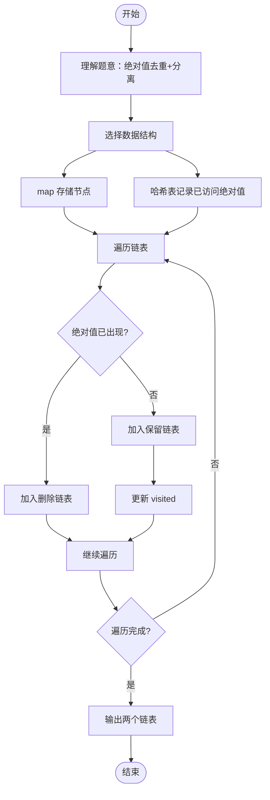

# L2-002 - 链表去重（25 分）

- **时间限制**: 400 ms
- **内存限制**: 65536 KB
- **代码长度限制**: 16 KB

---

## 题目描述

给定一个带整数键值的链表 $$L$$，你需要把其中绝对值重复的键值结点删掉。即对每个键值 $$K$$，只有第一个绝对值等于 $$K$$ 的结点被保留。同时，所有被删除的结点须被保存在另一个链表上。例如给定 $$L$$ 为 21→-15→-15→-7→15，你需要输出去重后的链表 21→-15→-7，还有被删除的链表 -15→15。

### 输入格式:

输入在第一行给出 L 的第一个结点的地址和一个正整数 $$N$$（$$\le 10^5$$，为结点总数）。一个结点的地址是非负的 5 位整数，空地址 NULL 用 $$-1$$ 来表示。

随后 $$N$$ 行，每行按以下格式描述一个结点：
```
地址 键值 下一个结点
```

其中`地址`是该结点的地址，`键值`是绝对值不超过$$10^4$$的整数，`下一个结点`是下个结点的地址。

### 输出格式:

首先输出去重后的链表，然后输出被删除的链表。每个结点占一行，按输入的格式输出。

### 输入样例:

```in
00100 5
99999 -7 87654
23854 -15 00000
87654 15 -1
00000 -15 99999
00100 21 23854
```

### 输出样例:

```out
00100 21 23854
23854 -15 99999
99999 -7 -1
00000 -15 87654
87654 15 -1
```

## 示例

### 示例 1

**输入:**
```
00100 5
99999 -7 87654
23854 -15 00000
87654 15 -1
00000 -15 99999
00100 21 23854
```

**输出:**
```
00100 21 23854
23854 -15 99999
99999 -7 -1
00000 -15 87654
87654 15 -1
```

---

## 题目详解

### 一、解题思路

本题的 R 实现采用以下方法：沿链表顺序遍历，用集合记录已经出现的绝对值；首次出现的结点保留，重复结点移动到删除链表。

### 二、代码流程说明

1. 读取并解析标准输入，转换为题目所需的数据结构。
2. 按题意执行核心算法，维护中间状态并处理边界情况。
3. 整理计算结果，按照输出格式生成答案。

### 三、代码实现

```r
# 实现原理：沿链表顺序遍历，用集合记录已经出现的绝对值；首次出现的结点保留，重复结点移动到删除链表。
# 处理流程：读取输入 -> 建立状态 -> 执行算法 -> 按题目格式输出。
# 关键变量和循环均直接对应题目中的数据、约束或操作。

# 读取并解析标准输入。
v <- scan(file = "stdin", what = "", quiet = TRUE)
head <- v[1]
n <- as.integer(v[2])
data <- setNames(as.integer(v[seq(4, 3 * n + 2, by = 3)]), v[seq(3,
    3 * n + 1, by = 3)])
nxt <- setNames(v[seq(5, 3 * n + 3, by = 3)], v[seq(3, 3 * n +
    1, by = 3)])
seen <- integer()
kept <- character()
removed <- character()
cur <- head
# 按题目约束遍历当前数据，更新中间状态。
while (cur != "-1" && !is.null(data[cur])) {
    if (abs(data[cur]) %in% seen)
        removed <- c(removed, cur)
    else kept <- c(kept, cur)
    seen <- c(seen, abs(data[cur]))
    cur <- nxt[cur]
}
lines <- character()
for (chain in list(kept, removed)) for (i in seq_along(chain)) lines <- c(lines,
    paste(chain[i], data[chain[i]], if (i < length(chain)) chain[i +
        1] else "-1"))
# 严格按照题目规定的输出格式输出答案。
cat(paste(lines, collapse = "\n"), "\n", sep = "")
```

### 四、代码流程图



### 五、解题流程图



### 六、常见易错点

- 题目描述、输入格式、输出格式和输入输出样例必须保持原文不变。
- R 语言下标从 1 开始，注意编号转换和空输入边界。
- 输出时严格保留题目规定的空格、换行和小数位数。
