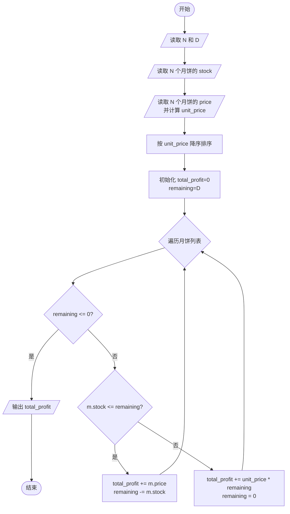
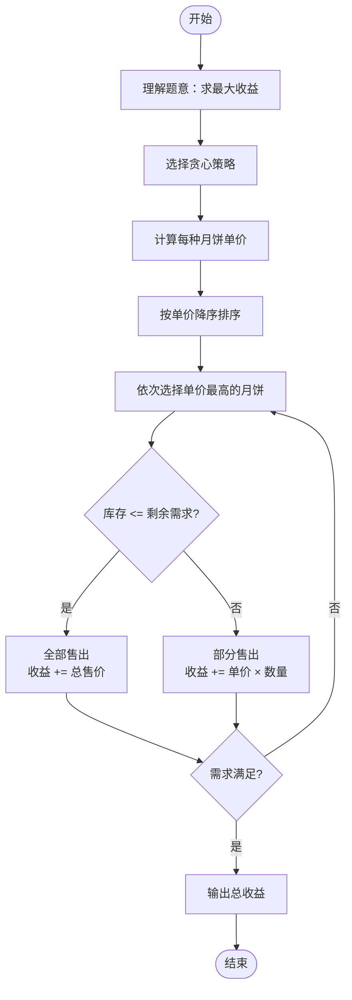

# L2-003 - 月饼（25 分）

- **时间限制**: 150 ms
- **内存限制**: 65536 KB
- **代码长度限制**: 16 KB

---

## 题目描述

月饼是中国人在中秋佳节时吃的一种传统食品，不同地区有许多不同风味的月饼。现给定所有种类月饼的库存量、总售价、以及市场的最大需求量，请你计算可以获得的最大收益是多少。

注意：销售时允许取出一部分库存。样例给出的情形是这样的：假如我们有 3 种月饼，其库存量分别为 18、15、10 万吨，总售价分别为 75、72、45 亿元。如果市场的最大需求量只有 20 万吨，那么我们最大收益策略应该是卖出全部 15 万吨第 2 种月饼、以及 5 万吨第 3 种月饼，获得 72 + 45/2 = 94.5（亿元）。

### 输入格式:

每个输入包含一个测试用例。每个测试用例先给出一个不超过 1000 的正整数 $$N$$ 表示月饼的种类数、以及不超过 500（以万吨为单位）的正整数 $$D$$ 表示市场最大需求量。随后一行给出 $$N$$ 个正数表示每种月饼的库存量（以万吨为单位）；最后一行给出 $$N$$ 个正数表示每种月饼的总售价（以亿元为单位）。数字间以空格分隔。

### 输出格式:

对每组测试用例，在一行中输出最大收益，以亿元为单位并精确到小数点后 2 位。

### 输入样例:

```in
3 20
18 15 10
75 72 45
```

### 输出样例:

```out
94.50
```

## 示例

### 示例 1

**输入:**
```
3 20
18 15 10
75 72 45
```

**输出:**
```
94.50
```

---

## 题目详解

### 一、解题思路

本题的 R 实现采用以下方法：先解析数据并按题目规定的关键字排序，再进行顺序处理和格式化输出。

### 二、代码流程说明

1. 读取并解析标准输入，转换为题目所需的数据结构。
2. 按题意执行核心算法，维护中间状态并处理边界情况。
3. 整理计算结果，按照输出格式生成答案。

### 三、代码实现

```r
# 实现原理：先解析数据并按题目规定的关键字排序，再进行顺序处理和格式化输出。
# 处理流程：读取输入 -> 建立状态 -> 执行算法 -> 按题目格式输出。
# 关键变量和循环均直接对应题目中的数据、约束或操作。

# 读取并解析标准输入。
v <- scan(file = "stdin", quiet = TRUE)
n <- v[1]
need <- v[2]
stock <- v[3:(n + 2)]
price <- v[(n + 3):(2 * n + 2)]
# 执行核心排序、状态转移或选择逻辑。
ord <- order(price/stock, decreasing = TRUE)
total <- 0
# 按题目约束遍历当前数据，更新中间状态。
for (i in ord) {
    take <- min(need, stock[i])
    total <- total + take * price[i]/stock[i]
    need <- need - take
    if (need <= 1e-09)
        break
}
# 严格按照题目规定的输出格式输出答案。
cat(sprintf("%.2f\n", total))
```

### 四、代码流程图



### 五、解题流程图



### 六、常见易错点

- 题目描述、输入格式、输出格式和输入输出样例必须保持原文不变。
- R 语言下标从 1 开始，注意编号转换和空输入边界。
- 输出时严格保留题目规定的空格、换行和小数位数。
