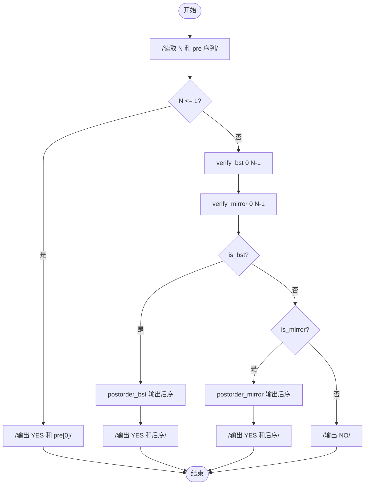
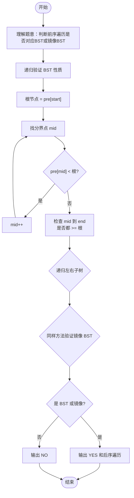

# L2-004 - 这是二叉搜索树吗？（25 分）

- **时间限制**: 400 ms
- **内存限制**: 65536 KB
- **代码长度限制**: 16 KB

---

## 题目描述

一棵二叉搜索树可被递归地定义为具有下列性质的二叉树：对于任一结点，

- 其左子树中所有结点的键值小于该结点的键值；
- 其右子树中所有结点的键值大于等于该结点的键值；
- 其左右子树都是二叉搜索树。

所谓二叉搜索树的“镜像”，即将所有结点的左右子树对换位置后所得到的树。

给定一个整数键值序列，现请你编写程序，判断这是否是对一棵二叉搜索树或其镜像进行前序遍历的结果。

### 输入格式:

输入的第一行给出正整数 $$N$$（$$\le 1000$$）。随后一行给出 $$N$$ 个整数键值，其间以空格分隔。

### 输出格式:

如果输入序列是对一棵二叉搜索树或其镜像进行前序遍历的结果，则首先在一行中输出 `YES` ，然后在下一行输出该树后序遍历的结果。数字间有 1 个空格，一行的首尾不得有多余空格。若答案是否，则输出 `NO`。

### 输入样例 1:

```in
7
8 6 5 7 10 8 11
```

### 输出样例 1:

```out
YES
5 7 6 8 11 10 8
```

### 输入样例 2:

```in
7
8 10 11 8 6 7 5
```

### 输出样例 2:

```out
YES
11 8 10 7 5 6 8
```

### 输入样例 3:

```in
7
8 6 8 5 10 9 11
```

### 输出样例 3:

```out
NO
```

## 示例

### 示例 1

**输入:**
```
7
8 6 5 7 10 8 11
```

**输出:**
```
YES
5 7 6 8 11 10 8
```

### 示例 2

**输入:**
```
7
8 10 11 8 6 7 5
```

**输出:**
```
YES
11 8 10 7 5 6 8
```

### 示例 3

**输入:**
```
7
8 6 8 5 10 9 11
```

**输出:**
```
NO
```

---

## 题目详解

### 一、解题思路

本题的 R 实现采用以下方法：读取标准输入后建立题目所需的数据结构，按约束执行核心计算并输出结果。

### 二、代码流程说明

1. 读取并解析标准输入，转换为题目所需的数据结构。
2. 按题意执行核心算法，维护中间状态并处理边界情况。
3. 整理计算结果，按照输出格式生成答案。

### 三、代码实现

```r
# 实现原理：读取标准输入后建立题目所需的数据结构，按约束执行核心计算并输出结果。
# 处理流程：读取输入 -> 建立状态 -> 执行算法 -> 按题目格式输出。
# 关键变量和循环均直接对应题目中的数据、约束或操作。

# 读取并解析标准输入。
v <- scan(file = "stdin", quiet = TRUE)
n <- v[1]
a <- v[2:(n + 1)]
post <- function(x, mirror) {
    if (!length(x))
        return(integer())
    root <- x[1]
    i <- 2
    if (mirror)
# 按题目约束遍历当前数据，更新中间状态。
        while (i <= length(x) && x[i] >= root) i <- i + 1
    else while (i <= length(x) && x[i] < root) i <- i + 1
    tail <- if (i <= length(x))
        x[i:length(x)]
    else numeric()
    if ((!mirror && any(tail < root)) || (mirror && any(tail >
        root)))
        return(NULL)
    left <- if (i > 2)
        x[2:(i - 1)]
    else numeric()
    right <- if (i <= length(x))
        x[i:length(x)]
    else numeric()
    l <- post(left, mirror)
    r <- post(right, mirror)
    if (is.null(l) || is.null(r))
        NULL
    else c(l, r, root)
}
z <- post(a, FALSE)
if (is.null(z)) z <- post(a, TRUE)
# 严格按照题目规定的输出格式输出答案。
if (is.null(z)) cat("NO\n") else {
    cat("YES\n")
    cat(paste(z, collapse = " "), "\n", sep = "")
}
```

### 四、代码流程图



### 五、解题流程图



### 六、常见易错点

- 题目描述、输入格式、输出格式和输入输出样例必须保持原文不变。
- R 语言下标从 1 开始，注意编号转换和空输入边界。
- 输出时严格保留题目规定的空格、换行和小数位数。
