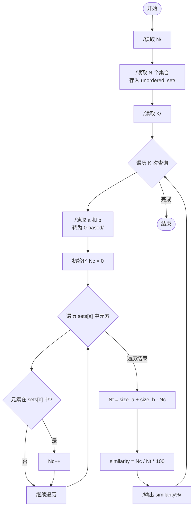
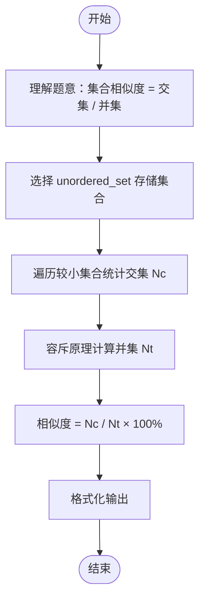

# L2-005 - 集合相似度（25 分）

- **时间限制**: 400 ms
- **内存限制**: 65536 KB
- **代码长度限制**: 16 KB

---

## 题目描述

给定两个整数集合，它们的相似度定义为：$$N_c / N_t \times 100\%$$。其中$$N_c$$是两个集合都有的不相等整数的个数，$$N_t$$是两个集合一共有的不相等整数的个数。你的任务就是计算任意一对给定集合的相似度。

### 输入格式:

输入第一行给出一个正整数$$N$$（$$\le 50$$），是集合的个数。随后$$N$$行，每行对应一个集合。每个集合首先给出一个正整数$$M$$（$$\le 10^4$$），是集合中元素的个数；然后跟$$M$$个$$[0, 10^9]$$区间内的整数。

之后一行给出一个正整数$$K$$（$$\le 2000$$），随后$$K$$行，每行对应一对需要计算相似度的集合的编号（集合从1到$$N$$编号）。数字间以空格分隔。

### 输出格式:

对每一对需要计算的集合，在一行中输出它们的相似度，为保留小数点后2位的百分比数字。

### 输入样例:

```in
3
3 99 87 101
4 87 101 5 87
7 99 101 18 5 135 18 99
2
1 2
1 3
```

### 输出样例:

```out
50.00%
33.33%
```

## 示例

### 示例 1

**输入:**
```
3
3 99 87 101
4 87 101 5 87
7 99 101 18 5 135 18 99
2
1 2
1 3
```

**输出:**
```
50.00%
33.33%
```

---

## 题目详解

### 一、解题思路

本题的 R 实现采用以下方法：读取标准输入后建立题目所需的数据结构，按约束执行核心计算并输出结果。

### 二、代码流程说明

1. 读取并解析标准输入，转换为题目所需的数据结构。
2. 按题意执行核心算法，维护中间状态并处理边界情况。
3. 整理计算结果，按照输出格式生成答案。

### 三、代码实现

```r
# 实现原理：读取标准输入后建立题目所需的数据结构，按约束执行核心计算并输出结果。
# 处理流程：读取输入 -> 建立状态 -> 执行算法 -> 按题目格式输出。
# 关键变量和循环均直接对应题目中的数据、约束或操作。

# 读取并解析标准输入。
v <- scan(file = "stdin", quiet = TRUE)
p <- 1
n <- v[p]
p <- p + 1
sets <- vector("list", n)
# 按题目约束遍历当前数据，更新中间状态。
for (i in seq_len(n)) {
    z <- v[p]
    p <- p + 1
    sets[[i]] <- unique(v[p:(p + z - 1)])
    p <- p + z
}
q <- v[p]
p <- p + 1
for (i in seq_len(q)) {
    a <- sets[[v[p]]]
    b <- sets[[v[p + 1]]]
    p <- p + 2
    u <- union(a, b)
# 严格按照题目规定的输出格式输出答案。
    cat(sprintf("%.2f%%\n", if (length(u))
        100 * length(intersect(a, b))/length(u)
    else 0))
}
```

### 四、代码流程图



### 五、解题流程图



### 六、常见易错点

- 题目描述、输入格式、输出格式和输入输出样例必须保持原文不变。
- R 语言下标从 1 开始，注意编号转换和空输入边界。
- 输出时严格保留题目规定的空格、换行和小数位数。
