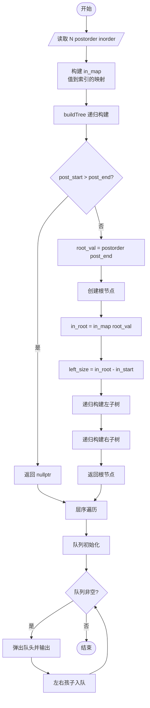
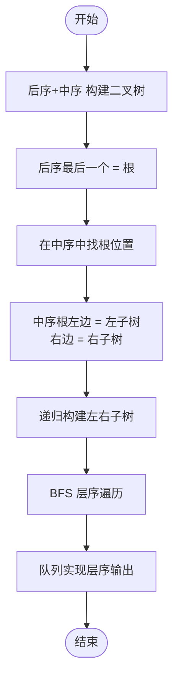

# L2-006 - 树的遍历（25 分）

- **时间限制**: 400 ms
- **内存限制**: 65536 KB
- **代码长度限制**: 16 KB

---

## 题目描述

给定一棵二叉树的后序遍历和中序遍历，请你输出其层序遍历的序列。这里假设键值都是互不相等的正整数。

### 输入格式:

输入第一行给出一个正整数$$N$$（$$\le 30$$），是二叉树中结点的个数。第二行给出其后序遍历序列。第三行给出其中序遍历序列。数字间以空格分隔。

### 输出格式:

在一行中输出该树的层序遍历的序列。数字间以1个空格分隔，行首尾不得有多余空格。

### 输入样例:

```in
7
2 3 1 5 7 6 4
1 2 3 4 5 6 7
```

### 输出样例:

```out
4 1 6 3 5 7 2
```

## 示例

### 示例 1

**输入:**
```
7
2 3 1 5 7 6 4
1 2 3 4 5 6 7
```

**输出:**
```
4 1 6 3 5 7 2
```

---

## 题目详解

### 一、解题思路

本题的 R 实现采用以下方法：读取标准输入后建立题目所需的数据结构，按约束执行核心计算并输出结果。

### 二、代码流程说明

1. 读取并解析标准输入，转换为题目所需的数据结构。
2. 按题意执行核心算法，维护中间状态并处理边界情况。
3. 整理计算结果，按照输出格式生成答案。

### 三、代码实现

```r
# 实现原理：读取标准输入后建立题目所需的数据结构，按约束执行核心计算并输出结果。
# 处理流程：读取输入 -> 建立状态 -> 执行算法 -> 按题目格式输出。
# 关键变量和循环均直接对应题目中的数据、约束或操作。

# 读取并解析标准输入。
v <- scan(file = "stdin", quiet = TRUE)
n <- v[1]
post <- v[2:(n + 1)]
ino <- v[(n + 2):(2 * n + 1)]
pos <- setNames(seq_len(n), ino)
build <- function(pl, pr, il, ir) {
    if (pl > pr)
        return(NULL)
    root <- post[pr]
    z <- unname(pos[as.character(root)])
    ls <- z - il
    list(root, build(pl, pl + ls - 1, il, z - 1), build(pl +
        ls, pr - 1, z + 1, ir))
}
root <- build(1, n, 1, n)
out <- numeric()
q <- list(root)
# 按题目约束遍历当前数据，更新中间状态。
while (length(q)) {
    x <- q[[1]]
    q <- q[-1]
    out <- c(out, x[[1]])
    if (!is.null(x[[2]]))
        q <- append(q, list(x[[2]]))
    if (!is.null(x[[3]]))
        q <- append(q, list(x[[3]]))
}
# 严格按照题目规定的输出格式输出答案。
cat(paste(out, collapse = " "), "\n", sep = "")
```

### 四、代码流程图



### 五、解题流程图



### 六、常见易错点

- 题目描述、输入格式、输出格式和输入输出样例必须保持原文不变。
- R 语言下标从 1 开始，注意编号转换和空输入边界。
- 输出时严格保留题目规定的空格、换行和小数位数。
