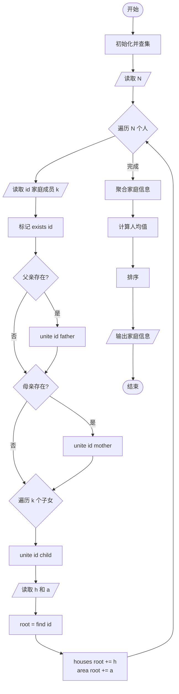
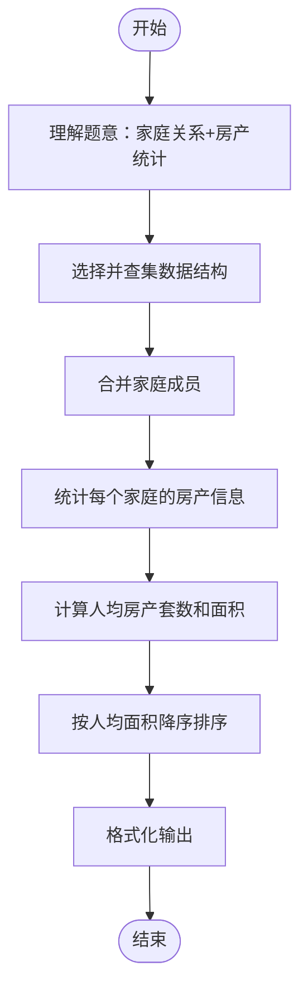

# L2-007 - 家庭房产（25 分）

- **时间限制**: 400 ms
- **内存限制**: 65536 KB
- **代码长度限制**: 16 KB

---

## 题目描述

给定每个人的家庭成员和其自己名下的房产，请你统计出每个家庭的人口数、人均房产面积及房产套数。

### 输入格式:

输入第一行给出一个正整数$$N$$（$$\le 1000$$），随后$$N$$行，每行按下列格式给出一个人的房产：
```
编号 父 母 k 孩子1 ... 孩子k 房产套数 总面积
```
其中`编号`是每个人独有的一个4位数的编号；`父`和`母`分别是该编号对应的这个人的父母的编号（如果已经过世，则显示`-1`）；`k`（$$0\le$$`k`$$\le 5$$）是该人的子女的个数；`孩子i`是其子女的编号。

### 输出格式:

首先在第一行输出家庭个数（所有有亲属关系的人都属于同一个家庭）。随后按下列格式输出每个家庭的信息：
```
家庭成员的最小编号 家庭人口数 人均房产套数 人均房产面积
```
其中人均值要求保留小数点后3位。家庭信息首先按人均面积降序输出，若有并列，则按成员编号的升序输出。

### 输入样例:

```in
10
6666 5551 5552 1 7777 1 100
1234 5678 9012 1 0002 2 300
8888 -1 -1 0 1 1000
2468 0001 0004 1 2222 1 500
7777 6666 -1 0 2 300
3721 -1 -1 1 2333 2 150
9012 -1 -1 3 1236 1235 1234 1 100
1235 5678 9012 0 1 50
2222 1236 2468 2 6661 6662 1 300
2333 -1 3721 3 6661 6662 6663 1 100
```

### 输出样例:

```out
3
8888 1 1.000 1000.000
0001 15 0.600 100.000
5551 4 0.750 100.000
```

## 示例

### 示例 1

**输入:**
```
10
6666 5551 5552 1 7777 1 100
1234 5678 9012 1 0002 2 300
8888 -1 -1 0 1 1000
2468 0001 0004 1 2222 1 500
7777 6666 -1 0 2 300
3721 -1 -1 1 2333 2 150
9012 -1 -1 3 1236 1235 1234 1 100
1235 5678 9012 0 1 50
2222 1236 2468 2 6661 6662 1 300
2333 -1 3721 3 6661 6662 6663 1 100
```

**输出:**
```
3
8888 1 1.000 1000.000
0001 15 0.600 100.000
5551 4 0.750 100.000
```

---

## 题目详解

### 一、解题思路

本题的 R 实现采用以下方法：将输入组织为矩阵或表格，按题目定义的行、列和状态关系完成计算。

### 二、代码流程说明

1. 读取并解析标准输入，转换为题目所需的数据结构。
2. 按题意执行核心算法，维护中间状态并处理边界情况。
3. 整理计算结果，按照输出格式生成答案。

### 三、代码实现

```r
# 实现原理：将输入组织为矩阵或表格，按题目定义的行、列和状态关系完成计算。
# 处理流程：读取输入 -> 建立状态 -> 执行算法 -> 按题目格式输出。
# 关键变量和循环均直接对应题目中的数据、约束或操作。

# 读取并解析标准输入。
v <- scan(file = "stdin", quiet = TRUE)
n <- v[1]
parent <- seq_len(10001)
exists <- rep(FALSE, 10001)
houses <- numeric(10001)
area <- numeric(10001)
find <- function(x) {
    if (parent[x] != x)
        parent[x] <<- find(parent[x])
    parent[x]
}
unite <- function(a, b) {
    ra <- find(a)
    rb <- find(b)
    if (ra != rb)
        parent[rb] <<- ra
}
p <- 2
# 按题目约束遍历当前数据，更新中间状态。
for (i in seq_len(n)) {
    ids <- v[p:(p + 3)]
    p <- p + 4
    id <- ids[1] + 1
    exists[id] <- TRUE
    for (x in ids[2:3]) if (x >= 0) {
        exists[x + 1] <- TRUE
        unite(id, x + 1)
    }
    k <- ids[4]
    if (k)
        for (j in seq_len(k)) {
            x <- v[p] + 1
            p <- p + 1
            exists[x] <- TRUE
            unite(id, x)
        }
    h <- v[p]
    ar <- v[p + 1]
    p <- p + 2
    houses[id] <- houses[id] + h
    area[id] <- area[id] + ar
}
groups <- list()
for (i in which(exists)) {
    r <- find(i)
    if (is.null(groups[[as.character(r)]]))
        groups[[as.character(r)]] <- c()
    groups[[as.character(r)]] <- c(groups[[as.character(r)]],
        i)
}
rows <- lapply(groups, function(ids) c(min(ids) - 1, length(ids),
    sum(houses[ids])/length(ids), sum(area[ids])/length(ids)))
# 执行核心排序、状态转移或选择逻辑。
rows <- rows[order(-vapply(rows, function(z) z[4], numeric(1)),
    vapply(rows, function(z) z[1], numeric(1)))]
# 严格按照题目规定的输出格式输出答案。
cat(length(rows), "\n", sep = "")
for (x in rows) cat(sprintf("%04d %d %.3f %.3f\n", x[1], x[2],
    x[3], x[4]))
```

### 四、代码流程图



### 五、解题流程图



### 六、常见易错点

- 题目描述、输入格式、输出格式和输入输出样例必须保持原文不变。
- R 语言下标从 1 开始，注意编号转换和空输入边界。
- 输出时严格保留题目规定的空格、换行和小数位数。
