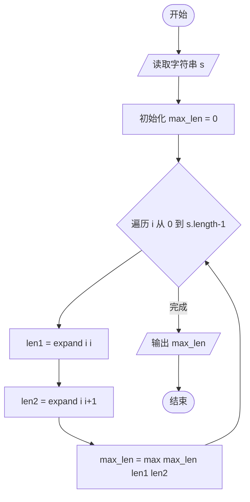
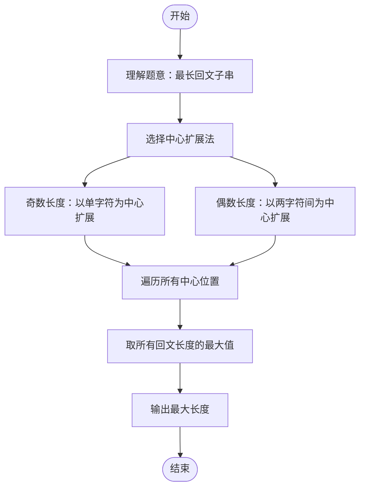

# L2-008 - 最长对称子串（25 分）

- **时间限制**: 200 ms
- **内存限制**: 65536 KB
- **代码长度限制**: 16 KB

---

## 题目描述

对给定的字符串，本题要求你输出最长对称子串的长度。例如，给定`Is PAT&TAP symmetric?`，最长对称子串为`s PAT&TAP s`，于是你应该输出11。

### 输入格式:

输入在一行中给出长度不超过1000的非空字符串。

### 输出格式:

在一行中输出最长对称子串的长度。

### 输入样例:

```in
Is PAT&TAP symmetric?
```

### 输出样例:

```out
11
```

## 示例

### 示例 1

**输入:**
```
Is PAT&TAP symmetric?
```

**输出:**
```
11
```

---

## 题目详解

### 一、解题思路

本题的 R 实现采用以下方法：把每个字符和字符间隙分别作为回文中心，向两侧扩展并比较字符，记录得到的最大回文长度。

### 二、代码流程说明

1. 读取并解析标准输入，转换为题目所需的数据结构。
2. 按题意执行核心算法，维护中间状态并处理边界情况。
3. 整理计算结果，按照输出格式生成答案。

### 三、代码实现

```r
# 实现原理：把每个字符和字符间隙分别作为回文中心，向两侧扩展并比较字符，记录得到的最大回文长度。
# 处理流程：读取输入 -> 建立状态 -> 执行算法 -> 按题目格式输出。
# 关键变量和循环均直接对应题目中的数据、约束或操作。

# 读取并解析标准输入。
s <- readLines("stdin", warn = FALSE)[1]
best <- 0
z <- strsplit(s, "", fixed = TRUE)[[1]]
# 按题目约束遍历当前数据，更新中间状态。
for (i in seq_along(z)) for (e in list(c(i, i), c(i, i + 1))) {
    l <- e[1]
    r <- e[2]
    while (l >= 1 && r <= length(z) && z[l] == z[r]) {
        best <- max(best, r - l + 1)
        l <- l - 1
        r <- r + 1
    }
}
# 严格按照题目规定的输出格式输出答案。
cat(best, "\n", sep = "")
```

### 四、代码流程图



### 五、解题流程图



### 六、常见易错点

- 题目描述、输入格式、输出格式和输入输出样例必须保持原文不变。
- R 语言下标从 1 开始，注意编号转换和空输入边界。
- 输出时严格保留题目规定的空格、换行和小数位数。
