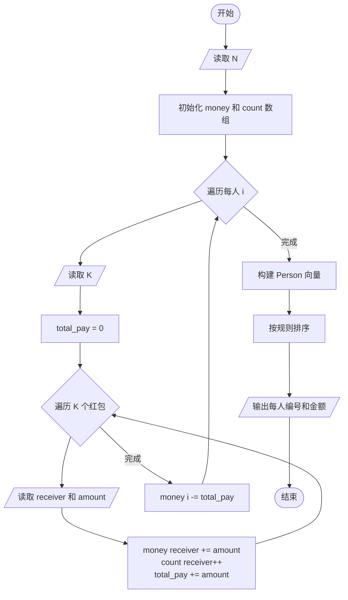
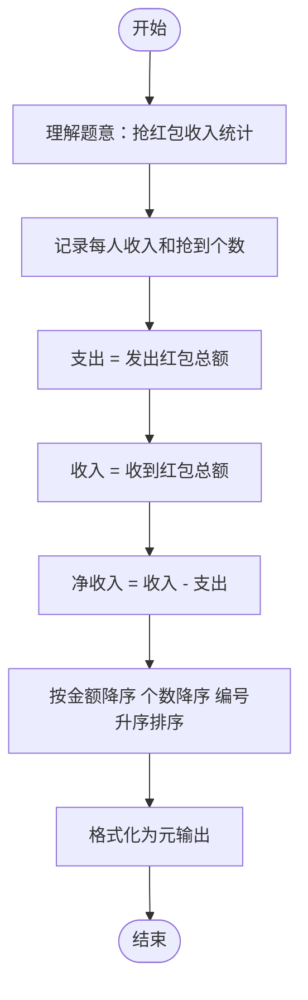

# L2-009 - 抢红包（25 分）

- **时间限制**: 300 ms
- **内存限制**: 65536 KB
- **代码长度限制**: 16 KB

---

## 题目描述

没有人没抢过红包吧…… 这里给出$$N$$个人之间互相发红包、抢红包的记录，请你统计一下他们抢红包的收获。

### 输入格式:

输入第一行给出一个正整数$$N$$（$$\le 10^4$$），即参与发红包和抢红包的总人数，则这些人从1到$$N$$编号。随后$$N$$行，第$$i$$行给出编号为$$i$$的人发红包的记录，格式如下：

$$K\quad N_1\quad P_1\quad \cdots\quad N_K\quad P_K$$

其中$$K$$（$$0 \le K \le 20$$）是发出去的红包个数，$$N_i$$是抢到红包的人的编号，$$P_i$$（$$>0$$）是其抢到的红包金额（以分为单位）。注意：对于同一个人发出的红包，每人最多只能抢1次，不能重复抢。

### 输出格式:

按照收入金额从高到低的递减顺序输出每个人的编号和收入金额（以元为单位，输出小数点后2位）。每个人的信息占一行，两数字间有1个空格。如果收入金额有并列，则按抢到红包的个数递减输出；如果还有并列，则按个人编号递增输出。

### 输入样例:

```in
10
3 2 22 10 58 8 125
5 1 345 3 211 5 233 7 13 8 101
1 7 8800
2 1 1000 2 1000
2 4 250 10 320
6 5 11 9 22 8 33 7 44 10 55 4 2
1 3 8800
2 1 23 2 123
1 8 250
4 2 121 4 516 7 112 9 10
```

### 输出样例:

```out
1 11.63
2 3.63
8 3.63
3 2.11
7 1.69
6 -1.67
9 -2.18
10 -3.26
5 -3.26
4 -12.32
```

## 示例

### 示例 1

**输入:**
```
10
3 2 22 10 58 8 125
5 1 345 3 211 5 233 7 13 8 101
1 7 8800
2 1 1000 2 1000
2 4 250 10 320
6 5 11 9 22 8 33 7 44 10 55 4 2
1 3 8800
2 1 23 2 123
1 8 250
4 2 121 4 516 7 112 9 10
```

**输出:**
```
1 11.63
2 3.63
8 3.63
3 2.11
7 1.69
6 -1.67
9 -2.18
10 -3.26
5 -3.26
4 -12.32
```

---

## 题目详解

### 一、解题思路

本题的 R 实现采用以下方法：先解析数据并按题目规定的关键字排序，再进行顺序处理和格式化输出。

### 二、代码流程说明

1. 读取并解析标准输入，转换为题目所需的数据结构。
2. 按题意执行核心算法，维护中间状态并处理边界情况。
3. 整理计算结果，按照输出格式生成答案。

### 三、代码实现

```r
# 实现原理：先解析数据并按题目规定的关键字排序，再进行顺序处理和格式化输出。
# 处理流程：读取输入 -> 建立状态 -> 执行算法 -> 按题目格式输出。
# 关键变量和循环均直接对应题目中的数据、约束或操作。

# 读取并解析标准输入。
v <- scan(file = "stdin", quiet = TRUE)
n <- v[1]
money <- numeric(n)
cnt <- integer(n)
p <- 2
# 按题目约束遍历当前数据，更新中间状态。
for (i in seq_len(n)) {
    z <- v[p]
    p <- p + 1
    for (j in seq_len(z)) {
        r <- v[p]
        amt <- v[p + 1]
        p <- p + 2
        money[i] <- money[i] - amt
        money[r] <- money[r] + amt
        cnt[r] <- cnt[r] + 1
    }
}
# 执行核心排序、状态转移或选择逻辑。
ord <- order(-money, -cnt, seq_len(n))
# 严格按照题目规定的输出格式输出答案。
for (i in ord) cat(sprintf("%d %.2f\n", i, money[i]/100))
```

### 四、代码流程图



### 五、解题流程图



### 六、常见易错点

- 题目描述、输入格式、输出格式和输入输出样例必须保持原文不变。
- R 语言下标从 1 开始，注意编号转换和空输入边界。
- 输出时严格保留题目规定的空格、换行和小数位数。
