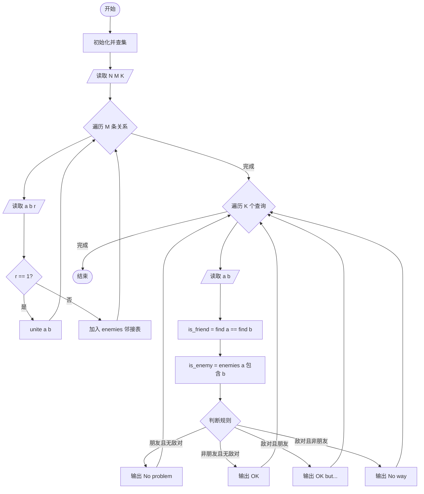
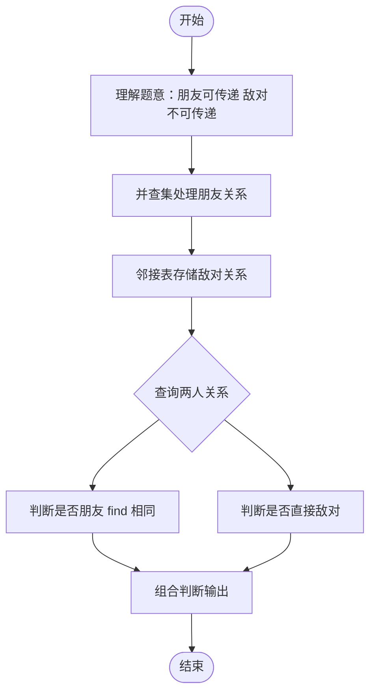

# L2-010 - 排座位（25 分）

- **时间限制**: 150 ms
- **内存限制**: 65536 KB
- **代码长度限制**: 16 KB

---

## 题目描述

布置宴席最微妙的事情，就是给前来参宴的各位宾客安排座位。无论如何，总不能把两个死对头排到同一张宴会桌旁！这个艰巨任务现在就交给你，对任何一对客人，请编写程序告诉主人他们是否能被安排同席。

### 输入格式:

输入第一行给出3个正整数：`N`（$$\le$$100），即前来参宴的宾客总人数，则这些人从1到`N`编号；`M`为已知两两宾客之间的关系数；`K`为查询的条数。随后`M`行，每行给出一对宾客之间的关系，格式为：`宾客1 宾客2 关系`，其中`关系`为1表示是朋友，-1表示是死对头。注意两个人不可能既是朋友又是敌人。最后`K`行，每行给出一对需要查询的宾客编号。

这里假设朋友的朋友也是朋友。但敌人的敌人并不一定就是朋友，朋友的敌人也不一定是敌人。只有单纯直接的敌对关系才是绝对不能同席的。

### 输出格式:

对每个查询输出一行结果：如果两位宾客之间是朋友，且没有敌对关系，则输出`No problem`；如果他们之间并不是朋友，但也不敌对，则输出`OK`；如果他们之间有敌对，然而也有共同的朋友，则输出`OK but...`；如果他们之间只有敌对关系，则输出`No way`。

### 输入样例:

```in
7 8 4
5 6 1
2 7 -1
1 3 1
3 4 1
6 7 -1
1 2 1
1 4 1
2 3 -1
3 4
5 7
2 3
7 2
```

### 输出样例:

```out
No problem
OK
OK but...
No way
```

## 示例

### 示例 1

**输入:**
```
7 8 4
5 6 1
2 7 -1
1 3 1
3 4 1
6 7 -1
1 2 1
1 4 1
2 3 -1
3 4
5 7
2 3
7 2
```

**输出:**
```
No problem
OK
OK but...
No way
```

---

## 题目详解

### 一、解题思路

本题的 R 实现采用以下方法：先解析数据并按题目规定的关键字排序，再进行顺序处理和格式化输出。

### 二、代码流程说明

1. 读取并解析标准输入，转换为题目所需的数据结构。
2. 按题意执行核心算法，维护中间状态并处理边界情况。
3. 整理计算结果，按照输出格式生成答案。

### 三、代码实现

```r
# 实现原理：先解析数据并按题目规定的关键字排序，再进行顺序处理和格式化输出。
# 处理流程：读取输入 -> 建立状态 -> 执行算法 -> 按题目格式输出。
# 关键变量和循环均直接对应题目中的数据、约束或操作。

# 读取并解析标准输入。
v <- scan(file = "stdin", quiet = TRUE)
n <- v[1]
m <- v[2]
q <- v[3]
par <- seq_len(n)
find <- function(x) {
    if (par[x] != x)
        par[x] <<- find(par[x])
    par[x]
}
enemy <- character()
p <- 4
# 按题目约束遍历当前数据，更新中间状态。
for (i in seq_len(m)) {
    a <- v[p]
    b <- v[p + 1]
    r <- v[p + 2]
    p <- p + 3
    if (r == 1)
        par[find(a)] <- find(b)
# 执行核心排序、状态转移或选择逻辑。
    else enemy <- c(enemy, paste(sort(c(a, b)), collapse = ","))
}
for (i in seq_len(q)) {
    a <- v[p]
    b <- v[p + 1]
    p <- p + 2
    rel <- find(a) == find(b)
    host <- paste(sort(c(a, b)), collapse = ",") %in% enemy
# 严格按照题目规定的输出格式输出答案。
    cat(if (rel)
        if (host)
            "OK but..."
        else "No problem"
    else if (host)
        "No way"
    else "OK", "\n", sep = "")
}
```

### 四、代码流程图



### 五、解题流程图



### 六、常见易错点

- 题目描述、输入格式、输出格式和输入输出样例必须保持原文不变。
- R 语言下标从 1 开始，注意编号转换和空输入边界。
- 输出时严格保留题目规定的空格、换行和小数位数。
