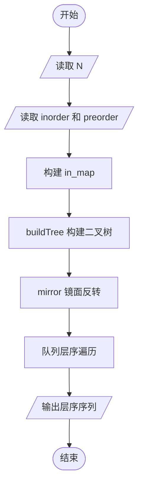
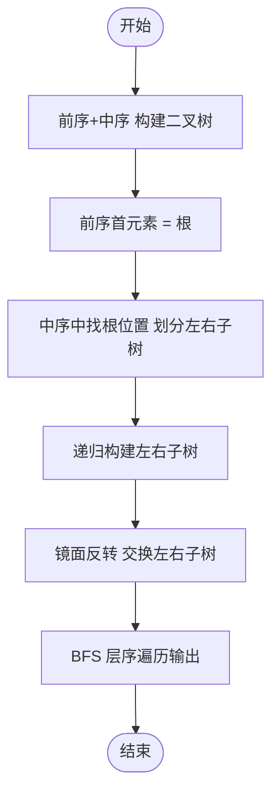

# L2-011 - 玩转二叉树（25 分）

- **时间限制**: 400 ms
- **内存限制**: 65536 KB
- **代码长度限制**: 16 KB

---

## 题目描述

给定一棵二叉树的中序遍历和前序遍历，请你先将树做个镜面反转，再输出反转后的层序遍历的序列。所谓镜面反转，是指将所有非叶结点的左右孩子对换。这里假设键值都是互不相等的正整数。

### 输入格式:

输入第一行给出一个正整数`N`（$$\le$$30），是二叉树中结点的个数。第二行给出其中序遍历序列。第三行给出其前序遍历序列。数字间以空格分隔。

### 输出格式:

在一行中输出该树反转后的层序遍历的序列。数字间以1个空格分隔，行首尾不得有多余空格。

### 输入样例:

```in
7
1 2 3 4 5 6 7
4 1 3 2 6 5 7
```

### 输出样例:

```out
4 6 1 7 5 3 2
```

## 示例

### 示例 1

**输入:**
```
7
1 2 3 4 5 6 7
4 1 3 2 6 5 7
```

**输出:**
```
4 6 1 7 5 3 2
```

---

## 题目详解

### 一、解题思路

本题的 R 实现采用以下方法：读取标准输入后建立题目所需的数据结构，按约束执行核心计算并输出结果。

### 二、代码流程说明

1. 读取并解析标准输入，转换为题目所需的数据结构。
2. 按题意执行核心算法，维护中间状态并处理边界情况。
3. 整理计算结果，按照输出格式生成答案。

### 三、代码实现

```r
# 实现原理：读取标准输入后建立题目所需的数据结构，按约束执行核心计算并输出结果。
# 处理流程：读取输入 -> 建立状态 -> 执行算法 -> 按题目格式输出。
# 关键变量和循环均直接对应题目中的数据、约束或操作。

# 读取并解析标准输入。
v <- scan(file = "stdin", quiet = TRUE)
n <- v[1]
ino <- v[2:(n + 1)]
pre <- v[(n + 2):(2 * n + 1)]
pos <- setNames(seq_len(n) - 1L, as.character(ino))
build <- function(pl, pr, il, ir) {
    if (pl >= pr)
        return(NULL)
    root <- pre[pl + 1L]
    z <- unname(pos[as.character(root)])
    left_len <- z - il
    list(root, build(pl + 1L, pl + 1L + left_len, il, z), build(pl +
        1L + left_len, pr, z + 1L, ir))
}
root <- build(0L, n, 0L, n)
mirror <- function(x) {
    if (is.null(x))
        return(NULL)
    left <- mirror(x[[2]])
    right <- mirror(x[[3]])
    list(x[[1]], right, left)
}
root <- mirror(root)
q <- list(root)
out <- numeric()
# 按题目约束遍历当前数据，更新中间状态。
while (length(q)) {
    x <- q[[1]]
    q <- q[-1]
    out <- c(out, x[[1]])
    if (!is.null(x[[2]]))
        q <- append(q, list(x[[2]]))
    if (!is.null(x[[3]]))
        q <- append(q, list(x[[3]]))
}
# 严格按照题目规定的输出格式输出答案。
cat(paste(out, collapse = " "), "\n", sep = "")
```

### 四、代码流程图



### 五、解题流程图



### 六、常见易错点

- 题目描述、输入格式、输出格式和输入输出样例必须保持原文不变。
- R 语言下标从 1 开始，注意编号转换和空输入边界。
- 输出时严格保留题目规定的空格、换行和小数位数。
