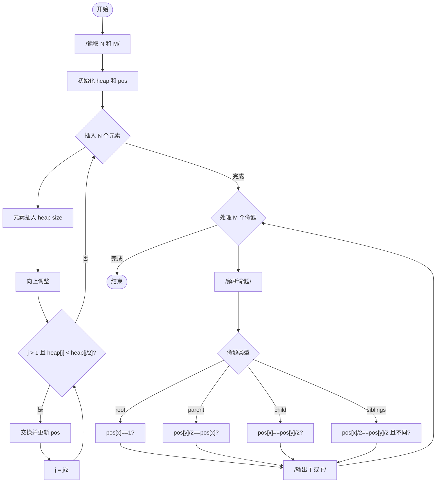
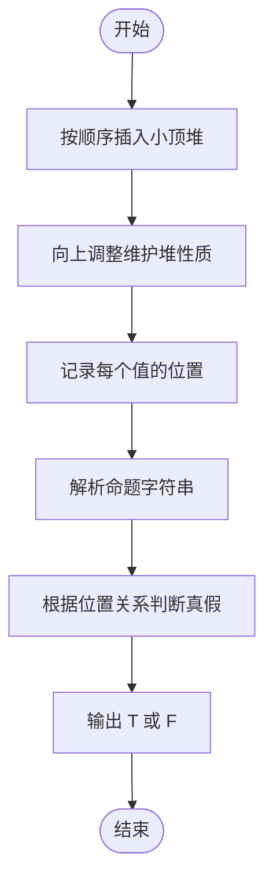

# L2-012 - 关于堆的判断（25 分）

- **时间限制**: 400 ms
- **内存限制**: 65536 KB
- **代码长度限制**: 16 KB

---

## 题目描述

将一系列给定数字顺序插入一个初始为空的小顶堆`H[]`。随后判断一系列相关命题是否为真。命题分下列几种：

- `x is the root`：`x`是根结点；
- `x and y are siblings`：`x`和`y`是兄弟结点；
- `x is the parent of y`：`x`是`y`的父结点；
- `x is a child of y`：`x`是`y`的一个子结点。

### 输入格式:

每组测试第1行包含2个正整数`N`（$$\le$$ 1000）和`M`（$$\le$$ 20），分别是插入元素的个数、以及需要判断的命题数。下一行给出区间$$[-10000, 10000]$$内的`N`个要被插入一个初始为空的小顶堆的整数。之后`M`行，每行给出一个命题。题目保证命题中的结点键值都是存在的。

### 输出格式:

对输入的每个命题，如果其为真，则在一行中输出`T`，否则输出`F`。

### 输入样例:

```in
5 4
46 23 26 24 10
24 is the root
26 and 23 are siblings
46 is the parent of 23
23 is a child of 10
```

### 输出样例:

```out
F
T
F
T
```

## 示例

### 示例 1

**输入:**
```
5 4
46 23 26 24 10
24 is the root
26 and 23 are siblings
46 is the parent of 23
23 is a child of 10
```

**输出:**
```
F
T
F
T
```

---

## 题目详解

### 一、解题思路

本题的 R 实现采用以下方法：按小根堆的上滤过程建立堆，再用数组下标关系判断根、父子和兄弟关系，逐条回答查询。

### 二、代码流程说明

1. 读取并解析标准输入，转换为题目所需的数据结构。
2. 按题意执行核心算法，维护中间状态并处理边界情况。
3. 整理计算结果，按照输出格式生成答案。

### 三、代码实现

```r
# 实现原理：按小根堆的上滤过程建立堆，再用数组下标关系判断根、父子和兄弟关系，逐条回答查询。
# 处理流程：读取输入 -> 建立状态 -> 执行算法 -> 按题目格式输出。
# 关键变量和循环均直接对应题目中的数据、约束或操作。

# 读取并解析标准输入。
x <- readLines("stdin", warn = FALSE)
q <- as.integer(strsplit(x[1], " ", fixed = TRUE)[[1]])[2]
a <- as.integer(strsplit(x[2], " ", fixed = TRUE)[[1]])
h <- integer()
# 按题目约束遍历当前数据，更新中间状态。
for (z in a) {
    h <- c(h, z)
    i <- length(h)
    while (i > 1) {
        j <- i%/%2
        if (h[j] <= h[i])
            break
        h[c(i, j)] <- h[c(j, i)]
        i <- j
    }
}
pos <- setNames(seq_along(h) - 1, h)
out <- character()
for (s in x[3:length(x)]) {
    z <- as.integer(regmatches(s, gregexpr("-?[0-9]+", s))[[1]])
    if (grepl("root", s))
        ok <- length(z) && pos[as.character(z[1])] == 0
    else if (grepl("siblings", s))
        ok <- length(z) >= 2 && !is.na(pos[as.character(z[1])]) &&
            !is.na(pos[as.character(z[2])]) && (pos[as.character(z[1])] -
            1)%/%2 == (pos[as.character(z[2])] - 1)%/%2
    else if (grepl("parent", s))
        ok <- length(z) >= 2 && !is.na(pos[as.character(z[1])]) &&
            (pos[as.character(z[2])] - 1)%/%2 == pos[as.character(z[1])]
    else ok <- length(z) >= 2 && !is.na(pos[as.character(z[1])]) &&
        (pos[as.character(z[1])] - 1)%/%2 == pos[as.character(z[2])]
    out <- c(out, if (isTRUE(ok)) "T" else "F")
}
# 严格按照题目规定的输出格式输出答案。
cat(paste(head(out, q), collapse = "\n"), "\n", sep = "")
```

### 四、代码流程图



### 五、解题流程图



### 六、常见易错点

- 题目描述、输入格式、输出格式和输入输出样例必须保持原文不变。
- R 语言下标从 1 开始，注意编号转换和空输入边界。
- 输出时严格保留题目规定的空格、换行和小数位数。
