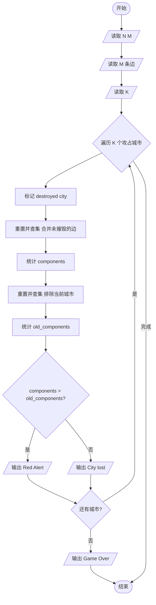
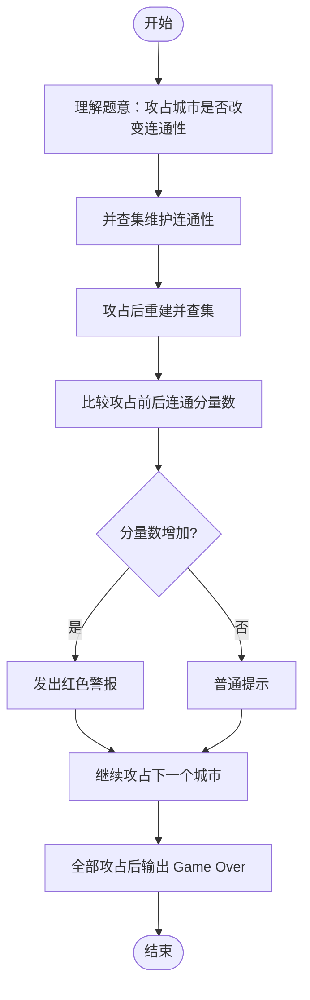

# L2-013 - 红色警报（25 分）

- **时间限制**: 400 ms
- **内存限制**: 65536 KB
- **代码长度限制**: 16 KB

---

## 题目描述

战争中保持各个城市间的连通性非常重要。本题要求你编写一个报警程序，当失去一个城市导致国家被分裂为多个无法连通的区域时，就发出红色警报。注意：若该国本来就不完全连通，是分裂的k个区域，而失去一个城市并不改变其他城市之间的连通性，则不要发出警报。

### 输入格式:

输入在第一行给出两个整数`N`（0 $$<$$ `N` $$\le$$ 500）和`M`（$$\le$$ 5000），分别为城市个数（于是默认城市从0到`N`-1编号）和连接两城市的通路条数。随后`M`行，每行给出一条通路所连接的两个城市的编号，其间以1个空格分隔。在城市信息之后给出被攻占的信息，即一个正整数`K`和随后的`K`个被攻占的城市的编号。

注意：输入保证给出的被攻占的城市编号都是合法的且无重复，但并不保证给出的通路没有重复。

### 输出格式:

对每个被攻占的城市，如果它会改变整个国家的连通性，则输出`Red Alert: City k is lost!`，其中`k`是该城市的编号；否则只输出`City k is lost.`即可。如果该国失去了最后一个城市，则增加一行输出`Game Over.`。

### 输入样例:

```in
5 4
0 1
1 3
3 0
0 4
5
1 2 0 4 3
```

### 输出样例:

```out
City 1 is lost.
City 2 is lost.
Red Alert: City 0 is lost!
City 4 is lost.
City 3 is lost.
Game Over.
```

## 示例

### 示例 1

**输入:**
```
5 4
0 1
1 3
3 0
0 4
5
1 2 0 4 3
```

**输出:**
```
City 1 is lost.
City 2 is lost.
Red Alert: City 0 is lost!
City 4 is lost.
City 3 is lost.
Game Over.
```

---

## 题目详解

### 一、解题思路

本题的 R 实现采用以下方法：每次删除城市后，从未被删除的城市重新进行图遍历，比较删除前后的连通分量数判断是否触发红色警报。

### 二、代码流程说明

1. 读取并解析标准输入，转换为题目所需的数据结构。
2. 按题意执行核心算法，维护中间状态并处理边界情况。
3. 整理计算结果，按照输出格式生成答案。

### 三、代码实现

```r
# 实现原理：每次删除城市后，从未被删除的城市重新进行图遍历，比较删除前后的连通分量数判断是否触发红色警报。
# 处理流程：读取输入 -> 建立状态 -> 执行算法 -> 按题目格式输出。
# 关键变量和循环均直接对应题目中的数据、约束或操作。

# 读取并解析标准输入。
v <- scan(file = "stdin", quiet = TRUE)
n <- v[1]
m <- v[2]
p <- 3
g <- vector("list", n)
# 按题目约束遍历当前数据，更新中间状态。
for (i in seq_len(n)) g[[i]] <- integer()
for (i in seq_len(m)) {
    a <- v[p] + 1
    b <- v[p + 1] + 1
    p <- p + 2
    g[[a]] <- c(g[[a]], b)
    g[[b]] <- c(g[[b]], a)
}
q <- v[p]
p <- p + 1
lost <- rep(FALSE, n)
comp <- function() {
    seen <- rep(FALSE, n)
    z <- 0
    for (i in seq_len(n)) if (!lost[i] && !seen[i]) {
        z <- z + 1
        st <- i
        seen[i] <- TRUE
        while (length(st)) {
            u <- st[1]
            st <- st[-1]
            for (w in g[[u]]) if (!lost[w] && !seen[w]) {
                seen[w] <- TRUE
                st <- c(st, w)
            }
        }
    }
    z
}
last <- comp()
for (i in seq_len(q)) {
    x <- v[p] + 1
    p <- p + 1
    lost[x] <- TRUE
    now <- comp()
# 严格按照题目规定的输出格式输出答案。
    cat(if (now > last)
        paste0("Red Alert: City ", x - 1, " is lost!")
    else paste0("City ", x - 1, " is lost."), "\n", sep = "")
    last <- now
    if (sum(lost) == n)
        cat("Game Over.\n", sep = "")
}
```

### 四、代码流程图



### 五、解题流程图



### 六、常见易错点

- 题目描述、输入格式、输出格式和输入输出样例必须保持原文不变。
- R 语言下标从 1 开始，注意编号转换和空输入边界。
- 输出时严格保留题目规定的空格、换行和小数位数。
