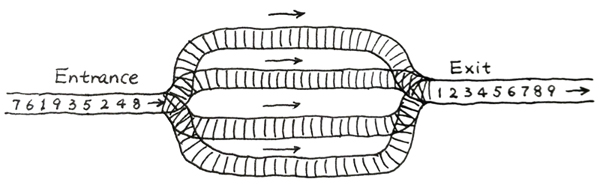
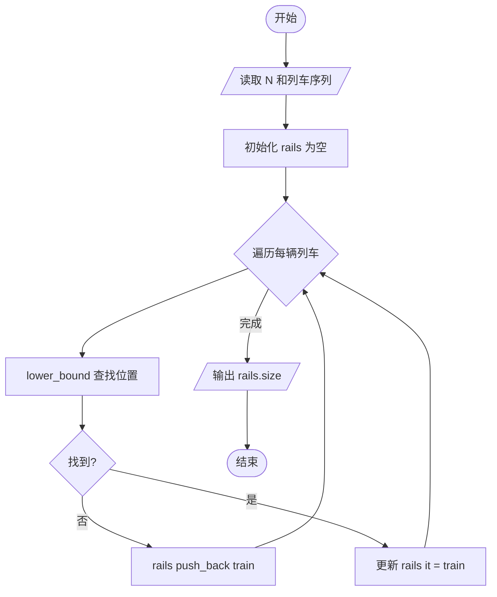
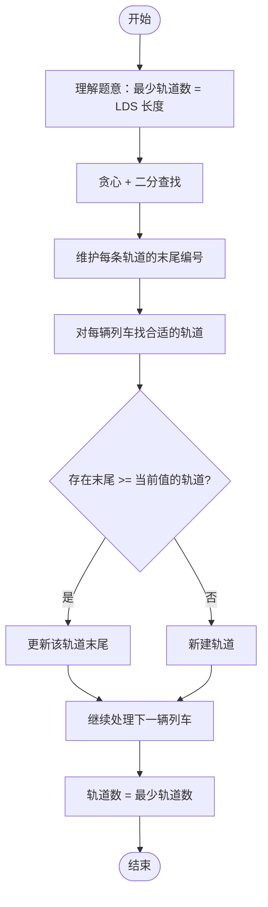

# L2-014 - 列车调度（25 分）

- **时间限制**: 300 ms
- **内存限制**: 65536 KB
- **代码长度限制**: 16 KB

---

## 题目描述

火车站的列车调度铁轨的结构如下图所示。



两端分别是一条入口（Entrance）轨道和一条出口（Exit）轨道，它们之间有`N`条平行的轨道。每趟列车从入口可以选择任意一条轨道进入，最后从出口离开。在图中有9趟列车，在入口处按照{8，4，2，5，3，9，1，6，7}的顺序排队等待进入。如果要求它们必须按序号递减的顺序从出口离开，则至少需要多少条平行铁轨用于调度？

### 输入格式:

输入第一行给出一个整数`N` (2 $$\le$$ `N` $$\le 10^5$$)，下一行给出从1到`N`的整数序号的一个重排列。数字间以空格分隔。

### 输出格式:

在一行中输出可以将输入的列车按序号递减的顺序调离所需要的最少的铁轨条数。

### 输入样例:

```in
9
8 4 2 5 3 9 1 6 7
```

### 输出样例:

```out
4
```

## 示例

### 示例 1

**输入:**
```
9
8 4 2 5 3 9 1 6 7
```

**输出:**
```
4
```

---

## 题目详解

### 一、解题思路

本题的 R 实现采用以下方法：读取标准输入后建立题目所需的数据结构，按约束执行核心计算并输出结果。

### 二、代码流程说明

1. 读取并解析标准输入，转换为题目所需的数据结构。
2. 按题意执行核心算法，维护中间状态并处理边界情况。
3. 整理计算结果，按照输出格式生成答案。

### 三、代码实现

```r
# 实现原理：读取标准输入后建立题目所需的数据结构，按约束执行核心计算并输出结果。
# 处理流程：读取输入 -> 建立状态 -> 执行算法 -> 按题目格式输出。
# 关键变量和循环均直接对应题目中的数据、约束或操作。

# 读取并解析标准输入。
v <- scan(file = "stdin", quiet = TRUE)
n <- v[1]
a <- v[2:(n + 1)]
tails <- numeric()
# 按题目约束遍历当前数据，更新中间状态。
for (x in a) {
    i <- findInterval(x, tails) + 1
    if (i > length(tails))
        tails <- c(tails, x)
    else tails[i] <- x
}
# 严格按照题目规定的输出格式输出答案。
cat(length(tails), "\n", sep = "")
```

### 四、代码流程图



### 五、解题流程图



### 六、常见易错点

- 题目描述、输入格式、输出格式和输入输出样例必须保持原文不变。
- R 语言下标从 1 开始，注意编号转换和空输入边界。
- 输出时严格保留题目规定的空格、换行和小数位数。
