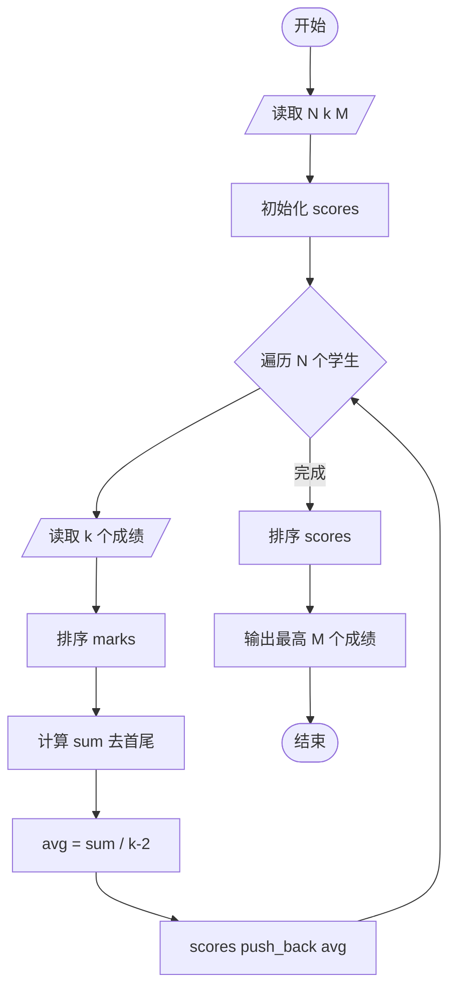
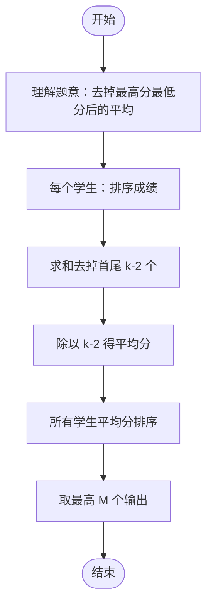

# L2-015 - 互评成绩（25 分）

- **时间限制**: 300 ms
- **内存限制**: 65536 KB
- **代码长度限制**: 16 KB

---

## 题目描述

学生互评作业的简单规则是这样定的：每个人的作业会被`k`个同学评审，得到`k`个成绩。系统需要去掉一个最高分和一个最低分，将剩下的分数取平均，就得到这个学生的最后成绩。本题就要求你编写这个互评系统的算分模块。

### 输入格式:

输入第一行给出3个正整数`N`（3 $$<$$ `N` $$\le 10^4$$，学生总数）、`k`（3 $$\le$$ `k` $$\le$$ 10，每份作业的评审数）、`M`（$$\le$$ 20，需要输出的学生数）。随后`N`行，每行给出一份作业得到的`k`个评审成绩（在区间[0, 100]内），其间以空格分隔。

### 输出格式:

按非递减顺序输出最后得分最高的`M`个成绩，保留小数点后3位。分数间有1个空格，行首尾不得有多余空格。

### 输入样例:

```in
6 5 3
88 90 85 99 60
67 60 80 76 70
90 93 96 99 99
78 65 77 70 72
88 88 88 88 88
55 55 55 55 55
```

### 输出样例:

```out
87.667 88.000 96.000
```

## 示例

### 示例 1

**输入:**
```
6 5 3
88 90 85 99 60
67 60 80 76 70
90 93 96 99 99
78 65 77 70 72
88 88 88 88 88
55 55 55 55 55
```

**输出:**
```
87.667 88.000 96.000
```

---

## 题目详解

### 一、解题思路

本题的 R 实现采用以下方法：先解析数据并按题目规定的关键字排序，再进行顺序处理和格式化输出。

### 二、代码流程说明

1. 读取并解析标准输入，转换为题目所需的数据结构。
2. 按题意执行核心算法，维护中间状态并处理边界情况。
3. 整理计算结果，按照输出格式生成答案。

### 三、代码实现

```r
# 实现原理：先解析数据并按题目规定的关键字排序，再进行顺序处理和格式化输出。
# 处理流程：读取输入 -> 建立状态 -> 执行算法 -> 按题目格式输出。
# 关键变量和循环均直接对应题目中的数据、约束或操作。

# 读取并解析标准输入。
v <- scan(file = "stdin", quiet = TRUE)
n <- v[1]
k <- v[2]
m <- v[3]
p <- 4
s <- numeric()
# 按题目约束遍历当前数据，更新中间状态。
for (i in seq_len(n)) {
    z <- v[p:(p + k - 1)]
    p <- p + k
    s <- c(s, (sum(z) - min(z) - max(z))/(k - 2))
}
# 执行核心排序、状态转移或选择逻辑。
s <- sort(s)
# 严格按照题目规定的输出格式输出答案。
cat(paste(sprintf("%.3f", tail(s, m)), collapse = " "), "\n",
    sep = "")
```

### 四、代码流程图



### 五、解题流程图



### 六、常见易错点

- 题目描述、输入格式、输出格式和输入输出样例必须保持原文不变。
- R 语言下标从 1 开始，注意编号转换和空输入边界。
- 输出时严格保留题目规定的空格、换行和小数位数。
