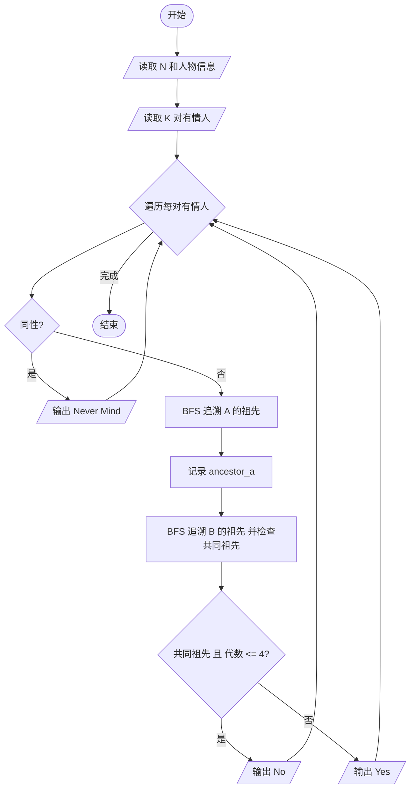
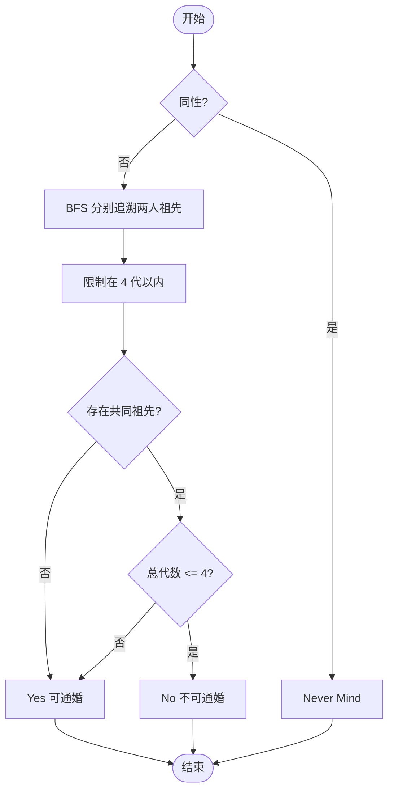

# L2-016 - 愿天下有情人都是失散多年的兄妹（25 分）

- **时间限制**: 200 ms
- **内存限制**: 65536 KB
- **代码长度限制**: 16 KB

---

## 题目描述

呵呵。大家都知道五服以内不得通婚，即两个人最近的共同祖先如果在五代以内（即本人、父母、祖父母、曾祖父母、高祖父母）则不可通婚。本题就请你帮助一对有情人判断一下，他们究竟是否可以成婚？

### 输入格式:

输入第一行给出一个正整数`N`（2 $$\le$$ `N` $$\le 10^4$$），随后`N`行，每行按以下格式给出一个人的信息：

```
本人ID 性别 父亲ID 母亲ID
```

其中`ID`是5位数字，每人不同；性别`M`代表男性、`F`代表女性。如果某人的父亲或母亲已经不可考，则相应的`ID`位置上标记为`-1`。

接下来给出一个正整数`K`，随后`K`行，每行给出一对有情人的`ID`，其间以空格分隔。

注意：题目保证两个人是同辈，每人只有一个性别，并且血缘关系网中没有乱伦或隔辈成婚的情况。

### 输出格式:

对每一对有情人，判断他们的关系是否可以通婚：如果两人是同性，输出`Never Mind`；如果是异性并且关系出了五服，输出`Yes`；如果异性关系未出五服，输出`No`。

### 输入样例:

```in
24
00001 M 01111 -1
00002 F 02222 03333
00003 M 02222 03333
00004 F 04444 03333
00005 M 04444 05555
00006 F 04444 05555
00007 F 06666 07777
00008 M 06666 07777
00009 M 00001 00002
00010 M 00003 00006
00011 F 00005 00007
00012 F 00008 08888
00013 F 00009 00011
00014 M 00010 09999
00015 M 00010 09999
00016 M 10000 00012
00017 F -1 00012
00018 F 11000 00013
00019 F 11100 00018
00020 F 00015 11110
00021 M 11100 00020
00022 M 00016 -1
00023 M 10012 00017
00024 M 00022 10013
9
00021 00024
00019 00024
00011 00012
00022 00018
00001 00004
00013 00016
00017 00015
00019 00021
00010 00011
```

### 输出样例:

```out
Never Mind
Yes
Never Mind
No
Yes
No
Yes
No
No
```

## 示例

### 示例 1

**输入:**
```
24
00001 M 01111 -1
00002 F 02222 03333
00003 M 02222 03333
00004 F 04444 03333
00005 M 04444 05555
00006 F 04444 05555
00007 F 06666 07777
00008 M 06666 07777
00009 M 00001 00002
00010 M 00003 00006
00011 F 00005 00007
00012 F 00008 08888
00013 F 00009 00011
00014 M 00010 09999
00015 M 00010 09999
00016 M 10000 00012
00017 F -1 00012
00018 F 11000 00013
00019 F 11100 00018
00020 F 00015 11110
00021 M 11100 00020
00022 M 00016 -1
00023 M 10012 00017
00024 M 00022 10013
9
00021 00024
00019 00024
00011 00012
00022 00018
00001 00004
00013 00016
00017 00015
00019 00021
00010 00011
```

**输出:**
```
Never Mind
Yes
Never Mind
No
Yes
No
Yes
No
No
```

---

## 题目详解

### 一、解题思路

本题的 R 实现采用以下方法：读取标准输入后建立题目所需的数据结构，按约束执行核心计算并输出结果。

### 二、代码流程说明

1. 读取并解析标准输入，转换为题目所需的数据结构。
2. 按题意执行核心算法，维护中间状态并处理边界情况。
3. 整理计算结果，按照输出格式生成答案。

### 三、代码实现

```r
# 实现原理：读取标准输入后建立题目所需的数据结构，按约束执行核心计算并输出结果。
# 处理流程：读取输入 -> 建立状态 -> 执行算法 -> 按题目格式输出。
# 关键变量和循环均直接对应题目中的数据、约束或操作。

# 读取并解析标准输入。
v <- scan(file = "stdin", what = "", quiet = TRUE)
n <- as.integer(v[1])
p <- 2
people <- list()
# 按题目约束遍历当前数据，更新中间状态。
for (i in seq_len(n)) {
    id <- v[p]
    people[[id]] <- v[(p + 1):(p + 3)]
    p <- p + 4
}
anc <- function(id) {
    seen <- id
    front <- id
    for (d in 1:4) {
        nextf <- character()
        for (x in front) if (!is.null(people[[x]]))
            for (y in people[[x]][2:3]) if (y != "-1" && !y %in%
                seen) {
                seen <- c(seen, y)
                nextf <- c(nextf, y)
            }
        front <- nextf
    }
    seen
}
q <- as.integer(v[p])
p <- p + 1
for (i in seq_len(q)) {
    a <- v[p]
    b <- v[p + 1]
    p <- p + 2
    if (is.null(people[[a]]) || is.null(people[[b]]) || people[[a]][1] ==
        people[[b]][1])
# 严格按照题目规定的输出格式输出答案。
        cat("Never Mind\n")
    else cat(if (length(intersect(anc(a), anc(b))) == 0)
        "Yes"
    else "No", "\n", sep = "")
}
```

### 四、代码流程图



### 五、解题流程图



### 六、常见易错点

- 题目描述、输入格式、输出格式和输入输出样例必须保持原文不变。
- R 语言下标从 1 开始，注意编号转换和空输入边界。
- 输出时严格保留题目规定的空格、换行和小数位数。
