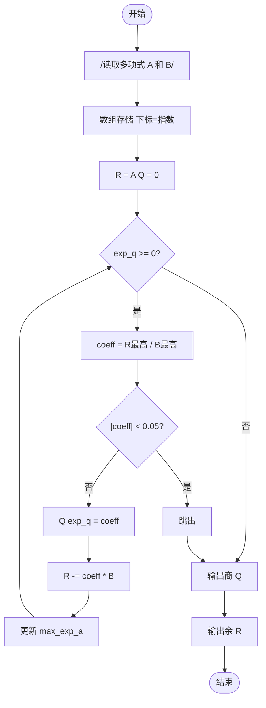
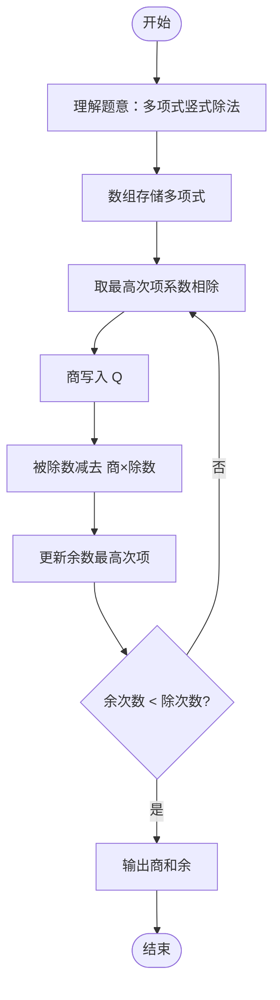

# L2-018 - 多项式A除以B（25 分）

- **时间限制**: 400 ms
- **内存限制**: 65536 KB
- **代码长度限制**: 16 KB

---

## 题目描述

这仍然是一道关于A/B的题，只不过A和B都换成了多项式。你需要计算两个多项式相除的商Q和余R，其中R的阶数必须小于B的阶数。

### 输入格式:

输入分两行，每行给出一个非零多项式，先给出A，再给出B。每行的格式如下：

```
N e[1] c[1] ... e[N] c[N]
```

其中`N`是该多项式非零项的个数，`e[i]`是第`i`个非零项的指数，`c[i]`是第`i`个非零项的系数。各项按照指数递减的顺序给出，保证所有指数是各不相同的非负整数，所有系数是非零整数，所有整数在整型范围内。

### 输出格式:

分两行先后输出商和余，输出格式与输入格式相同，输出的系数保留小数点后1位。同行数字间以1个空格分隔，行首尾不得有多余空格。注意：零多项式是一个特殊多项式，对应输出为`0 0 0.0`。但非零多项式不能输出零系数（包括舍入后为0.0）的项。在样例中，余多项式其实有常数项`-1/27`，但因其舍入后为0.0，故不输出。

### 输入样例:

```in
4 4 1 2 -3 1 -1 0 -1
3 2 3 1 -2 0 1
```

### 输出样例:

```out
3 2 0.3 1 0.2 0 -1.0
1 1 -3.1
```

## 示例

### 示例 1

**输入:**
```
4 4 1 2 -3 1 -1 0 -1
3 2 3 1 -2 0 1
```

**输出:**
```
3 2 0.3 1 0.2 0 -1.0
1 1 -3.1
```

---

## 题目详解

### 一、解题思路

本题的 R 实现采用以下方法：将输入组织为矩阵或表格，按题目定义的行、列和状态关系完成计算。

### 二、代码流程说明

1. 读取并解析标准输入，转换为题目所需的数据结构。
2. 按题意执行核心算法，维护中间状态并处理边界情况。
3. 整理计算结果，按照输出格式生成答案。

### 三、代码实现

```r
# 实现原理：将输入组织为矩阵或表格，按题目定义的行、列和状态关系完成计算。
# 处理流程：读取输入 -> 建立状态 -> 执行算法 -> 按题目格式输出。
# 关键变量和循环均直接对应题目中的数据、约束或操作。

# 读取并解析标准输入。
v <- scan(file = "stdin", quiet = TRUE)
p <- 1
na <- v[p]
p <- p + 1
a <- numeric()
# 按题目约束遍历当前数据，更新中间状态。
for (i in seq_len(na)) {
    e <- v[p]
    c <- v[p + 1]
    p <- p + 2
    a[as.character(e)] <- c
}
nb <- v[p]
p <- p + 1
b <- numeric()
for (i in seq_len(nb)) {
    e <- v[p]
    c <- v[p + 1]
    p <- p + 2
    b[as.character(e)] <- c
}
quo <- numeric()
while (length(a) > 0L && length(b) > 0L && max(as.integer(names(a))) >=
    max(as.integer(names(b)))) {
    ea <- max(as.integer(names(a)))
    eb <- max(as.integer(names(b)))
    sh <- ea - eb
    fac <- unname(a[as.character(ea)])/unname(b[as.character(eb)])
    key <- as.character(sh)
    old <- if (key %in% names(quo))
        unname(quo[key])
    else 0
    quo[key] <- old + fac
    for (e in names(b)) {
        key <- as.character(as.integer(e) + sh)
        old <- if (key %in% names(a))
            unname(a[key])
        else 0
        a[key] <- old - fac * unname(b[e])
    }
    a <- a[!is.na(a) & abs(a) >= 1e-08]
}
fmt <- function(z) {
    if (!length(z))
        return("0")
    e <- names(z)[!is.na(z) & abs(z) >= 0.05]
# 执行核心排序、状态转移或选择逻辑。
    e <- e[order(-as.integer(e))]
    c(length(e), unlist(lapply(e, function(i) c(i, sprintf("%.1f",
        z[i])))))
}
# 严格按照题目规定的输出格式输出答案。
cat(paste(fmt(quo), collapse = " "), "\n", sep = "")
cat(paste(fmt(a), collapse = " "), "\n", sep = "")
```

### 四、代码流程图



### 五、解题流程图



### 六、常见易错点

- 题目描述、输入格式、输出格式和输入输出样例必须保持原文不变。
- R 语言下标从 1 开始，注意编号转换和空输入边界。
- 输出时严格保留题目规定的空格、换行和小数位数。
