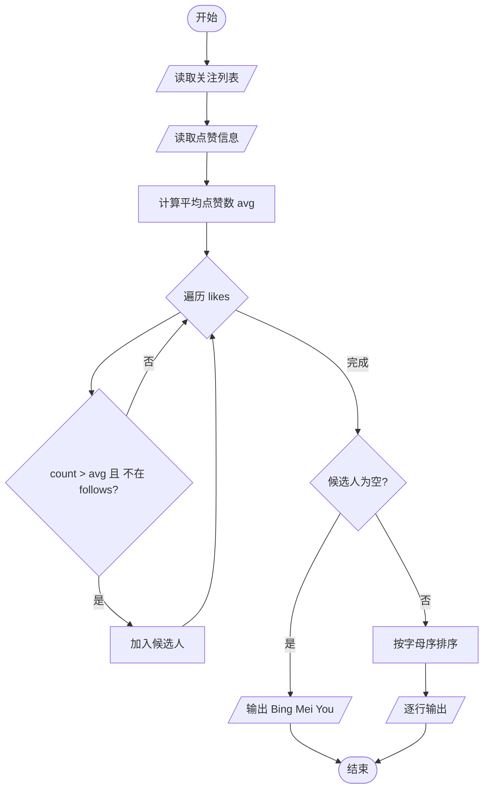
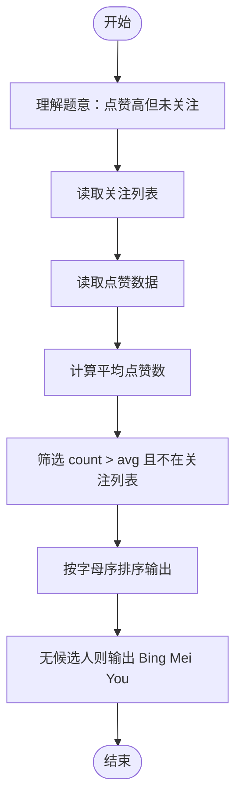

# L2-019 - 悄悄关注（25 分）

- **时间限制**: 150 ms
- **内存限制**: 65536 KB
- **代码长度限制**: 16 KB

---

## 题目描述

新浪微博上有个“悄悄关注”，一个用户悄悄关注的人，不出现在这个用户的关注列表上，但系统会推送其悄悄关注的人发表的微博给该用户。现在我们来做一回网络侦探，根据某人的关注列表和其对其他用户的点赞情况，扒出有可能被其悄悄关注的人。

### 输入格式:

输入首先在第一行给出某用户的关注列表，格式如下：

```
人数N 用户1 用户2 …… 用户N
```

其中`N`是不超过5000的正整数，每个`用户i`（`i`=1, ..., `N`）是被其关注的用户的ID，是长度为4位的由数字和英文字母组成的字符串，各项间以空格分隔。

之后给出该用户点赞的信息：首先给出一个不超过10000的正整数`M`，随后`M`行，每行给出一个被其点赞的用户ID和对该用户的点赞次数（不超过1000），以空格分隔。注意：用户ID是一个用户的唯一身份标识。题目保证在关注列表中没有重复用户，在点赞信息中也没有重复用户。

### 输出格式:

我们认为被该用户点赞次数大于其点赞平均数、且不在其关注列表上的人，很可能是其悄悄关注的人。根据这个假设，请你按用户ID字母序的升序输出可能是其悄悄关注的人，每行1个ID。如果其实并没有这样的人，则输出“Bing Mei You”。

### 输入样例 1:

```in
10 GAO3 Magi Zha1 Sen1 Quan FaMK LSum Eins FatM LLao
8
Magi 50
Pota 30
LLao 3
Ammy 48
Dave 15
GAO3 31
Zoro 1
Cath 60
```

### 输出样例 1:

```out
Ammy
Cath
Pota
```

### 输入样例 2:

```in
11 GAO3 Magi Zha1 Sen1 Quan FaMK LSum Eins FatM LLao Pota
7
Magi 50
Pota 30
LLao 48
Ammy 3
Dave 15
GAO3 31
Zoro 29
```

### 输出样例 2:

```out
Bing Mei You
```

## 示例

### 示例 1

**输入:**
```
10 GAO3 Magi Zha1 Sen1 Quan FaMK LSum Eins FatM LLao
8
Magi 50
Pota 30
LLao 3
Ammy 48
Dave 15
GAO3 31
Zoro 1
Cath 60
```

**输出:**
```
Ammy
Cath
Pota
```

### 示例 2

**输入:**
```
11 GAO3 Magi Zha1 Sen1 Quan FaMK LSum Eins FatM LLao Pota
7
Magi 50
Pota 30
LLao 48
Ammy 3
Dave 15
GAO3 31
Zoro 29
```

**输出:**
```
Bing Mei You
```

---

## 题目详解

### 一、解题思路

本题的 R 实现采用以下方法：先解析数据并按题目规定的关键字排序，再进行顺序处理和格式化输出。

### 二、代码流程说明

1. 读取并解析标准输入，转换为题目所需的数据结构。
2. 按题意执行核心算法，维护中间状态并处理边界情况。
3. 整理计算结果，按照输出格式生成答案。

### 三、代码实现

```r
# 实现原理：先解析数据并按题目规定的关键字排序，再进行顺序处理和格式化输出。
# 处理流程：读取输入 -> 建立状态 -> 执行算法 -> 按题目格式输出。
# 关键变量和循环均直接对应题目中的数据、约束或操作。

# 读取并解析标准输入。
v <- scan(file = "stdin", what = "", quiet = TRUE)
p <- 1
n <- as.integer(v[p])
p <- p + 1
follow <- v[p:(p + n - 1)]
p <- p + n
m <- as.integer(v[p])
p <- p + 1
name <- character()
score <- numeric()
# 按题目约束遍历当前数据，更新中间状态。
for (i in seq_len(m)) {
    name[i] <- v[p]
    score[i] <- as.numeric(v[p + 1])
    p <- p + 2
}
# 执行核心排序、状态转移或选择逻辑。
out <- sort(name[score > sum(score)/m & !name %in% follow])
# 严格按照题目规定的输出格式输出答案。
if (length(out)) cat(paste(out, collapse = "\n"), "\n", sep = "") else cat("Bing Mei You\n")
```

### 四、代码流程图



### 五、解题流程图



### 六、常见易错点

- 题目描述、输入格式、输出格式和输入输出样例必须保持原文不变。
- R 语言下标从 1 开始，注意编号转换和空输入边界。
- 输出时严格保留题目规定的空格、换行和小数位数。
