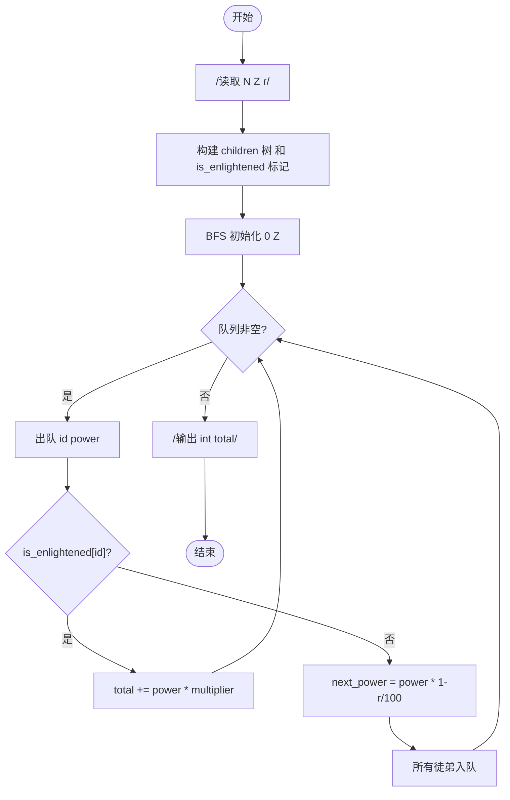
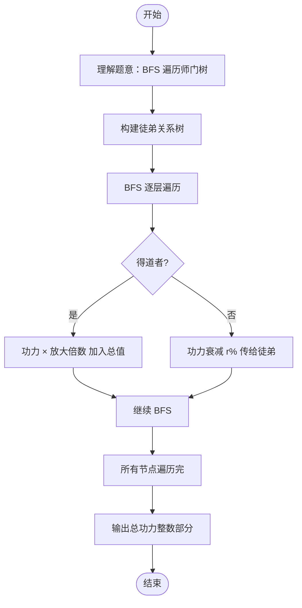

# L2-020 - 功夫传人（25 分）

- **时间限制**: 400 ms
- **内存限制**: 65536 KB
- **代码长度限制**: 16 KB

---

## 题目描述

一门武功能否传承久远并被发扬光大，是要看缘分的。一般来说，师傅传授给徒弟的武功总要打个折扣，于是越往后传，弟子们的功夫就越弱…… 直到某一支的某一代突然出现一个天分特别高的弟子（或者是吃到了灵丹、挖到了特别的秘笈），会将功夫的威力一下子放大N倍 —— 我们称这种弟子为“得道者”。

这里我们来考察某一位祖师爷门下的徒子徒孙家谱：假设家谱中的每个人只有1位师傅（除了祖师爷没有师傅）；每位师傅可以带很多徒弟；并且假设辈分严格有序，即祖师爷这门武功的每个第`i`代传人只能在第`i-1`代传人中拜1个师傅。我们假设已知祖师爷的功力值为`Z`，每向下传承一代，就会减弱`r%`，除非某一代弟子得道。现给出师门谱系关系，要求你算出所有得道者的功力总值。

### 输入格式:

输入在第一行给出3个正整数，分别是：$$N$$（$$\le 10^5$$）——整个师门的总人数（于是每个人从0到$$N-1$$编号，祖师爷的编号为0）；$$Z$$——祖师爷的功力值（不一定是整数，但起码是正数）；$$r$$ ——每传一代功夫所打的折扣百分比值（不超过100的正数）。接下来有$$N$$行，第$$i$$行（$$i=0, \cdots , N-1$$）描述编号为$$i$$的人所传的徒弟，格式为：

$$K_i$$ ID[1] ID[2] $$\cdots$$ ID[$$K_i$$]

其中$$K_i$$是徒弟的个数，后面跟的是各位徒弟的编号，数字间以空格间隔。$$K_i$$为零表示这是一位得道者，这时后面跟的一个数字表示其武功被放大的倍数。

### 输出格式:

在一行中输出所有得道者的功力总值，只保留其整数部分。题目保证输入和正确的输出都不超过$$10^{10}$$。

### 输入样例:

```in
10 18.0 1.00
3 2 3 5
1 9
1 4
1 7
0 7
2 6 1
1 8
0 9
0 4
0 3
```

### 输出样例:

```out
404
```

## 示例

### 示例 1

**输入:**
```
10 18.0 1.00
3 2 3 5
1 9
1 4
1 7
0 7
2 6 1
1 8
0 9
0 4
0 3
```

**输出:**
```
404
```

---

## 题目详解

### 一、解题思路

本题的 R 实现采用以下方法：读取标准输入后建立题目所需的数据结构，按约束执行核心计算并输出结果。

### 二、代码流程说明

1. 读取并解析标准输入，转换为题目所需的数据结构。
2. 按题意执行核心算法，维护中间状态并处理边界情况。
3. 整理计算结果，按照输出格式生成答案。

### 三、代码实现

```r
# 实现原理：读取标准输入后建立题目所需的数据结构，按约束执行核心计算并输出结果。
# 处理流程：读取输入 -> 建立状态 -> 执行算法 -> 按题目格式输出。
# 关键变量和循环均直接对应题目中的数据、约束或操作。

# 读取并解析标准输入。
v <- scan(file = "stdin", what = "", quiet = TRUE)
n <- as.integer(v[1])
z <- as.numeric(v[2])
f <- 1 - as.numeric(v[3])/100
p <- 4
g <- vector("list", n)
leaf <- numeric(n)
# 按题目约束遍历当前数据，更新中间状态。
for (i in seq_len(n)) {
    c <- as.integer(v[p])
    p <- p + 1
    if (c == 0) {
        leaf[i] <- as.numeric(v[p])
        p <- p + 1
        g[[i]] <- integer()
    }
    else {
        g[[i]] <- as.integer(v[p:(p + c - 1)]) + 1
        p <- p + c
    }
}
st <- list(c(1, z))
ans <- 0
while (length(st)) {
    x <- st[[1]]
    st <- st[-1]
    u <- x[1]
    power <- x[2]
    if (!length(g[[u]]))
        ans <- ans + power * leaf[u]
    else for (w in g[[u]]) st <- append(st, list(c(w, power *
        f)))
}
# 严格按照题目规定的输出格式输出答案。
cat(as.integer(ans), "\n", sep = "")
```

### 四、代码流程图



### 五、解题流程图



### 六、常见易错点

- 题目描述、输入格式、输出格式和输入输出样例必须保持原文不变。
- R 语言下标从 1 开始，注意编号转换和空输入边界。
- 输出时严格保留题目规定的空格、换行和小数位数。
