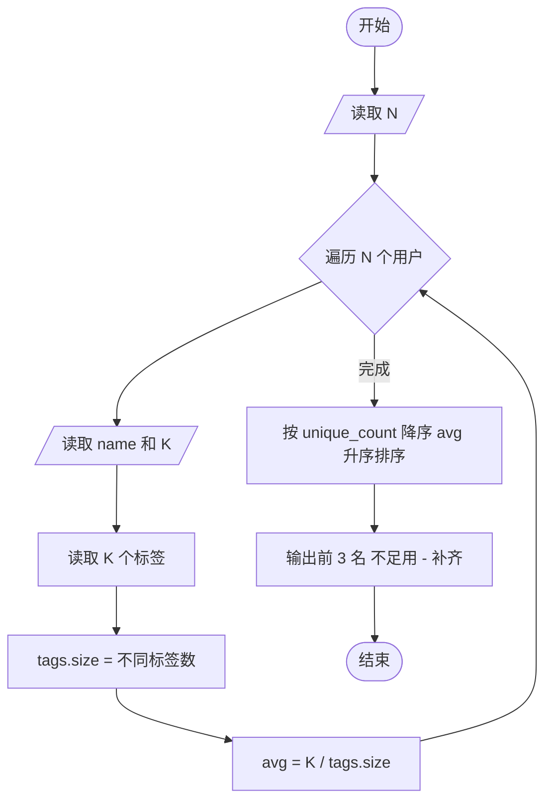
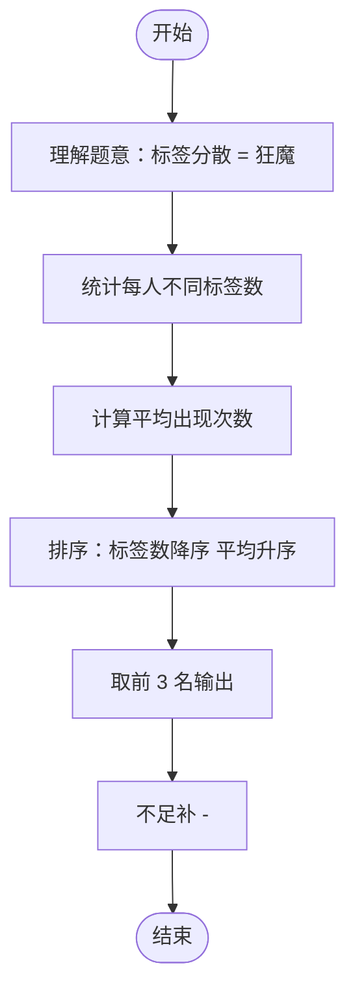

# L2-021 - 点赞狂魔（25 分）

- **时间限制**: 200 ms
- **内存限制**: 65536 KB
- **代码长度限制**: 16 KB

---

## 题目描述

微博上有个“点赞”功能，你可以为你喜欢的博文点个赞表示支持。每篇博文都有一些刻画其特性的标签，而你点赞的博文的类型，也间接刻画了你的特性。然而有这么一种人，他们会通过给自己看到的一切内容点赞来狂刷存在感，这种人就被称为“点赞狂魔”。他们点赞的标签非常分散，无法体现出明显的特性。本题就要求你写个程序，通过统计每个人点赞的不同标签的数量，找出前3名点赞狂魔。

### 输入格式:

输入在第一行给出一个正整数$$N$$（$$\le 100$$），是待统计的用户数。随后$$N$$行，每行列出一位用户的点赞标签。格式为“`Name` $$K$$ $$F_1 \cdots F_K$$”，其中`Name`是不超过8个英文小写字母的非空用户名，$$1\le K\le 1000$$，$$F_i$$（$$i=1, \cdots , K$$）是特性标签的编号，我们将所有特性标签从 1 到 $$10^7$$ 编号。数字间以空格分隔。

### 输出格式:

统计每个人点赞的不同标签的数量，找出数量最大的前3名，在一行中顺序输出他们的用户名,其间以1个空格分隔,且行末不得有多余空格。如果有并列，则输出标签出现次数平均值最小的那个，题目保证这样的用户没有并列。若不足3人，则用`-`补齐缺失，例如`mike jenny -`就表示只有2人。

### 输入样例:

```in
5
bob 11 101 102 103 104 105 106 107 108 108 107 107
peter 8 1 2 3 4 3 2 5 1
chris 12 1 2 3 4 5 6 7 8 9 1 2 3
john 10 8 7 6 5 4 3 2 1 7 5
jack 9 6 7 8 9 10 11 12 13 14
```

### 输出样例:

```out
jack chris john
```

## 示例

### 示例 1

**输入:**
```
5
bob 11 101 102 103 104 105 106 107 108 108 107 107
peter 8 1 2 3 4 3 2 5 1
chris 12 1 2 3 4 5 6 7 8 9 1 2 3
john 10 8 7 6 5 4 3 2 1 7 5
jack 9 6 7 8 9 10 11 12 13 14
```

**输出:**
```
jack chris john
```

---

## 题目详解

### 一、解题思路

本题的 R 实现采用以下方法：将输入组织为矩阵或表格，按题目定义的行、列和状态关系完成计算。

### 二、代码流程说明

1. 读取并解析标准输入，转换为题目所需的数据结构。
2. 按题意执行核心算法，维护中间状态并处理边界情况。
3. 整理计算结果，按照输出格式生成答案。

### 三、代码实现

```r
# 实现原理：将输入组织为矩阵或表格，按题目定义的行、列和状态关系完成计算。
# 处理流程：读取输入 -> 建立状态 -> 执行算法 -> 按题目格式输出。
# 关键变量和循环均直接对应题目中的数据、约束或操作。

# 读取并解析标准输入。
x <- readLines("stdin", warn = FALSE)
n <- as.integer(x[1])
rows <- lapply(x[2:(n + 1)], function(s) {
    v <- strsplit(trimws(s), " ", fixed = TRUE)[[1]]
    z <- as.integer(v[2])
    tags <- unique(v[3:(z + 2)])
    list(unique = length(tags), ratio = z/length(tags), name = v[1])
})
# 执行核心排序、状态转移或选择逻辑。
rows <- rows[order(-vapply(rows, `[[`, numeric(1), "unique"),
    vapply(rows, `[[`, numeric(1), "ratio"), vapply(rows, `[[`,
        character(1), "name"))]
out <- vapply(head(rows, 3), `[[`, character(1), "name")
if (length(out) < 3) out <- c(out, rep("-", 3 - length(out)))
# 严格按照题目规定的输出格式输出答案。
cat(paste(out, collapse = " "), "\n", sep = "")
```

### 四、代码流程图



### 五、解题流程图



### 六、常见易错点

- 题目描述、输入格式、输出格式和输入输出样例必须保持原文不变。
- R 语言下标从 1 开始，注意编号转换和空输入边界。
- 输出时严格保留题目规定的空格、换行和小数位数。
