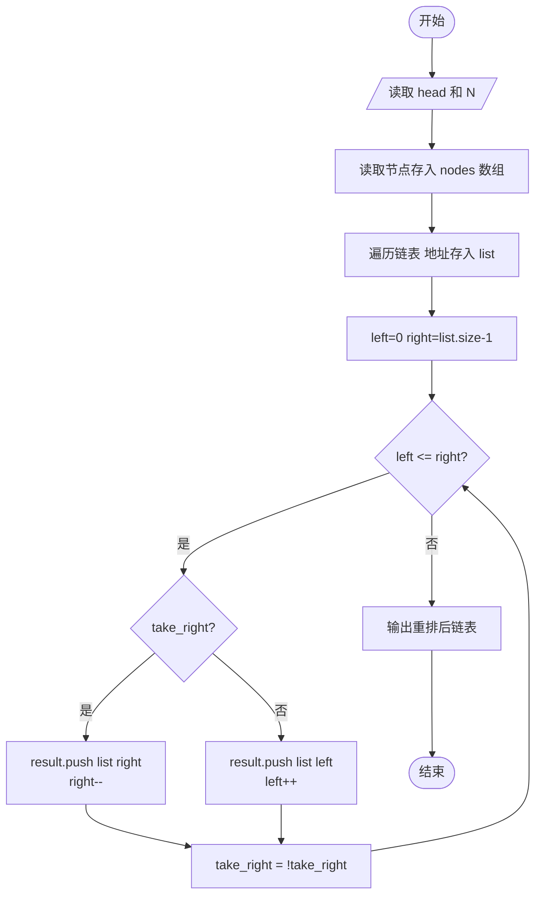
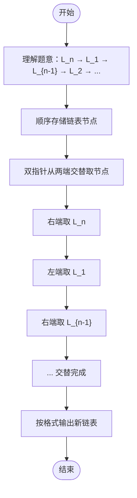

# L2-022 - 重排链表（25 分）

- **时间限制**: 500 ms
- **内存限制**: 65536 KB
- **代码长度限制**: 16 KB

---

## 题目描述

给定一个单链表 $$L_1$$→$$L_2$$→$$\cdots$$→$$L_{n-1}$$→$$L_n$$，请编写程序将链表重新排列为 $$L_n$$→$$L_1$$→$$L_{n-1}$$→$$L_2$$→$$\cdots$$。例如：给定$$L$$为1→2→3→4→5→6，则输出应该为6→1→5→2→4→3。

### 输入格式:

每个输入包含1个测试用例。每个测试用例第1行给出第1个结点的地址和结点总个数，即正整数$$N$$ ($$\le 10^5$$)。结点的地址是5位非负整数，NULL地址用$$-1$$表示。

接下来有$$N$$行，每行格式为：

```
Address Data Next
```

其中`Address`是结点地址；`Data`是该结点保存的数据，为不超过$$10^5$$的正整数；`Next`是下一结点的地址。题目保证给出的链表上至少有两个结点。

### 输出格式:

对每个测试用例，顺序输出重排后的结果链表，其上每个结点占一行，格式与输入相同。

### 输入样例:

```in
00100 6
00000 4 99999
00100 1 12309
68237 6 -1
33218 3 00000
99999 5 68237
12309 2 33218
```

### 输出样例:

```out
68237 6 00100
00100 1 99999
99999 5 12309
12309 2 00000
00000 4 33218
33218 3 -1
```

## 示例

### 示例 1

**输入:**
```
00100 6
00000 4 99999
00100 1 12309
68237 6 -1
33218 3 00000
99999 5 68237
12309 2 33218
```

**输出:**
```
68237 6 00100
00100 1 99999
99999 5 12309
12309 2 00000
00000 4 33218
33218 3 -1
```

---

## 题目详解

### 一、解题思路

本题的 R 实现采用以下方法：先按原链表顺序取出结点，再从尾部和头部交替取结点，形成“尾、头、尾、头”的重排顺序。

### 二、代码流程说明

1. 读取并解析标准输入，转换为题目所需的数据结构。
2. 按题意执行核心算法，维护中间状态并处理边界情况。
3. 整理计算结果，按照输出格式生成答案。

### 三、代码实现

```r
# 实现原理：先按原链表顺序取出结点，再从尾部和头部交替取结点，形成“尾、头、尾、头”的重排顺序。
# 处理流程：读取输入 -> 建立状态 -> 执行算法 -> 按题目格式输出。
# 关键变量和循环均直接对应题目中的数据、约束或操作。

# 读取并解析标准输入。
v <- scan(file = "stdin", what = "", quiet = TRUE)
head <- v[1]
n <- as.integer(v[2])
data <- setNames(as.integer(v[seq(4, 3 * n + 2, by = 3)]), v[seq(3,
    3 * n + 1, by = 3)])
nxt <- setNames(v[seq(5, 3 * n + 3, by = 3)], v[seq(3, 3 * n +
    1, by = 3)])
chain <- character()
cur <- head
# 按题目约束遍历当前数据，更新中间状态。
while (cur != "-1" && !is.null(data[cur])) {
    chain <- c(chain, cur)
    cur <- nxt[cur]
}
ord <- character()
l <- 1
r <- length(chain)
while (l <= r) {
    ord <- c(ord, chain[r])
    if (l < r)
        ord <- c(ord, chain[l])
    l <- l + 1
    r <- r - 1
}
# 严格按照题目规定的输出格式输出答案。
for (i in seq_along(ord)) cat(paste(ord[i], data[ord[i]], if (i < length(ord)) ord[i +
    1] else "-1"), "\n", sep = "")
```

### 四、代码流程图



### 五、解题流程图



### 六、常见易错点

- 题目描述、输入格式、输出格式和输入输出样例必须保持原文不变。
- R 语言下标从 1 开始，注意编号转换和空输入边界。
- 输出时严格保留题目规定的空格、换行和小数位数。
