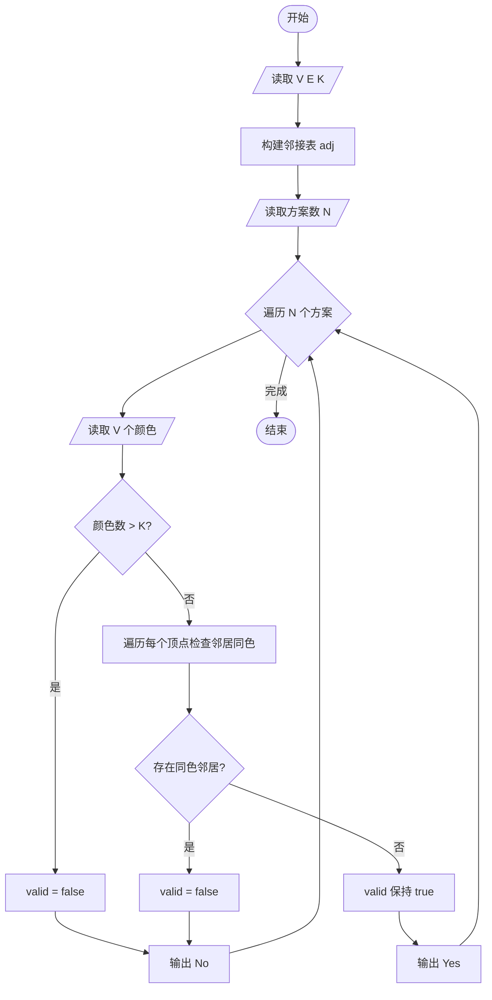
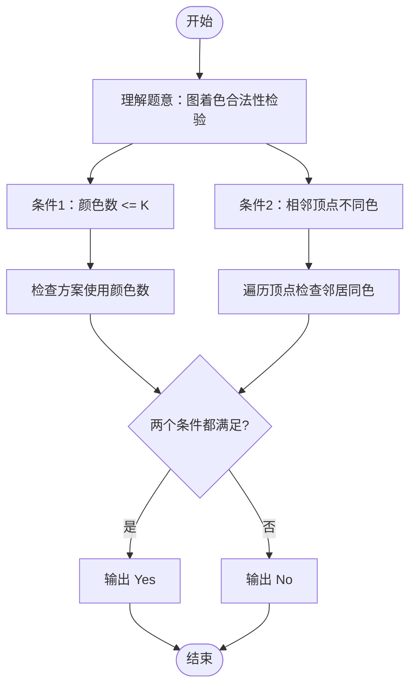

# L2-023 - 图着色问题（25 分）

- **时间限制**: 300 ms
- **内存限制**: 65536 KB
- **代码长度限制**: 16 KB

---

## 题目描述

图着色问题是一个著名的NP完全问题。给定无向图$$G = (V, E)$$，问可否用$$K$$种颜色为$$V$$中的每一个顶点分配一种颜色，使得不会有两个相邻顶点具有同一种颜色？

但本题并不是要你解决这个着色问题，而是对给定的一种颜色分配，请你判断这是否是图着色问题的一个解。

### 输入格式:

输入在第一行给出3个整数$$V$$（$$0 < V \le 500$$）、$$E$$（$$\ge 0$$）和$$K$$（$$0 < K \le V$$），分别是无向图的顶点数、边数、以及颜色数。顶点和颜色都从1到$$V$$编号。随后$$E$$行，每行给出一条边的两个端点的编号。在图的信息给出之后，给出了一个正整数$$N$$（$$\le 20$$），是待检查的颜色分配方案的个数。随后$$N$$行，每行顺次给出$$V$$个顶点的颜色（第$$i$$个数字表示第$$i$$个顶点的颜色），数字间以空格分隔。题目保证给定的无向图是合法的（即不存在自回路和重边）。

### 输出格式:

对每种颜色分配方案，如果是图着色问题的一个解则输出`Yes`，否则输出`No`，每句占一行。

### 输入样例:

```in
6 8 3
2 1
1 3
4 6
2 5
2 4
5 4
5 6
3 6
4
1 2 3 3 1 2
4 5 6 6 4 5
1 2 3 4 5 6
2 3 4 2 3 4
```

### 输出样例:

```out
Yes
Yes
No
No
```

## 示例

### 示例 1

**输入:**
```
6 8 3
2 1
1 3
4 6
2 5
2 4
5 4
5 6
3 6
4
1 2 3 3 1 2
4 5 6 6 4 5
1 2 3 4 5 6
2 3 4 2 3 4
```

**输出:**
```
Yes
Yes
No
No
```

---

## 题目详解

### 一、解题思路

本题的 R 实现采用以下方法：将输入组织为矩阵或表格，按题目定义的行、列和状态关系完成计算。

### 二、代码流程说明

1. 读取并解析标准输入，转换为题目所需的数据结构。
2. 按题意执行核心算法，维护中间状态并处理边界情况。
3. 整理计算结果，按照输出格式生成答案。

### 三、代码实现

```r
# 实现原理：将输入组织为矩阵或表格，按题目定义的行、列和状态关系完成计算。
# 处理流程：读取输入 -> 建立状态 -> 执行算法 -> 按题目格式输出。
# 关键变量和循环均直接对应题目中的数据、约束或操作。

# 读取并解析标准输入。
v <- scan(file = "stdin", quiet = TRUE)
n <- v[1]
m <- v[2]
colors <- v[3]
p <- 4
e <- matrix(0, m, 2)
# 按题目约束遍历当前数据，更新中间状态。
for (i in seq_len(m)) {
    e[i, ] <- v[p:(p + 1)]
    p <- p + 2
}
q <- v[p]
p <- p + 1
for (i in seq_len(q)) {
    col <- c(0, v[p:(p + n - 1)])
    p <- p + n
    good <- length(unique(col[-1])) == colors && all(col[e[,
        1] + 1] != col[e[, 2] + 1])
# 严格按照题目规定的输出格式输出答案。
    cat(if (good)
        "Yes"
    else "No", "\n", sep = "")
}
```

### 四、代码流程图



### 五、解题流程图



### 六、常见易错点

- 题目描述、输入格式、输出格式和输入输出样例必须保持原文不变。
- R 语言下标从 1 开始，注意编号转换和空输入边界。
- 输出时严格保留题目规定的空格、换行和小数位数。
