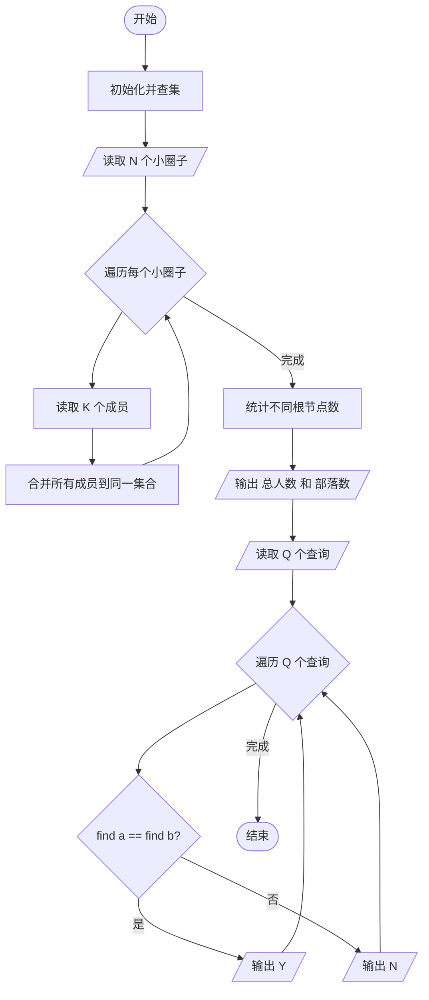
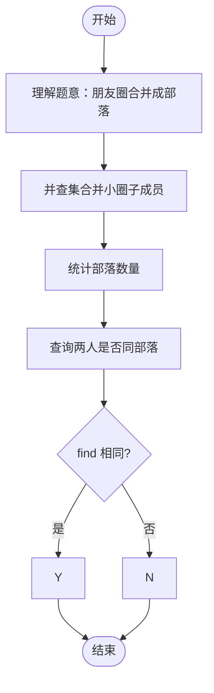

# L2-024 - 部落（25 分）

- **时间限制**: 150 ms
- **内存限制**: 65536 KB
- **代码长度限制**: 16 KB

---

## 题目描述

在一个社区里，每个人都有自己的小圈子，还可能同时属于很多不同的朋友圈。我们认为朋友的朋友都算在一个部落里，于是要请你统计一下，在一个给定社区中，到底有多少个互不相交的部落？并且检查任意两个人是否属于同一个部落。

### 输入格式:

输入在第一行给出一个正整数$$N$$（$$\le 10^4$$），是已知小圈子的个数。随后$$N$$行，每行按下列格式给出一个小圈子里的人：

$$K$$ $$P[1]$$ $$P[2]$$ $$\cdots$$ $$P[K]$$

其中$$K$$是小圈子里的人数，$$P[i]$$（$$i=1, \cdots , K$$）是小圈子里每个人的编号。这里所有人的编号从1开始连续编号，最大编号不会超过$$10^4$$。

之后一行给出一个非负整数$$Q$$（$$\le 10^4$$），是查询次数。随后$$Q$$行，每行给出一对被查询的人的编号。

### 输出格式:

首先在一行中输出这个社区的总人数、以及互不相交的部落的个数。随后对每一次查询，如果他们属于同一个部落，则在一行中输出`Y`，否则输出`N`。

### 输入样例:

```in
4
3 10 1 2
2 3 4
4 1 5 7 8
3 9 6 4
2
10 5
3 7
```

### 输出样例:

```out
10 2
Y
N
```

## 示例

### 示例 1

**输入:**
```
4
3 10 1 2
2 3 4
4 1 5 7 8
3 9 6 4
2
10 5
3 7
```

**输出:**
```
10 2
Y
N
```

---

## 题目详解

### 一、解题思路

本题的 R 实现采用以下方法：将输入组织为矩阵或表格，按题目定义的行、列和状态关系完成计算。

### 二、代码流程说明

1. 读取并解析标准输入，转换为题目所需的数据结构。
2. 按题意执行核心算法，维护中间状态并处理边界情况。
3. 整理计算结果，按照输出格式生成答案。

### 三、代码实现

```r
# 实现原理：将输入组织为矩阵或表格，按题目定义的行、列和状态关系完成计算。
# 处理流程：读取输入 -> 建立状态 -> 执行算法 -> 按题目格式输出。
# 关键变量和循环均直接对应题目中的数据、约束或操作。

# 读取并解析标准输入。
v <- scan(file = "stdin", quiet = TRUE)
p <- 1
n <- v[p]
p <- p + 1
par <- seq_len(10001)
find <- function(x) {
    if (par[x] != x)
        par[x] <<- find(par[x])
    par[x]
}
people <- integer()
# 按题目约束遍历当前数据，更新中间状态。
for (i in seq_len(n)) {
    z <- v[p]
    p <- p + 1
    ids <- v[p:(p + z - 1)] + 1
    p <- p + z
    people <- c(people, ids)
    for (x in ids[-1]) par[find(ids[1])] <- find(x)
}
people <- unique(people)
roots <- unique(vapply(people, find, 0))
q <- v[p]
p <- p + 1
# 严格按照题目规定的输出格式输出答案。
cat(paste(length(people), length(roots)), "\n", sep = "")
for (i in seq_len(q)) {
    a <- v[p]
    b <- v[p + 1]
    p <- p + 2
    cat(if (find(a + 1) == find(b + 1))
        "Y"
    else "N", "\n", sep = "")
}
```

### 四、代码流程图



### 五、解题流程图



### 六、常见易错点

- 题目描述、输入格式、输出格式和输入输出样例必须保持原文不变。
- R 语言下标从 1 开始，注意编号转换和空输入边界。
- 输出时严格保留题目规定的空格、换行和小数位数。
