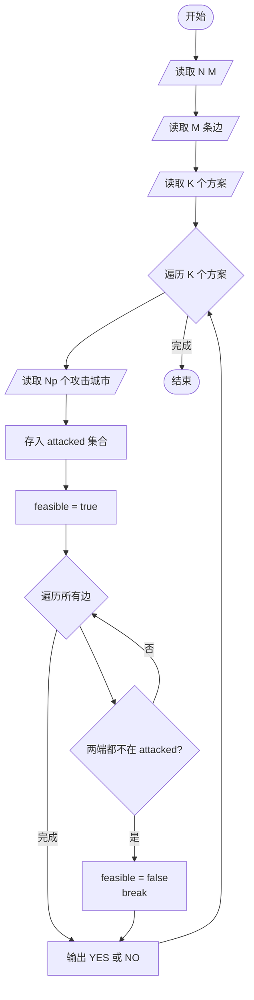
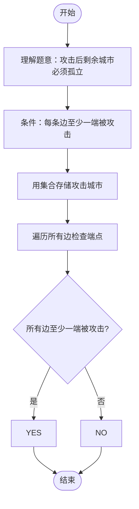

# L2-025 - 分而治之（25 分）

- **时间限制**: 600 ms
- **内存限制**: 65536 KB
- **代码长度限制**: 16 KB

---

## 题目描述

分而治之，各个击破是兵家常用的策略之一。在战争中，我们希望首先攻下敌方的部分城市，使其剩余的城市变成孤立无援，然后再分头各个击破。为此参谋部提供了若干打击方案。本题就请你编写程序，判断每个方案的可行性。

### 输入格式:

输入在第一行给出两个正整数 N 和 M（均不超过10 000），分别为敌方城市个数（于是默认城市从 1 到 N 编号）和连接两城市的通路条数。随后 M 行，每行给出一条通路所连接的两个城市的编号，其间以一个空格分隔。在城市信息之后给出参谋部的系列方案，即一个正整数 K （$$\le$$ 100）和随后的 K 行方案，每行按以下格式给出：

```
Np v[1] v[2] ... v[Np]
```

其中 `Np` 是该方案中计划攻下的城市数量，后面的系列 `v[i]` 是计划攻下的城市编号。

### 输出格式:

对每一套方案，如果可行就输出`YES`，否则输出`NO`。

### 输入样例:

```in
10 11
8 7
6 8
4 5
8 4
8 1
1 2
1 4
9 8
9 1
1 10
2 4
5
4 10 3 8 4
6 6 1 7 5 4 9
3 1 8 4
2 2 8
7 9 8 7 6 5 4 2
```

### 输出样例:

```out
NO
YES
YES
NO
NO
```

## 示例

### 示例 1

**输入:**
```
10 11
8 7
6 8
4 5
8 4
8 1
1 2
1 4
9 8
9 1
1 10
2 4
5
4 10 3 8 4
6 6 1 7 5 4 9
3 1 8 4
2 2 8
7 9 8 7 6 5 4 2
```

**输出:**
```
NO
YES
YES
NO
NO
```

---

## 题目详解

### 一、解题思路

本题的 R 实现采用以下方法：将输入组织为矩阵或表格，按题目定义的行、列和状态关系完成计算。

### 二、代码流程说明

1. 读取并解析标准输入，转换为题目所需的数据结构。
2. 按题意执行核心算法，维护中间状态并处理边界情况。
3. 整理计算结果，按照输出格式生成答案。

### 三、代码实现

```r
# 实现原理：将输入组织为矩阵或表格，按题目定义的行、列和状态关系完成计算。
# 处理流程：读取输入 -> 建立状态 -> 执行算法 -> 按题目格式输出。
# 关键变量和循环均直接对应题目中的数据、约束或操作。

# 读取并解析标准输入。
v <- scan(file = "stdin", quiet = TRUE)
n <- v[1]
m <- v[2]
p <- 3
e <- matrix(0, m, 2)
# 按题目约束遍历当前数据，更新中间状态。
for (i in seq_len(m)) {
    e[i, ] <- v[p:(p + 1)] + 1
    p <- p + 2
}
q <- v[p]
p <- p + 1
for (i in seq_len(q)) {
    z <- v[p]
    dead <- v[(p + 1):(p + z)] + 1
    p <- p + z + 1
    ok <- all(e[, 1] %in% dead | e[, 2] %in% dead)
# 严格按照题目规定的输出格式输出答案。
    cat(if (ok)
        "YES"
    else "NO", "\n", sep = "")
}
```

### 四、代码流程图



### 五、解题流程图



### 六、常见易错点

- 题目描述、输入格式、输出格式和输入输出样例必须保持原文不变。
- R 语言下标从 1 开始，注意编号转换和空输入边界。
- 输出时严格保留题目规定的空格、换行和小数位数。
